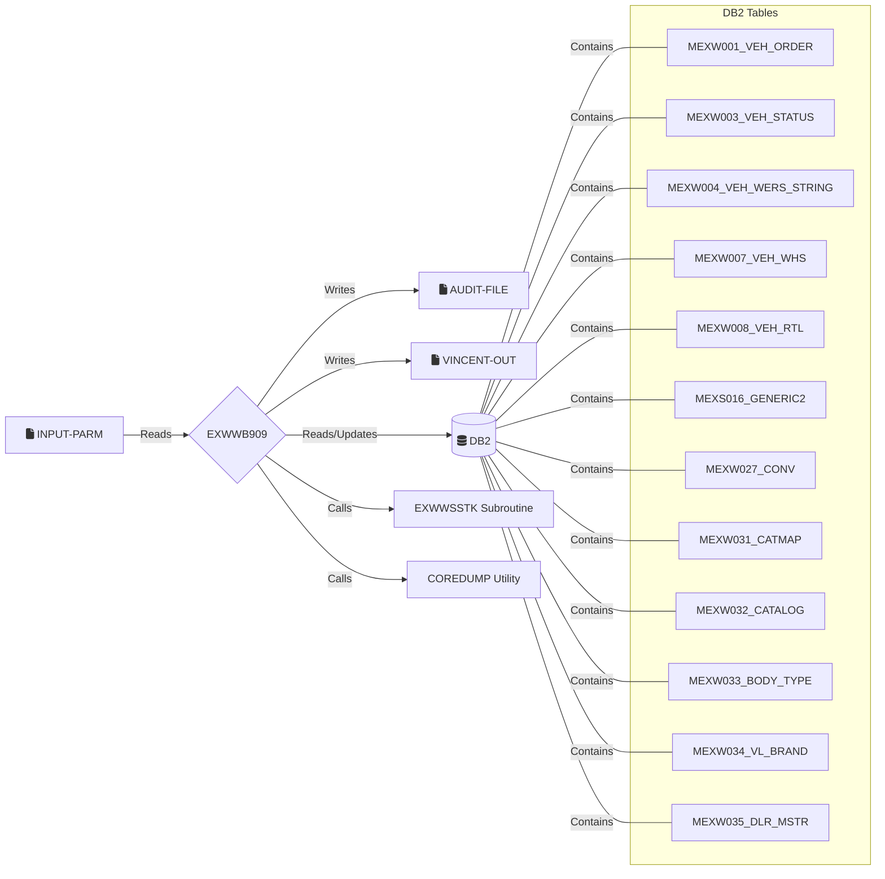

```markdown
COBOL - Technical Design Specification for Modernization: EXWWB909

---

# 1. Introduction
## 1.1 Purpose
The EXWWB909 program is a batch COBOL application designed to extract vehicle, customer, and dealer data from various GEVIS-owned DB2 tables. It creates an outbound bridge file intended for use by the VINCENT (North American Incentive Claiming System). This bridge file enables VINCENT to re-review VRULES programs, compare against VIN records, and manage chargeback (automatic post-claim validation) and auto claim generation processes, particularly during "full pass" requests in VRULES.

## 1.2 Scope
This document provides the technical design specifications for the COBOL program EXWWB909. It covers the program's architecture, data structures, processing logic, database interactions, error handling, and interfaces. The program reads a SYSPARM file for a list of producers, processes data for each producer by querying DB2 tables based on model year and update timestamps, filters for WDMO dealers, and generates an output file for the VINCENT system.

## 1.3 Audience
This document is intended for COBOL developers, system analysts, testers, and project managers involved in the maintenance, modernization, or understanding of the EXWWB909 program and its interactions within the GEVIS and VINCENT systems.

# 2. Overview
## 2.1 Background
EXWWB909 was created in April 2017 to support the VINCENT system's need for comprehensive vehicle, customer, and dealer data from GEVIS. It processes data based on the last run timestamp of the program and specific model year criteria (initially current year -1 to +2, later changed to -4 to +2). The program is a clone of EXWWB910 and EXWWGEVP, implying that changes to one might necessitate similar changes in the others. A key aspect is handling potentially unpopulated fields from DB2, replacing them with spaces (alphanumeric) or zeros (numeric) in the output.

## 2.2 Objectives
*   Extract specified vehicle, customer, and dealer data from GEVIS DB2 tables.
*   Filter records to include only those associated with a current WDMO (Wholesale Dealer Marketing Organization) dealer.
*   Generate an outbound bridge file formatted for the VINCENT system.
*   Include standard E&G (presumably a system or standard) headers/trailers and VINCENT-specific headers/trailers in the output file.
*   Process data based on a list of producers provided in an input SYSPARM file.
*   Manage batch control and timestamping for incremental processing.

## 2.3 Assumptions and Constraints
*   The program runs in a batch environment.
*   DB2 is the primary source for vehicle, customer, and dealer data.
*   Input SYSPARM file format is fixed.
*   Output bridge file format for VINCENT is fixed.
*   The program relies on the subroutine EXWWSSTK for obtaining current stocking dealer information.
*   DB2 table structures and copybook layouts are accurate and available.
*   Empty alphanumeric fields from DB2 should be output as spaces; empty numeric fields as zeros.
*   The program processes one producer at a time from the SYSPARM file.

# 3. System Architecture
## 3.1 System Context Diagram


## 3.2 Component Diagram
```mermaid
graph TD
    Main[0000P_MAINLINE]

    subgraph Initialization_Phase
        direction LR
        InitFiles[0300P_OPEN_FILES]
        InitOther[0400P_INITIALIZE_OTHER]
        InitOther --> InitTimestamp(0500P_GET_TIMESTMP)
        InitTimestamp --> InitDBTimestamp(7000P_OBTAIN_DRBN_TIMESTAMP)
        InitDBTimestamp -- Reads --> DB2_CurrentTimestamp[(DB2 CURRENT TIMESTAMP)]
        InitOther --> InitParams(0600P_GET_PROGAM_PARMS)
        InitParams --> InitSelectMEXS016(7010P_SELECT_MEXS016)
        InitSelectMEXS016 -- Reads --> DB_MEXS016_Ctrl[(MEXS016_GENERIC2 - Control)]
        InitOther --> WriteAuditHdr(0750P_WRITE_AUDIT_HEADER)
        WriteAuditHdr -- Writes --> AuditFile[AUDIT-FILE]
        InitOther --> WriteVincentHdr(0800P_POPULATE_VINCENT_HEADER)
        WriteVincentHdr -- Writes --> VincentOutFile[VINCENT-OUT]
    end

    subgraph Main_Processing_Loop_Per_Producer
        direction TD
        ReadSysparm(0700P_GET_SYSPARM_RECORD)
        ReadSysparm -- Reads --> ParmFile[INPUT-PARM]
        ReadSysparm --> ProcessCursors(1000P_PROCESS_CURSORS)
        
        ProcessCursors --> ProcessMEXW001_CSR(1100P_PROCESS_MEXW001_CSR)
        ProcessMEXW001_CSR -- Iterates Through --> CUR_MEXW001[MEXW001_CSR]
        ProcessCursors --> ProcessMEXW003_CSR(1200P_PROCESS_MEXW003_CSR)
        ProcessMEXW003_CSR -- Iterates Through --> CUR_MEXW003[MEXW003_CSR]
        ProcessCursors --> ProcessMEXW008_CSR(1300P_PROCESS_MEXW008_CSR)
        ProcessMEXW008_CSR -- Iterates Through --> CUR_MEXW008[MEXW008_CSR]
        ProcessCursors --> ProcessSALE_CHK_CSR(1400P_PROCESS_SALE_CHK_CSR)
        ProcessSALE_CHK_CSR -- Iterates Through --> CUR_SALE_CHK[SALE_CHK_CSR]
        
        CUR_MEXW001 -- Reads --> DB_MEXW001_Table[(MEXW001_VEH_ORDER)]
        CUR_MEXW003 -- Reads --> DB_MEXW001_003_Join[(MEXW001_VEH_ORDER, MEXW003_VEH_STATUS)]
        CUR_MEXW008 -- Reads --> DB_MEXW001_008_Join[(MEXW001_VEH_ORDER, MEXW008_VEH_RTL)]
        CUR_SALE_CHK -- Reads --> DB_MEXW001_008_Sale_Join[(MEXW001_VEH_ORDER, MEXW008_VEH_RTL)]

        ProcessMEXW001_CSR --> ProcessVehicleLoop(2000P_PROCESS_GEVIS_VEHICLE)
        ProcessMEXW003_CSR --> ProcessVehicleLoop
        ProcessMEXW008_CSR --> ProcessVehicleLoop
        ProcessSALE_CHK_CSR --> ProcessVehicleLoop

        ProcessVehicleLoop --> VerifyWDMODealer(2105P_VERIFY_WDMO_DEALER)
        VerifyWDMODealer --> CallEXWWSSTK(2110P_CALL_EXWWSSTK)
        CallEXWWSSTK -- Calls --> EXWWSSTK_Sub[EXWWSSTK]
        VerifyWDMODealer --> GetMEXW035Data(7020P_GET_MEXW035_DATA)
        GetMEXW035Data -- Reads --> DB_MEXW035_Table[(MEXW035_DLR_MSTR)]
        
        ProcessVehicleLoop --> ProcessGevisDetail(2120P_PROCESS_GEVIS_DETAIL_REC)
        ProcessGevisDetail -- Reads --> Various_DB_Tables[(DB2 Tables via SELECTs/Cursors)]
        ProcessGevisDetail -- Writes --> VincentOutFile
    end

    subgraph Conclusion_Phase
        direction LR
        Conclude[6000P_CONCLUSION]
        Conclude --> UpdateProgParams(6010P_UPDATE_PROG_PARMS)
        UpdateProgParams --> UpdateMEXS016(7005P_UPDATE_TIMESTAMP)
        UpdateMEXS016 -- Updates --> DB_MEXS016_Ctrl
        Conclude --> WriteVincentTrl(6030P_POPULATE_VINCENT_TRAILER)
        WriteVincentTrl -- Writes --> VincentOutFile
        Conclude --> WriteAuditDetail(6040P_WRITE_AUDIT_DETAIL)
        WriteAuditDetail -- Writes --> AuditFile
        Conclude --> WriteAuditTrl(6050P_WRITE_AUDIT_TRAILER)
        WriteAuditTrl -- Writes --> AuditFile
    end
    
    Main --> Initialization_Phase
    Main -- Iterates Per Producer --> ReadSysparm
    Main --> Conclusion_Phase

    ErrorHandler[9999I_ABEND] -- Calls --> COREDUMP_Util[COREDUMP Utility]
    ErrorHandler -- Writes --> AuditFile
    Initialization_Phase -->|On DB Error| ErrorHandler
    Main_Processing_Loop_Per_Producer -->|On DB/Subroutine Error| ErrorHandler
    Conclusion_Phase -->|On DB Error| ErrorHandler
    
    classDef file fill:#eee,stroke:#ccc,stroke-width:2px;
    class ParmFile,AuditFile,VincentOutFile file;
    classDef db fill:#lightgrey,stroke:#ccc,stroke-width:2px;
    class DB_MEXS016_Ctrl,DB_MEXW001_Table,DB_MEXW001_003_Join,DB_MEXW001_008_Join,DB_MEXW001_008_Sale_Join,DB_MEXW035_Table,Various_DB_Tables,DB_CurrentTimestamp,DB_MEXW003_Table, DB_MEXW004_Table,DB_MEXW007_Table, DB_MEXW008_Table, DB_MEXW027_Table, DB_MEXW031_Table, DB_MEXW032_Table, DB_MEXW033_Table, DB_MEXW034_Table db;
    classDef subprogram fill:#lightblue,stroke:#ccc,stroke-width:2px;
    class EXWWSSTK_Sub,COREDUMP_Util subprogram;
```

# 4. Detailed Design
## 4.1 Program Structure
The program EXWWB909 operates in a batch mode and follows a sequential processing flow structured into distinct phases:

1.  **Initialization (0000P-MAINLINE leading to 0300P, 0400P, 0500P, 0600P, 0750P, 0800P):**
    *   Opens input (INPUT-PARM), output (AUDIT-FILE, VINCENT-OUT) files.
    *   Initializes working storage variables, switches, and counters.
    *   Obtains the current system timestamp and formats it for DB2 queries (WS-CURR-DRBN-TIMESTAMP).
    *   Retrieves the previous run's batch number and timestamp from MEXS016_GENERIC2 table. Calculates the current batch number.
    *   Writes audit report headers and the VINCENT output file header.

2.  **Main Processing Loop (0000P-MAINLINE performing 0700P-GET-SYSPARM-RECORD UNTIL END-OF-SYSPARM-FILE):**
    *   Reads a producer data source code from the INPUT-PARM file (PARM-RECORD).
    *   If the SYSPARM file is empty or ends, the loop terminates.
    *   For each producer:
        *   **Data Extraction via Cursors (1000P-PROCESS-CURSORS performing 1100P, 1200P, 1300P, 1400P):**
            *   Processes MEXW001_CSR: Selects vehicle orders from MEXW001_VEH_ORDER based on data source, model year range, active flag, non-blank VIN, and update timestamp range.
            *   Processes MEXW003_CSR: Selects vehicle orders by joining MEXW001_VEH_ORDER with MEXW003_VEH_STATUS, applying similar model year/timestamp criteria and specific status codes.
            *   Processes MEXW008_CSR: Selects vehicle orders by joining MEXW001_VEH_ORDER with MEXW008_VEH_RTL, applying similar model year/timestamp criteria.
            *   Processes SALE_CHK_CSR: Selects older vehicle orders (model year < current - 4) that were sold recently by joining MEXW001_VEH_ORDER with MEXW008_VEH_RTL.
        *   **Vehicle Record Processing (2000P-PROCESS-GEVIS-VEHICLE for each fetched record):**
            *   **WDMO Dealer Verification (2105P-VERIFY-WDMO-DEALER):**
                *   Calls EXWWSSTK subroutine (2110P-CALL-EXWWSSTK) to get the current stocking dealer for the vehicle.
                *   If EXWWSSTK is successful, queries MEXW035_DLR_MSTR (7020P-GET-MEXW035-DATA) to check if the stocking dealer's `DLR-SUB-SUBLVL1-C` is 'WDM'.
            *   **Detail Record Assembly (2120P-PROCESS-GEVIS-DETAIL-REC if WDMO dealer):**
                *   Retrieves WERS string from MEXW004_VEH_WERS_STRING (2125P performing 7030P).
                *   Moves data from the fetched MEXW001 record to the output detail record (2130P).
                *   If WERS string not found, gets catalog data from MEXW031_CATMAP (2132P performing 8200P-series).
                *   Obtains retail data by joining MEXW003_VEH_STATUS and MEXW008_VEH_RTL for '90V' status (2135P performing 7040P). Populates customer details (2137P) and converts customer type (2139P).
                *   Moves current stocking dealer info from EXWWSSTK output to detail record (2142P). Converts status codes using MEXW027_CONV (2145P performing 7045P).
                *   Obtains wholesale data by joining MEXW003_VEH_STATUS and MEXW007_VEH_WHS for '40V' status (2150P performing 7050P).
                *   Obtains WERS data from MEXW034_VL_BRAND, MEXW004_VEH_WERS_STRING, MEXW032_CATALOG, and MEXW033_BODY_TYPE based on complex rules (2160P and its sub-paragraphs).
                *   Retrieves various status dates (Scheduled, Produced, Released, Arrival) from MEXW003_VEH_STATUS (2198P performing 7090P).
                *   Retrieves last QAD wholesale global dealer from MEXW003_VEH_STATUS using MEXW003_40V_CSR (3010P performing 8300P-series).
                *   If data is valid (MEXW027-FOUND), writes the assembled detail record to VINCENT-OUT.
        *   Fetches the next record from the active cursor.

3.  **Conclusion (0000P-MAINLINE performing 6000P-CONCLUSION):**
    *   Obtains the final DRBN timestamp.
    *   Updates the MEXS016_GENERIC2 table with the current run's start timestamp (WS-HOLD-CURR-TIMESTAMP) and the current batch number (WS-CURRENT-BATCH-NBR) (6010P performing 7005P).
    *   Populates and writes the VINCENT trailer record to VINCENT-OUT (6030P).
    *   Writes audit trail summary (counts of records read/written) to AUDIT-FILE (6040P).
    *   Writes audit trail program end message to AUDIT-FILE (6050P).
    *   Closes all files.
    *   If `SEND-EMAIL` flag is set (e.g., due to EXWWSSTK not found), sets RETURN-CODE to 3.
    *   Ends program execution (GOBACK).

4.  **Error Handling (Throughout, centralized in 9999I-ABEND):**
    *   DB2 SQL errors are checked after each SQL operation. Fatal errors typically lead to writing diagnostic messages to AUDIT-FILE and calling `9999I-ABEND`.
    *   `9999I-ABEND` writes abend messages to AUDIT-FILE and calls 'COREDUMP'.
    *   Subroutine EXWWSSTK errors are handled in `2110P` and `2115P`, potentially setting `SEND-EMAIL` flag or abending.

## 4.2 Data Structures
This section describes the record layouts for files and parameters passed to/from called subroutines.

**File Record Layouts:**

*   **AUDIT-FILE (FD: AUDIT-FILE)**
    *   Purpose: Used for writing audit trail messages, including headers, detail counts, and error messages.
    *   Record Layout (`AUDIT-RECORD`):
        ```cobol
        01  AUDIT-RECORD.
            05  AUDIT-LABEL             PIC X(30).
            05  AUDIT-DATA              PIC X(50).
        ```
    *   Copybooks: None explicitly for FD, but `CPESEBWS` provides `ABEND-MESSAGES` often written here.

*   **INPUT-PARM (FD: INPUT-PARM)**
    *   Purpose: Contains a list of producers (data source codes) to be processed by the program.
    *   Record Layout (`PARM-RECORD` and `PARM-DETAIL`):
        ```cobol
        FD  INPUT-PARM.
        01  PARM-RECORD.
            05  PARM-DATA               PIC X(80).
        
        * Defined in Working-Storage for INTO clause of READ:
        01  PARM-DETAIL.
            05  INPUT-SOURCE            PIC X(02).
            05  FILLER                  PIC X(78).
        ```
    *   Copybooks: None.

*   **VINCENT-OUT (FD: VINCENT-OUT)**
    *   Purpose: The main output bridge file containing extracted and formatted data for the VINCENT system.
    *   Record Layout (`VINCENT-RECORD`):
        ```cobol
        FD  VINCENT-OUT.
        01  VINCENT-RECORD.
            05  VINCENT-DETAIL          PIC X(1000).
        ```
    *   This file receives records from `WS-VINCENT-HEAD-TRAIL-RECORD` (populated via `VIN-HEADER-TRAILER` using `CPEWVNCT`) and `WS-VINCENT-DETAIL-RECORD`.

    *   **VINCENT Header/Trailer Structure (`VIN-HEADER-TRAILER` via `CPEWVNCT`)**:
        *   Purpose: Defines the layout for header and trailer records in the VINCENT-OUT file.
        *   The program populates the initial fields of the header/trailer from `CPEWVNCT` as follows:
            *   **Header (VNT-HDR-REC-TYPE based on VINCENT-HEADER in CPEWVNCT):**
                *   `LIT-WDMHAEXT` moved to `VNT-HDR-REC-TYPE` (first 8 bytes of `VINCENT-HEADER`).
                *   Current date (`WS-DRBN-YEAR`, `WS-DRBN-MONTH`, `WS-DRBN-DAY`) to `VNT-HDR-CURR-DATE`.
                *   Current time (`WS-DRBN-HOUR`, `WS-DRBN-MINUTE`, `WS-DRBN-SECOND`) to `VNT-HDR-CURR-TIME`.
                *   `WS-CURRENT-BATCH-NBR` to `VNT-HDR-CURR-BATCH-NBR`.
                *   `WS-PREV-BATCH-NBR` to `VNT-HDR-PREV-BATCH-NBR`.
                *   `LOW-VALUES` to `VNT-HDR-LOW-VALUES`.
                *   The rest of the header (`VINCENT-HEADER(38:)`) is moved from the copybook structure.
            *   **Trailer (VNT-TRL-REC-TYPE based on VINCENT-TRAILER in CPEWVNCT):**
                *   `LIT-WDMHAEXT` moved to `VNT-TRL-REC-TYPE` (first 8 bytes of `VINCENT-TRAILER`).
                *   `LIT-999` moved to `VNT-TRL-HUB-REC-TYPE`.
                *   `WS-CURRENT-BATCH-NBR` to `VNT-TRL-CURR-BATCH-NBR`.
                *   `WS-COUNT-DTL-NBR` to `VNT-TRL-COUNTER`.
                *   The rest of the trailer (`VINCENT-TRAILER(38:)`) is moved from the copybook structure.
        *   Copybooks: `CPEWVNCT`.

    *   **VINCENT Detail Record Structure (`WS-VINCENT-DETAIL-RECORD`)**:
        *   Purpose: Defines the layout for data detail records written to the VINCENT-OUT file.
        *   Record Layout (hierarchical outline):
            ```cobol
            01  WS-VINCENT-DETAIL-RECORD.
                05  WS-DTL-VIN-FULL-C               PIC X(17).
                05  WS-DTL-DTA-DATA-SRC-C           PIC X(02).
                05  WS-DTL-BDT-MDL-YR-Y             PIC X(02).
                05  WS-DTL-GEVIS-VEH-LINE-C         PIC X(02).
                05  WS-DTL-LCL-BDYTYP-C             PIC X(05).
                05  WS-DTL-CUR-STA-STATUS-C         PIC X(03).
                05  WS-DTL-VEH-DIVISION-C           PIC X(01).
                05  WS-DTL-WMI-WMI-C                PIC X(03).
                05  WS-DTL-LCL-PLT-C                PIC X(03).
                05  WS-DTL-VWS-TOT-US-A             PIC S9(07)V99 COMP-3.
                05  WS-DTL-VEH-GBL-DLR-C            PIC X(06).
                05  WS-DTL-LAST-QAD-VST-GBL-LOC-C   PIC X(06).
                05  WS-DTL-CURR-VST-GBL-LOC-C       PIC X(06).
                05  WS-DTL-SHIP-TO-DLR-C            PIC X(06).
                05  WS-DTL-CURR-STOCKING-DLR-C      PIC X(06).
                05  WS-DTL-CURR-DLR-C               PIC X(06).
                05  WS-DTL-WDMO-FLEET-C             PIC X(05).
                05  WS-DTL-VRS-LCL-FLEET-C          PIC X(06).
                05  WS-DTL-VRS-CST-FIRST-N          PIC X(30).
                05  WS-DTL-VRS-CST-MID-INIT-X       PIC X(01).
                05  WS-DTL-VRS-CST-LAST-N           PIC X(30).
                05  WS-DTL-VRS-CST-ADDR-1-X         PIC X(40).
                05  WS-DTL-VRS-CST-ADD-DIV2-N       PIC X(40).
                05  WS-DTL-VRS-CST-ADD-DIV1-C       PIC X(02).
                05  WS-DTL-VRS-CST-POSTAL-C         PIC X(10).
                05  WS-DTL-VRS-SALESPERSON-C        PIC X(11).
                05  WS-DTL-VRS-TYP-LCL-CUST-C       PIC X(01).
                05  WS-DTL-VEH-WDMO-ORD-TYP         PIC X(01).
                05  WS-DTL-VEH-ORD-RCPT-Y           PIC X(08).
                05  WS-DTL-VEH-SCHD-VST-TARGET-Y    PIC X(08).
                05  WS-DTL-VEH-PRODUCE-VST-STAT-Y   PIC X(08).
                05  WS-DTL-VEH-RELEASE-VST-STAT-Y   PIC X(08).
                05  WS-DTL-VEH-ARRIVAL-VST-STAT-Y   PIC X(08).
                05  WS-DTL-VEH-INVOICE-VST-STAT-Y   PIC X(08).
                05  WS-DTL-VEH-STOCK-VST-STAT-Y     PIC X(08).
                05  WS-DTL-VEH-RETAIL-VST-STAT-Y    PIC X(08).
                05  WS-DTL-VEH-DELIVER-VST-STAT-Y   PIC X(08).
                05  WS-DTL-VEH-SLSRCPT-VST-STAT-Y   PIC X(08).
                05  WS-DTL-VEH-WARRANT-VST-STAT-Y   PIC X(08).
                05  WS-DTL-VEH-CATALOG-C            PIC X(15).
                05  WS-DTL-WERS-VEH-LINE-C          PIC X(02).
                05  WS-DTL-WERS-BODY-STYLE-C        PIC X(03).
                05  WS-DTL-WERS-BRAND-C             PIC X(01).
                05  WS-DTL-VEH-PO-Y                 PIC X(08).
                05  WS-DTL-FILLER-01                PIC X(627) VALUE SPACES.
            ```
        *   Copybooks: None directly, this is a `WORKING-STORAGE` definition.

**Called Subroutine Parameters:**

*   **EXWWSSTK (Parameters defined in `SSTK-I-O-DATA`)**
    *   Purpose: To obtain the current stocking dealer, current status code, and current status date for a given vehicle.
    *   Parameter Layout (`SSTK-I-O-DATA`):
        *   Input Block:
            ```cobol
            05  SSTK-INPUT-DATA.
                10   SSTK-MODE                    PIC X(01).
                    88  SSTK-INQUIRY-MODE        VALUE "I".
                    88  SSTK-UPDATE-MODE         VALUE "U".
                10   SSTK-DTA-DATA-SRC-C          PIC X(02).
                10   SSTK-VEH-ORD-ID-C            PIC X(25).
            ```
        *   Output Data Block:
            ```cobol
            05  SSTK-OUTPUT-DATA.
                10  SSTK-GBL-STK-DLR-C            PIC X(06).
                10  SSTK-LCL-STK-DLR-C            PIC X(07).
                10  SSTK-STK-DLR-STAT-C           PIC X(03).
                10  SSTK-STK-DLR-STAT-Y           PIC X(10).
                10  SSTK-STK-DLR-CNTRY-ISO3-C     PIC X(03).
                10  SSTK-CUR-STAT-C               PIC X(03).
                10  SSTK-CUR-LCL-STAT-C           PIC X(06).
                10  SSTK-CUR-STAT-Y               PIC X(10).
                10  SSTK-DIV-DIV-C                PIC X(02).
            ```
        *   Output Message Block:
            ```cobol
            05  SSTK-OUT-DATA-MSG.
                10  SSTK-PGM-ID                   PIC X(08).
                10  SSTK-RETURN-CD                PIC X(01).
                    88  SSTK-SUCCESSFUL           VALUE "0".
                    88  SSTK-INPUT-ERROR          VALUE "1".
                    88  SSTK-DB2-ERROR            VALUE "2".
                10  SSTK-PARAGRAPH                PIC X(06).
                10  SSTK-DB2-AREA.
                    15  SSTK-HOST-VAR1            PIC X(80).
                    15  SSTK-HOST-VAR2            PIC X(80).
                    15  SSTK-HOST-VAR3            PIC X(80).
                    15  SSTK-HOST-VAR4            PIC X(80).
                    15  SSTK-HOST-VAR5            PIC X(80).
                    15  SSTK-HOST-VAR6            PIC X(80).
                    15  SSTK-HOST-VAR7            PIC X(80).
                10  SSTK-DB2-AREA.
                    15  SSTK-HOST-VAR8            PIC X(80).
                    15  SSTK-DB2-TABLES.
                        20  SSTK-DB2-TABLE1       PIC X(18).
                        20  SSTK-DB2-TABLE2       PIC X(18).
                        20  SSTK-DB2-TABLE3       PIC X(18).
                        20  SSTK-DB2-TABLE4       PIC X(18).
                        20  SSTK-DB2-TABLE5       PIC X(18).
                    15  SSTK-SQL-FUNCTION        PIC X(12).
                    15  SSTK-SQL-RETURN-CODE     PIC S9(04) COMP-3.
                    15  SSTK-SQL-WARNING         PIC X(08).
                    15  SSTK-SQL-ERROR-MESSAGE   PIC X(70).
                    15  SSTK-SQL-FULL-ERROR.
                        20  SSTK-SQL-MSG1        PIC X(72).
                        20  SSTK-SQL-MSG2        PIC X(72).
                        20  SSTK-SQL-MSG3        PIC X(72).
                        20  SSTK-SQL-MSG4        PIC X(72).
                    15  SSTK-SQLCA               PIC X(200).
            05  SSTK-FILLER                       PIC X(1596).
            ```
    *   Copybooks: `CPEWSSTK`.

*   **COREDUMP**
    *   Purpose: Standard system utility to generate a memory dump for diagnostic purposes upon severe error.
    *   Parameters: Not explicitly defined, typically takes no parameters or standard system parameters.
    *   Copybooks: None.

## 4.3 Algorithms
### 4.3.1 Overall Program Logic (Condensed Pseudocode)
```
START PROGRAM EXWWB909
  PERFORM Initialize_Program
    Open Files (AUDIT-FILE, VINCENT-OUT, INPUT-PARM)
    Initialize Working Storage (Detail Record, Switches, Variables, Counters)
    Get Current Timestamp (System and DB2 DRBN Timestamp)
    Store Current Year from DRBN Timestamp
    Get Program Parameters (Previous Batch Number, Previous Run Timestamp from MEXS016_GENERIC2)
    Calculate Current Batch Number
    Write Audit Header
    Populate and Write VINCENT Header Record to VINCENT-OUT

  PERFORM Read_SYSPARM_Record UNTIL End_Of_SYSPARM_File
    READ INPUT-PARM record INTO PARM-DETAIL
    IF AT END AND No_SYSPARM_Records_Read_Yet THEN
      ABEND "MISSING SYSPARM RECORDS"
    ELSE IF NOT AT END THEN
      Increment SYSPARM_Records_Read_Counter
      Set Producer_Data_Source from PARM-DETAIL.INPUT-SOURCE
      Initialize Cursor_Found_Switches to FALSE

      PERFORM Process_Producer_Data_Sources
        PERFORM Process_MEXW001_Cursor
          OPEN MEXW001_CSR
          PERFORM Fetch_MEXW001_Cursor UNTIL MEXW001_CSR_NOT_FOUND
            IF record found THEN
              PERFORM Process_Single_GEVIS_Vehicle_Record
            END-IF
          END-PERFORM
          CLOSE MEXW001_CSR
        END-PERFORM

        PERFORM Process_MEXW003_Cursor (similar logic with MEXW003_CSR)
        PERFORM Process_MEXW008_Cursor (similar logic with MEXW008_CSR)
        PERFORM Process_SALE_CHK_Cursor (similar logic with SALE_CHK_CSR)
    END-IF
  END-PERFORM

  PERFORM Conclude_Program
    Get Current DB2 DRBN Timestamp (for audit trailer)
    Update Program Parameters (Current Batch Number, Held Start Timestamp to MEXS016_GENERIC2)
    Populate and Write VINCENT Trailer Record to VINCENT-OUT
    Write Audit Detail (counters)
    Write Audit Trailer (end time)
    Close Files
    IF Send_Email_Flag is TRUE THEN
      Set RETURN-CODE to 3
    END-IF
  STOP PROGRAM (GOBACK)

Process_Single_GEVIS_Vehicle_Record:
  PERFORM Verify_WDMO_Dealer
    CALL "EXWWSSTK" USING SSTK-I-O-DATA (Vehicle Order ID, Data Source)
    IF SSTK-SUCCESSFUL THEN
      SELECT from MEXW035_DLR_MSTR using SSTK-GBL-STK-DLR-C
      IF MEXW035_FOUND AND DLR-SUB-SUBLVL1-C = "WDM" THEN
        Set WDMO_Dealer_Flag to TRUE
      ELSE
        Set WDMO_Dealer_Flag to FALSE
        IF MEXW035_NOT_FOUND THEN
          Write "MISSING DEALER ON MEXW035" to Audit
        END-IF
      END-IF
    ELSE IF SSTK-DB2-ERROR THEN
      Handle_SSTK_Fatal_Error (write audit, potentially ABEND or set email flag)
    END-IF
  END-PERFORM

  IF WDMO_Dealer_Flag is TRUE AND SSTK-SUCCESSFUL THEN
    PERFORM Assemble_GEVIS_Detail_Record
      Initialize WS-VINCENT-DETAIL-RECORD
      Set Division Code
      Process WERS String (SELECT from MEXW004_VEH_WERS_STRING)
      Move MEXW001 fields to WS-DTL-*
      IF WERS String not found, Get Catalog Data (SELECT from MEXW031_CATMAP)
      Obtain Retail Data (SELECT join MEXW003_VEH_STATUS, MEXW008_VEH_RTL for '90V')
      Populate Retail Output fields, Convert Customer Type
      Move SSTK Current Data to WS-DTL-*
      Get Status Conversion (SELECT from MEXW027_CONV)
      Adjust Status Code 800 to 600/801 based on sales type/date
      Obtain Wholesale Data (SELECT join MEXW003_VEH_STATUS, MEXW007_VEH_WHS for '40V')
      Obtain WERS Data (complex logic involving MEXW034, MEXW032, MEXW033)
      Get specific MEXW003 Status Dates (20T, 30R/30P, 30T, 80F)
      Process Wholesale (SELECT from MEXW003_VEH_STATUS via MEXW003_40V_CSR for '40V' WD source)
      IF WS-VINCENT-DETAIL-RECORD is valid (MEXW027-FOUND) THEN
        Increment Output_Record_Counters
        WRITE VINCENT-RECORD FROM WS-VINCENT-DETAIL-RECORD
      END-IF
    END-PERFORM
  END-IF

  Fetch Next Record from active cursor (MEXW001_CSR, MEXW003_CSR, MEXW008_CSR, or SALE_CHK_CSR)
```

### 4.3.2 Key Algorithmic Details
1.  **Producer Processing:** The program reads producer codes one by one from `INPUT-PARM`. For each producer, it re-opens and processes four main DB2 cursors.
2.  **Timestamp and Batch Control:**
    *   Before processing, it reads the `WS-PREV-RUN-TIMESTAMP` and `WS-PREV-BATCH-NBR` from `MEXS016_GENERIC2` using keys "EXWWB909TIMESTMP" and "EXWWB909BATCHCTL" respectively.
    *   `WS-CURR-DRBN-TIMESTAMP` is obtained at the start and held in `WS-HOLD-CURR-TIMESTAMP`.
    *   `WS-CURRENT-BATCH-NBR` is `WS-PREV-BATCH-NBR + 1`.
    *   At the end, `WS-HOLD-CURR-TIMESTAMP` and `WS-CURRENT-BATCH-NBR` are written back to `MEXS016_GENERIC2`.
3.  **Cursor Logic (General Pattern for MEXW001_CSR, MEXW003_CSR, MEXW008_CSR, SALE_CHK_CSR):**
    *   Cursors select vehicle data based on:
        *   `DTA_DATA_SRC_C` (from current SYSPARM producer).
        *   `BDT_MDL_YR_Y` between `WS-CURR-MODEL-YY - 4` and `WS-CURR-MODEL-YY + 2` (except `SALE_CHK_CSR` which is `< WS-CURR-MODEL-YY - 4`).
        *   `VEH_ACTIVE_F = "Y"`.
        *   `VEH_VIN_FULL_C > " "`.
        *   An update timestamp (`VEH_UPDT_S`, `VST_UPDT_S`, or `VRS_UPDT_S`) between `WS-PREV-RUN-TIMESTAMP` and `WS-CURR-DRBN-TIMESTAMP`.
    *   `MEXW003_CSR` additionally filters on specific `B.STA_STATUS_C` values ("00B", "30T", "40V", "80J", "80V", "90U", "90V") and `B.VST_CUR_STAT_F = "Y"`, `B.VST_ACTIVE_F = "Y"`.
4.  **WDMO Dealer Check (2105P-VERIFY-WDMO-DEALER):**
    *   For each vehicle record, call `EXWWSSTK` using `VEH-ORD-ID-C` and `VEH-DTA-DATA-SRC-C` to get the stocking dealer (`SSTK-GBL-STK-DLR-C`).
    *   If `EXWWSSTK` is successful, use `SSTK-GBL-STK-DLR-C` to query `MEXW035_DLR_MSTR`.
    *   If a record is found in `MEXW035_DLR_MSTR` and `DLR-SUB-SUBLVL1-C` is "WDM", the vehicle is processed further. Otherwise, it's skipped.
    *   Missing `MEXW035` records are reported in the audit.
5.  **WERS Data Retrieval (2160P-OBTAIN-WERS-DATA and sub-paragraphs):**
    *   Complex logic to determine `WS-DTL-WERS-VEH-LINE-C`, `WS-DTL-WERS-BRAND-C`, and `WS-DTL-WERS-BODY-STYLE-C`.
    *   If data source is 'EA' or 'NA': Uses `MEXW034_VL_BRAND` based on `VEH-GEVIS-VL-C`.
    *   Otherwise (non 'EA'/'NA'):
        *   If `WERS-STRING-FOUND-SW` (from `MEXW004_VEH_WERS_STRING`): Processes WERS string, potentially using `MEXW034_VL_BRAND` for specific vehicle lines ("KI", "K5", "DB").
        *   Else (WERS string not found): Selects from `MEXW032_CATALOG` using `VEH-CATALOG-C`. Then, similar logic as above using `CTG-VHL-VEH-LINE-C` to query `MEXW034_VL_BRAND`.
    *   `WS-DTL-WERS-BODY-STYLE-C` is formed by combining product type and body type/option codes obtained from `MEXW004`, `MEXW031_CATMAP`, or `MEXW033_BODY_TYPE` based on availability and data source.
6.  **Status Code Conversion (2145P-GET-MEXW027-INFO):**
    *   The current vehicle status `SSTK-CUR-STAT-C` (from `EXWWSSTK`) is converted to a VINCENT-specific status code.
    *   `MEXW027_CONV` is queried with `CNT-CND-CNV-TYP-C = "STATUS"`, `CNT-DTA-DATA-SRC-C = "VI"`, and `CNT-GBL-DATA-X = SSTK-CUR-STAT-C`.
    *   The result `CNT-LCL-DATA-X (1:3)` populates `WS-DTL-CUR-STA-STATUS-C`.
    *   Special handling for status "800": if `VRS-TYP-LCL-CUST-C` is "A4", `WS-DTL-CUR-STA-STATUS-C` becomes "801". If customer type or sales receipt date is blank, it becomes "600".
7.  **Date Formatting:** Dates like `VEH-ORD-RCPT-Y` (YYYY-MM-DD) are reformatted to `WS-DTL-VEH-ORD-RCPT-Y` (YYYYMMDD) using STRING.
8.  **Customer Name Handling (2137P-POPULATE-RETAIL-OUTPUT):** If customer first name and last name are blank, the business name fields (`VRS-CST-BUS-1-N`, `VRS-CST-BUS-2-N`) are moved to `WS-DTL-VRS-CST-FIRST-N` and `WS-DTL-VRS-CST-LAST-N` respectively.
9.  **Defaulting Empty Fields:** The program description notes that if fields extracted from DB2 are unpopulated, alphanumeric fields will contain spaces, and numeric fields will contain zeros in the output. This is generally achieved by initializing `WS-VINCENT-DETAIL-RECORD` and then moving data. `COMP-3` fields are initialized to zero by `INITIALIZE` if not explicitly handled.

## 4.4 Input/Output Specifications
*   **Input Files:**
    *   `INPUT-PARM`: Sequential file containing producer codes to process.
        *   Logical Record Name: `PARM-RECORD`
        *   Record Length: 80 bytes.
        *   Format: `INPUT-SOURCE` (PIC X(02)) followed by `FILLER` (PIC X(78)).
*   **Output Files:**
    *   `VINCENT-OUT`: Sequential bridge file for the VINCENT system.
        *   Logical Record Name: `VINCENT-RECORD`
        *   Record Length: 1000 bytes.
        *   Contains header, detail, and trailer records. Details in section 4.2.
    *   `AUDIT-FILE`: Sequential file for program audit trail and error messages.
        *   Logical Record Name: `AUDIT-RECORD`
        *   Record Length: 80 bytes (AUDIT-LABEL PIC X(30), AUDIT-DATA PIC X(50)).
*   **DB2 Tables (Accessed via SQL):**
    *   Input: `MEXW001_VEH_ORDER`, `MEXW003_VEH_STATUS`, `MEXW004_VEH_WERS_STRING`, `MEXW007_VEH_WHS`, `MEXW008_VEH_RTL`, `MEXS016_GENERIC2`, `MEXW027_CONV`, `MEXW031_CATMAP`, `MEXW032_CATALOG`, `MEXW033_BODY_TYPE`, `MEXW034_VL_BRAND`, `MEXW035_DLR_MSTR`.
    *   Output (Update): `MEXS016_GENERIC2`.

## 4.5 DB2 Database Details
The program interacts extensively with DB2 using embedded SQL.

**Cursors:**

1.  **MEXW001_CSR:**
    ```sql
    EXEC SQL
    DECLARE MEXW001_CSR CURSOR WITH HOLD FOR
    SELECT VEH_VIN_FULL_C
    ,   VEH_ORD_ID_C
    ,   DTA_DATA_SRC_C
    ,   BDT_MDL_YR_Y
    ,   DLR_DLR_C
    ,   WMI_WMI_C
    ,   VEH_LCL_PLT_C
    ,   VEH_LCL_BDYTYP_C
    ,   VEH_GBL_ORD_DLR_C
    ,   VEH_GBL_SHIP_TO_C
    ,   VEH_ORD_RCPT_Y
    ,   VEH_WDMO_FLEET_C
    ,   VEH_WDMO_ORD_TYP
    ,   VEH_CATALOG_C
    ,   VEH_GBL_CATALOG_C
    ,   VEH_PO_Y
    ,   VEH_GEVIS_VL_C
    ,   COUNTRY_ISO3_C
    FROM MEXW001_VEH_ORDER
    WHERE DTA_DATA_SRC_C      = :VEH-DTA-DATA-SRC-C
    AND BDT_MDL_YR_Y  BETWEEN :WS-CURR-MODEL-YY -4
    AND :WS-CURR-MODEL-YY +2
    AND VEH_ACTIVE_F        = "Y"
    AND VEH_VIN_FULL_C      > " "
    AND VEH_UPDT_S  BETWEEN   :WS-PREV-RUN-TIMESTAMP
    AND   :WS-CURR-DRBN-TIMESTAMP
    FOR READ ONLY
    END-EXEC.
    ```

2.  **MEXW003_CSR:**
    ```sql
    EXEC SQL
    DECLARE MEXW003_CSR CURSOR WITH HOLD FOR
    SELECT A.VEH_VIN_FULL_C
    ,   A.VEH_ORD_ID_C
    ,   A.DTA_DATA_SRC_C
    ,   A.BDT_MDL_YR_Y
    ,   A.DLR_DLR_C
    ,   A.WMI_WMI_C
    ,   A.VEH_LCL_PLT_C
    ,   A.VEH_LCL_BDYTYP_C
    ,   A.VEH_GBL_ORD_DLR_C
    ,   A.VEH_GBL_SHIP_TO_C
    ,   A.VEH_ORD_RCPT_Y
    ,   A.VEH_WDMO_FLEET_C
    ,   A.VEH_WDMO_ORD_TYP
    ,   A.VEH_CATALOG_C
    ,   A.VEH_GBL_CATALOG_C
    ,   A.VEH_PO_Y
    ,   A.VEH_GEVIS_VL_C
    ,   A.COUNTRY_ISO3_C
    FROM MEXW001_VEH_ORDER  A
    ,   MEXW003_VEH_STATUS B
    WHERE A.DTA_DATA_SRC_C      = :VEH-DTA-DATA-SRC-C
    AND A.DTA_DATA_SRC_C      = B.DTA_DATA_SRC_C
    AND A.VEH_ORD_ID_C        = B.VEH_ORD_ID_C
    AND A.BDT_MDL_YR_Y  BETWEEN :WS-CURR-MODEL-YY -4
    AND :WS-CURR-MODEL-YY +2
    AND A.VEH_ACTIVE_F        = "Y"
    AND A.VEH_VIN_FULL_C      > " "
    AND B.VST_UPDT_S   BETWEEN  :WS-PREV-RUN-TIMESTAMP
    AND  :WS-CURR-DRBN-TIMESTAMP
    AND B.STA_STATUS_C      IN ("00B","30T", "40V","80J",
    "80V","90U", "90V")
    AND B.VST_CUR_STAT_F      = "Y"
    AND B.VST_ACTIVE_F        = "Y"
    FOR READ ONLY
    END-EXEC.
    ```

3.  **MEXW008_CSR:**
    ```sql
    EXEC SQL
    DECLARE MEXW008_CSR CURSOR WITH HOLD FOR
    SELECT A.VEH_VIN_FULL_C
    ,   A.VEH_ORD_ID_C
    ,   A.DTA_DATA_SRC_C
    ,   A.BDT_MDL_YR_Y
    ,   A.DLR_DLR_C
    ,   A.WMI_WMI_C
    ,   A.VEH_LCL_PLT_C
    ,   A.VEH_LCL_BDYTYP_C
    ,   A.VEH_GBL_ORD_DLR_C
    ,   A.VEH_GBL_SHIP_TO_C
    ,   A.VEH_ORD_RCPT_Y
    ,   A.VEH_WDMO_FLEET_C
    ,   A.VEH_WDMO_ORD_TYP
    ,   A.VEH_CATALOG_C
    ,   A.VEH_GBL_CATALOG_C
    ,   A.VEH_PO_Y
    ,   A.VEH_GEVIS_VL_C
    ,   A.COUNTRY_ISO3_C
    FROM MEXW001_VEH_ORDER  A
    ,   MEXW008_VEH_RTL    B
    WHERE A.DTA_DATA_SRC_C      = :VEH-DTA-DATA-SRC-C
    AND A.DTA_DATA_SRC_C      = B.DTA_DATA_SRC_C
    AND A.VEH_ORD_ID_C        = B.VEH_ORD_ID_C
    AND A.BDT_MDL_YR_Y  BETWEEN :WS-CURR-MODEL-YY -4
    AND :WS-CURR-MODEL-YY +2
    AND A.VEH_ACTIVE_F        = "Y"
    AND A.VEH_VIN_FULL_C      > " "
    AND B.VRS_UPDT_S   BETWEEN  :WS-PREV-RUN-TIMESTAMP
    AND  :WS-CURR-DRBN-TIMESTAMP
    AND B.VRS_ACTIVE_F        = "Y"
    FOR READ ONLY
    END-EXEC.
    ```

4.  **SALE_CHK_CSR:**
    ```sql
    EXEC SQL
    DECLARE  SALE_CHK_CSR CURSOR WITH HOLD FOR
    SELECT  A.VEH_VIN_FULL_C
    ,A.VEH_ORD_ID_C
    ,A.DTA_DATA_SRC_C
    ,A.BDT_MDL_YR_Y
    ,A.WMI_WMI_C
    ,A.VEH_LCL_PLT_C
    ,A.VEH_LCL_BDYTYP_C
    ,A.VEH_GBL_ORD_DLR_C
    ,A.VEH_GBL_SHIP_TO_C
    ,A.VEH_ORD_RCPT_Y
    ,A.VEH_WDMO_FLEET_C
    ,A.VEH_WDMO_ORD_TYP
    ,A.VEH_CATALOG_C
    ,A.VEH_GBL_CATALOG_C
    ,A.VEH_PO_Y
    ,A.VEH_GEVIS_VL_C
    ,A.COUNTRY_ISO3_C
    FROM  MEXW001_VEH_ORDER A
    ,MEXW008_VEH_RTL   B
    WHERE  B.DTA_DATA_SRC_C =   :VRS-DTA-DATA-SRC-C
    AND  B.VRS_UPDT_S BETWEEN :WS-PREV-RUN-TIMESTAMP
    AND :WS-CURR-DRBN-TIMESTAMP
    AND  B.VRS_ACTIVE_F   = "Y"
    AND  A.BDT_MDL_YR_Y   <   :WS-CURR-MODEL-YY -4
    AND  A.VEH_VIN_FULL_C > " "
    AND  A.VEH_ORD_ID_C   = B.VEH_ORD_ID_C
    AND  A.DTA_DATA_SRC_C = B.DTA_DATA_SRC_C
    FOR READ ONLY
    END-EXEC
    ```

5.  **MEXW031_CSR:**
    ```sql
    EXEC SQL
    DECLARE  MEXW031_CSR CURSOR WITH HOLD FOR
    SELECT  OPT_OPTION_C
    ,VPT_PROD_TYP_C
    FROM  MEXW031_CATMAP
    WHERE  DTA_DATA_SRC_C    = :CTM-DTA-DATA-SRC-C
    AND  CTM_LCL_CATALOG_C = :CTM-LCL-CATALOG-C
    AND  OFM_OPTION_FAM_C IN ("BS", "CA")
    OPTIMIZE FOR 1 ROW
    FOR READ ONLY
    END-EXEC
    ```

6.  **MEXW003_40V_CSR:**
    ```sql
    EXEC SQL
    DECLARE  MEXW003_40V_CSR CURSOR WITH HOLD FOR
    SELECT  VST_GBL_LOC_C
    FROM  MEXW003_VEH_STATUS
    WHERE  VEH_ORD_ID_C       = :VST-VEH-ORD-ID-C
    AND  DTA_DATA_SRC_C     = :VST-DTA-DATA-SRC-C
    AND  STA_STATUS_C       = :VST-STA-STATUS-C
    AND  VST_ACTIVE_F       = :VST-ACTIVE-F
    AND  VST_STAT_TYP_C     = :VST-STAT-TYP-C
    AND  VST_CUR_DATA_SRC_C = :VST-CUR-DATA-SRC-C
    ORDER BY  VST_STAT_Y  DESC
    ,VST_STATIC_ISRT_REC_S  DESC
    FOR READ ONLY
    END-EXEC
    ```

**Singleton SQL Statements:**

1.  **Get Current Timestamp (7000P-OBTAIN-DRBN-TIMESTAMP):**
    ```sql
    EXEC SQL
    SET  :WS-CURR-DRBN-TIMESTAMP    = CURRENT TIMESTAMP
    END-EXEC
    ```

2.  **Update Program Parameters - Timestamp/Batch Control (7005P-UPDATE-TIMESTAMP):**
    ```sql
    EXEC SQL
    UPDATE MEXS016_GENERIC2
    SET    GNT_ATTRIBUTE_DATA     = :GNT-ATTRIBUTE-DATA
    WHERE  GNT_SYSTEM_CD          = :GNT-SYSTEM-CD
    AND    GNT_TABLE_ID           = :GNT-TABLE-ID
    AND    GNT_KEY_DATA           = :GNT-KEY-DATA
    END-EXEC
    ```

3.  **Select Program Parameters - Timestamp/Batch Control (7010P-SELECT-MEXS016):**
    ```sql
    EXEC SQL
    SELECT GNT_ATTRIBUTE_DATA
    INTO  :GNT-ATTRIBUTE-DATA
    FROM   MEXS016_GENERIC2
    WHERE  GNT_SYSTEM_CD           = :GNT-SYSTEM-CD
    AND    GNT_TABLE_ID            = :GNT-TABLE-ID
    AND    GNT_KEY_DATA            = :GNT-KEY-DATA
    END-EXEC
    ```

4.  **Get Dealer Master Data (7020P-GET-MEXW035-DATA):**
    ```sql
    EXEC SQL
    SELECT  SUB_SUBLVL1_C
    ,DLR_SUPER_DLR_C
    INTO :DLR-SUB-SUBLVL1-C
    ,:DLR-SUPER-DLR-C
    FROM  MEXW035_DLR_MSTR
    WHERE  DLR_DLR_C              = :DLR-DLR-DLR-C
    END-EXEC
    ```

5.  **Select WERS String Data (7030P-SELECT-WERS-DATA-W004):**
    ```sql
    EXEC SQL
    SELECT  VWR_WERS_STRING_X
    ,VWR_WERS_VL_C
    ,VWR_WERS_PRD_TP_C
    ,VWR_MAJ_FEAT_DFNED_F
    INTO :VWR-WERS-STRING-X
    ,:VWR-WERS-VL-C
    ,:VWR-WERS-PRD-TP-C
    ,:VWR-MAJ-FEAT-DFNED-F
    FROM  MEXW004_VEH_WERS_STRING
    WHERE  VEH_ORD_ID_C           = :VWR-VEH-ORD-ID-C
    AND  DTA_DATA_SRC_C         = :VWR-DTA-DATA-SRC-C
    END-EXEC
    ```

6.  **Select Retail Data (7040P-SELECT-MEXW008-90V-DATA):**
    ```sql
    EXEC SQL
    SELECT  A.VST_STAT_Y
    ,B.VRS_LCL_FLEET_C
    ,B.VRS_CST_FIRST_N
    ,B.VRS_CST_BUS_1_N
    ,B.VRS_CST_BUS_2_N
    ,B.VRS_CST_MID_INIT_X
    ,B.VRS_CST_LAST_N
    ,B.VRS_CST_ADDR_1_X
    ,B.VRS_CST_ADD_DIV2_N
    ,B.VRS_CST_ADD_DIV1_C
    ,B.VRS_CST_POSTAL_C
    ,B.VRS_SALESPERSON_C
    ,B.VRS_TYP_LCL_CUST_C
    ,B.VRS_RPT_SALE_Y
    ,B.VRS_WARR_STRT_Y
    INTO  :VST-STAT-Y
    ,:VRS-LCL-FLEET-C
    ,:VRS-CST-FIRST-N
    ,:VRS-CST-BUS-1-N
    ,:VRS-CST-BUS-2-N
    ,:VRS-CST-MID-INIT-X
    ,:VRS-CST-LAST-N
    ,:VRS-CST-ADDR-1-X
    ,:VRS-CST-ADD-DIV2-N
    ,:VRS-CST-ADD-DIV1-C
    ,:VRS-CST-POSTAL-C
    ,:VRS-SALESPERSON-C
    ,:VRS-TYP-LCL-CUST-C
    ,:VRS-RPT-SALE-Y
    ,:VRS-WARR-STRT-Y
    FROM  MEXW003_VEH_STATUS A
    ,MEXW008_VEH_RTL B
    WHERE  A.VEH_ORD_ID_C        = :VST-VEH-ORD-ID-C
    AND  A.DTA_DATA_SRC_C      = :VST-DTA-DATA-SRC-C
    AND  A.STA_STATUS_C        = :VST-STA-STATUS-C
    AND  A.VST_LAST_OCCUR_F    = :VST-LAST-OCCUR-F
    AND  A.VST_ACTIVE_F        = :VST-ACTIVE-F
    AND  A.VST_ACTIVE_F        = B.VRS_ACTIVE_F
    AND  A.STA_STATUS_C        = B.STA_STATUS_C
    AND  A.VEH_ORD_ID_C        = B.VEH_ORD_ID_C
    AND  A.DTA_DATA_SRC_C      = B.DTA_DATA_SRC_C
    AND  SUBSTR(A.VST_LCL_LOC_C, 1,7)
    = B.VRS_LCL_DLR_C
    AND  A.VST_STAT_Y          = B.VRS_RETAIL_Y
    END-EXEC
    ```

7.  **Select Conversion Data (7045P-SELECT-MEXW027):**
    ```sql
    EXEC SQL
    SELECT  CNT_LCL_DATA_X
    INTO :CNT-LCL-DATA-X
    FROM  MEXW027_CONV
    WHERE  CND_CNV_TYP_C          = :CNT-CND-CNV-TYP-C
    AND  DTA_DATA_SRC_C         = :CNT-DTA-DATA-SRC-C
    AND  CNT_GBL_DATA_X         = :CNT-GBL-DATA-X
    END-EXEC
    ```

8.  **Select Wholesale Data (7050P-SELECT-WHOLESALE):**
    ```sql
    EXEC SQL
    SELECT A.VST_GBL_LOC_C
    ,A.VST_STAT_Y
    ,B.VWS_TOT_LCL_A
    ,B.CUR_CURRENCY_C
    INTO :VST-GBL-LOC-C
    ,:VST-STAT-Y
    ,:VWS-TOT-LCL-A
    ,:VWS-CUR-CURRENCY-C
    FROM  MEXW003_VEH_STATUS A
    ,MEXW007_VEH_WHS B
    WHERE  A.VEH_ORD_ID_C          = :VST-VEH-ORD-ID-C
    AND  A.DTA_DATA_SRC_C        = :VST-DTA-DATA-SRC-C
    AND  A.STA_STATUS_C          = :VST-STA-STATUS-C
    AND  A.VST_LAST_OCCUR_F      = :VST-LAST-OCCUR-F
    AND  A.VST_ACTIVE_F          = :VST-ACTIVE-F
    AND  A.VST_ACTIVE_F          = B.VWS_ACTIVE_F
    AND  A.STA_STATUS_C          = B.STA_STATUS_C
    AND  A.VEH_ORD_ID_C          = B.VEH_ORD_ID_C
    AND  A.DTA_DATA_SRC_C        = B.DTA_DATA_SRC_C
    AND  A.VST_STAT_Y            = B.VWS_DATE_Y
    AND  SUBSTR(A.VST_LCL_LOC_C, 1,7)
    = B.VWS_LCL_DLR_C
    END-EXEC
    ```

9.  **Select Vehicle Line Brand Data (7060P-SELECT-MEXW034):**
    ```sql
    EXEC SQL
    SELECT   VLN_WERS_VL_C
    ,VLN_WERS_PRD_TP_C
    ,VLN_WERS_BRAND_C
    INTO :VLN-WERS-VL-C
    ,:VLN-WERS-PRD-TP-C
    ,:VLN-WERS-BRAND-C
    FROM  MEXW034_VL_BRAND
    WHERE  DTA_DATA_SRC_C         = :VLN-DTA-DATA-SRC-C
    AND  VLN_GEVIS_VL_C         = :VLN-GEVIS-VL-C
    AND  VLN_ACTIVE_F           = :VLN-ACTIVE-F
    END-EXEC
    ```

10. **Select Catalog Vehicle Line Data (7070P-SELECT-VL-MEXW032):**
    ```sql
    EXEC SQL
    SELECT  VHL_VEH_LINE_C
    ,VPT_PROD_TYP_C
    INTO :CTG-VHL-VEH-LINE-C
    ,:CTG-VPT-PROD-TYP-C
    FROM MEXW032_CATALOG
    WHERE DTA_DATA_SRC_C            = :CTG-DTA-DATA-SRC-C
    AND CTG_LCL_CATALOG_C         = :CTG-LCL-CATALOG-C
    END-EXEC
    ```

11. **Select Vehicle Line Brand Data by WERS VL (7080P-SELECT-VL-MEXW034):**
    ```sql
    EXEC SQL
    SELECT  VLN_GEVIS_VL_C
    ,VLN_WERS_PRD_TP_C
    ,VLN_WERS_BRAND_C
    INTO
    :VLN-GEVIS-VL-C
    ,:VLN-WERS-PRD-TP-C
    ,:VLN-WERS-BRAND-C
    FROM  MEXW034_VL_BRAND
    WHERE  DTA_DATA_SRC_C          = :VLN-DTA-DATA-SRC-C
    AND  VLN_WERS_VL_C           = :VLN-WERS-VL-C
    AND  VLN_ACTIVE_F            = :VLN-ACTIVE-F
    AND  VLN_WERS_PRD_TP_C       = :VLN-WERS-PRD-TP-C
    END-EXEC
    ```

12. **Select Body Type Data (7085P-SELECT-MEXW033):**
    ```sql
    EXEC SQL
    SELECT  BDT_WERS_BDY_TYP_C
    INTO :BDT-WERS-BDY-TYP-C
    FROM  MEXW033_BODY_TYPE
    WHERE  BDT_PROD_SRC_C         = :BDT-PROD-SRC-C
    AND  BDT_BDY_TYP_C          = :BDT-BDY-TYP-C
    AND  BDT_START_YR_R        <= :BDT-START-YR-R
    AND  BDT_END_YR_R          >= :BDT-END-YR-R
    END-EXEC
    ```

13. **Select Status Date (7090P-SELECT-MEXW003):**
    ```sql
    EXEC SQL
    SELECT  VST_STAT_Y
    INTO :VST-STAT-Y
    FROM  MEXW003_VEH_STATUS
    WHERE  VEH_ORD_ID_C           = :WS-VST-VEH-ORD-ID-C
    AND  DTA_DATA_SRC_C         = :WS-VST-DTA-DATA-SRC-C
    AND  STA_STATUS_C           = :WS-VST-STA-STATUS-C
    AND  VST_LAST_OCCUR_F       = :WS-VST-LAST-OCCUR-F
    AND  VST_ACTIVE_F           = :WS-VST-ACTIVE-F
    END-EXEC
    ```

**Tables Referenced:**
*   MEXW001_VEH_ORDER
*   MEXW003_VEH_STATUS
*   MEXW004_VEH_WERS_STRING
*   MEXW007_VEH_WHS
*   MEXW008_VEH_RTL
*   MEXS016_GENERIC2
*   MEXW027_CONV
*   MEXW031_CATMAP
*   MEXW032_CATALOG
*   MEXW033_BODY_TYPE
*   MEXW034_VL_BRAND
*   MEXW035_DLR_MSTR

## 4.6 IMS Database Details
No IMS databases are referenced in the program.

## 4.7 Called Sub-routine/Program Details
*   **EXWWSSTK**
    *   **Purpose:** Called to obtain the current stocking dealer, current status code, and current status date for a vehicle.
    *   **Called From Paragraph:** `2110P-CALL-EXWWSSTK`.
    *   **Parameters:** `SSTK-I-O-DATA` (defined in `CPEWSSTK` copybook, detailed in section 4.2).
        *   Input: `SSTK-MODE` (set to "I" for inquiry), `SSTK-DTA-DATA-SRC-C`, `SSTK-VEH-ORD-ID-C`.
        *   Output: `SSTK-GBL-STK-DLR-C`, `SSTK-CUR-STAT-C`, `SSTK-CUR-STAT-Y`, and error/status fields in `SSTK-OUT-DATA-MSG`.
    *   **Linkage Type:** Static CALL.
*   **COREDUMP**
    *   **Purpose:** Standard system utility called to generate a memory dump in case of unrecoverable errors.
    *   **Called From Paragraphs:** `2115P-SSTK-FATAL-ERROR`, `9999I-ABEND`.
    *   **Parameters:** None explicitly passed by EXWWB909.
    *   **Linkage Type:** Static CALL.

## 4.8 VSAM File Details
No VSAM files are referenced in the program.

## 4.9 IBM MQ Details
No IBM MQ series interfaces are referenced in the program.

## 4.10 CICS Details
No CICS interfaces are referenced in the program. This is a batch program.

## 4.11 Error Handling
Error handling is performed throughout the program, primarily by checking SQLCODEs after DB2 operations and return codes from called subroutines.

*   **Paragraph Name**: `0700P-GET-SYSPARM-RECORD`
    *   **Trigger Condition(s):**
        *   `INPUT-PARM` file is at end AND `WS-NBR-SYSPARM-RECS-READ <= ZERO`.
    *   **Action Taken:**
        *   Moves "MISSING SYSPARM RECORDS" to `ABEND-MSG`.
        *   Moves "PARAGRAPH 0700P" to `ABEND-MSG-2`.
        *   Performs `9999I-ABEND`.
    *   **Status Codes / Messages / Variables affected:**
        *   `ABEND-MSG`, `ABEND-MSG-2`.

*   **Paragraph Name**: `2115P-SSTK-FATAL-ERROR`
    *   **Trigger Condition(s):**
        *   Call to `EXWWSSTK` in `2110P` results in `SSTK-DB2-ERROR`.
        *   Specifically, if `SSTK-SQL-RETURN-CODE = 100` (not found) after `EXWWSSTK` call.
    *   **Action Taken:**
        *   Writes detailed error information from `SSTK-I-O-DATA` (program ID, return code, paragraph, table names, host variables, SQL code, message) to `AUDIT-FILE`.
        *   If `SSTK-SQL-RETURN-CODE = 100`:
            *   Sets `SEND-EMAIL` switch to TRUE.
            *   Increments `WS-NBR-EXWWSSTK-NOTFOUND-CALLS`.
        *   Else (other DB2 errors from EXWWSSTK):
            *   Calls "COREDUMP". (This implies abend after audit write, handled by `9999I-ABEND` if this path leads there, but direct call to `COREDUMP` is present).
    *   **Status Codes / Messages / Variables affected:**
        *   `AUDIT-RECORD`, `SEND-EMAIL`, `WS-NBR-EXWWSSTK-NOTFOUND-CALLS`, `RETURN-CODE` (implicitly via `SEND-EMAIL` at program end).

*   **Paragraph Name**: `2117P-MISSING-MEXW035-ROW`
    *   **Trigger Condition(s):**
        *   `SELECT` from `MEXW035_DLR_MSTR` in `7020P` (called by `2105P`) results in SQLCODE +100 (not found).
    *   **Action Taken:**
        *   Writes "MISSING DEALER ON MEXW035", dealer code, and associated VIN to `AUDIT-FILE`.
        *   Increments `WS-NBR-MEXW035-NOTFOUND-CALLS`.
    *   **Status Codes / Messages / Variables affected:**
        *   `AUDIT-RECORD`, `WS-NBR-MEXW035-NOTFOUND-CALLS`.

*   **Paragraph Name**: `2145P-GET-MEXW027-INFO`
    *   **Trigger Condition(s):**
        *   `SELECT` from `MEXW027_CONV` in `7045P` results in SQLCODE +100 (not found).
    *   **Action Taken:**
        *   Writes "MISSING STATUS ON MEXW027", status code, and associated VIN to `AUDIT-FILE`.
        *   Increments `WS-NBR-MEXW027-NOTFOUND-CALLS`.
    *   **Status Codes / Messages / Variables affected:**
        *   `AUDIT-RECORD`, `WS-NBR-MEXW027-NOTFOUND-CALLS`.

*   **Paragraph Name**: `7000P-OBTAIN-DRBN-TIMESTAMP`
    *   **Trigger Condition(s):**
        *   `SET CURRENT TIMESTAMP` SQL statement fails (SQLCODE not OK).
    *   **Action Taken:**
        *   Moves SQLCODE to `DB2-ABEND-SQLCODE`.
        *   Moves "SELECT", "DB2-TIMESTAMP" to `DB2-ABEND-FUNCTION`, `DB2-ABEND-TABLE`.
        *   Moves `DB2-ABEND-MSG` to `ABEND-MSG`.
        *   Moves "7000P" to `ABEND-PARAGRAPH`.
        *   Performs `9999I-ABEND`.
    *   **Status Codes / Messages / Variables affected:**
        *   `SC-DB2-SQLCODE`, `DB2-ABEND-MSG`, `ABEND-MSG`, `ABEND-PARAGRAPH`.

*   **Paragraph Name**: `7005P-UPDATE-TIMESTAMP` (Updates `MEXS016_GENERIC2`)
    *   **Trigger Condition(s):**
        *   `UPDATE MEXS016_GENERIC2` SQL statement fails (SQLCODE not OK).
    *   **Action Taken:**
        *   Writes key data (`GNT-SYSTEM-CD`, `GNT-ATTRIBUTE-DATA`, etc.) to `AUDIT-FILE`.
        *   Moves SQLCODE to `DB2-ABEND-SQLCODE`.
        *   Moves "UPDATE", "MEXS016-GENERIC" to `DB2-ABEND-FUNCTION`, `DB2-ABEND-TABLE`.
        *   Performs `9999I-ABEND`.
    *   **Status Codes / Messages / Variables affected:**
        *   `SC-DB2-SQLCODE`, `DB2-ABEND-MSG`, `AUDIT-RECORD`.

*   **Paragraph Name**: `7010P-SELECT-MEXS016` (Selects from `MEXS016_GENERIC2`)
    *   **Trigger Condition(s):**
        *   `SELECT` from `MEXS016_GENERIC2` fails (SQLCODE not OK and not +100).
    *   **Action Taken:**
        *   Writes key data to `AUDIT-FILE`.
        *   Moves SQLCODE to `DB2-ABEND-SQLCODE`.
        *   Moves "SELECT", "MEXS016_GENERIC2" to `DB2-ABEND-FUNCTION`, `DB2-ABEND-TABLE`.
        *   Performs `9999I-ABEND`.
    *   **Status Codes / Messages / Variables affected:**
        *   `SC-DB2-SQLCODE`, `DB2-ABEND-MSG`, `AUDIT-RECORD`, `WS-BATCHCTL-FOUND` (set to NOT-FOUND if +100).

*   **Paragraph Name**: General SQL Error Handling (e.g., `7020P`, `7030P`, `7045P`, `7060P`, `7070P`, `7080P`, `7085P`, `7090P`, Cursor OPEN/FETCH/CLOSE paragraphs like `8000P`, `8005P`, `8007P`, etc.)
    *   **Trigger Condition(s):**
        *   SQL operation (SELECT, OPEN, FETCH, CLOSE) results in an unexpected SQLCODE (not OK, not +100 where +100 is handled as a normal "not found" condition).
        *   SQLCODE -180, -181 (Invalid Date) on cursor OPENs is sometimes handled by writing specific timestamp values to audit before abending.
    *   **Action Taken:**
        *   Writes context-specific information (host variable values, table name, SQL function) to `AUDIT-FILE`.
        *   Moves SQLCODE to `DB2-ABEND-SQLCODE`.
        *   Sets `DB2-ABEND-FUNCTION` and `DB2-ABEND-TABLE` appropriately.
        *   Moves `DB2-ABEND-MSG` to `ABEND-MSG`.
        *   Sets `ABEND-PARAGRAPH` to the current paragraph name.
        *   Performs `9999I-ABEND`.
    *   **Status Codes / Messages / Variables affected:**
        *   `SC-DB2-SQLCODE`, `DB2-ABEND-MSG`, `ABEND-MSG`, `ABEND-PARAGRAPH`, `AUDIT-RECORD`.

*   **Paragraph Name**: `9999I-ABEND`
    *   **Trigger Condition(s):**
        *   Performed by other paragraphs upon detecting a fatal error.
    *   **Action Taken:**
        *   If `ABEND-PROGRAM` is spaces, moves `PL-PGM-NAME` to it.
        *   Writes `ABEND-MSG` and `ABEND-MSG-2` to `AUDIT-FILE`.
        *   Calls "COREDUMP".
    *   **Status Codes / Messages / Variables affected:**
        *   `AUDIT-RECORD`. Program termination.

# 5. Interface Design
## 5.1 External Interfaces
*   **Input File (INPUT-PARM):** Sequential file providing producer codes. Described in section 4.4.
*   **Output File (VINCENT-OUT):** Sequential file providing extracted data to VINCENT. Described in section 4.4 and 4.2.
*   **Output File (AUDIT-FILE):** Sequential file for logging program execution details and errors. Described in section 4.4 and 4.2.
*   **DB2 Database:** The program reads multiple GEVIS DB2 tables and updates one control table (`MEXS016_GENERIC2`). Details in section 4.5.
*   **Called Subroutine (EXWWSSTK):** Used to fetch dealer stocking information. Interface described in sections 4.2 and 4.7.
*   **Called Utility (COREDUMP):** Standard utility for abnormal termination dumps.

## 5.2 User Interface
This program is a batch application and does not have a direct user interface.

# 6. Testing Strategy
## 6.1 Test Plan
*   **Unit Testing:**
    *   Test individual paragraphs, especially those with complex logic or DB2 access (e.g., `2120P-PROCESS-GEVIS-DETAIL-REC`, cursor processing paragraphs, `2160P-OBTAIN-WERS-DATA`).
    *   Mock DB2 calls to simulate various SQLCODEs (0, +100, error codes).
    *   Mock `EXWWSSTK` calls to simulate successful and error return codes.
    *   Validate data transformation logic.
*   **Integration Testing:**
    *   Test with actual DB2 tables (test environment) to ensure correct data extraction and joins.
    *   Test interaction with `EXWWSSTK`.
    *   Validate `INPUT-PARM` reading and processing of multiple producers.
    *   Verify `MEXS016_GENERIC2` update for batch control.
*   **System Testing:**
    *   End-to-end test with sample `INPUT-PARM` data.
    *   Validate `VINCENT-OUT` file format and content against specifications.
    *   Verify `AUDIT-FILE` content for normal execution and error scenarios.
    *   Test specific scenarios: missing data in DB2 fields, WDMO vs. non-WDMO dealers, different WERS string conditions, various status codes.
    *   Test model year boundary conditions.
    *   Test timestamp boundary conditions (last run vs. current run).
*   **Regression Testing:** Execute existing test cases after any modifications to ensure no new defects are introduced.

## 6.2 Testing Environment
*   A mainframe test environment with DB2 access is required.
*   Test versions of all referenced DB2 tables (`MEXW001`, `MEXW003`, etc.) populated with diverse test data covering various scenarios.
*   A test version of the `EXWWSSTK` subroutine.
*   JCL to execute the EXWWB909 program.
*   Tools to create/edit the `INPUT-PARM` file and view/validate the `VINCENT-OUT` and `AUDIT-FILE` outputs.

# 7. Appendices
## 7.1 Glossary
*   **GEVIS:** Source system for vehicle, customer, and dealer data.
*   **VINCENT:** North American Incentive Claiming System, consumer of the output file.
*   **VRULES:** A system or set of rules within VINCENT.
*   **WDMO:** Wholesale Dealer Marketing Organization. A classification for dealers.
*   **SYSPARM:** System Parameter file, used here as an input file for producer codes.
*   **E&G Headers/Trailers:** Standard header/trailer records, format presumably known to the involved systems.
*   **DRBN Timestamp:** Dearborn timestamp, likely a system-wide standard timestamp.
*   **WERS:** Vehicle Engineering Release System, related to vehicle configuration and features.
*   **CSR:** Cursor (as in DB2 cursor).

## 7.2 References
*   COBOL Program: `EXWWB909`
*   Copybooks:
    *   `CPEWD001` (MEXW001_VEH_ORDER layout)
    *   `CPEWD003` (MEXW003_VEH_STATUS layout)
    *   `CPEWD004` (MEXW004_VEH_WERS_STRING layout)
    *   `CPEWD007` (MEXW007_VEH_WHS layout)
    *   `CPEWD008` (MEXW008_VEH_RTL layout)
    *   `CPESD016` (MEXS016_GENERIC2 layout)
    *   `CPEWD021` (MEXW021_SUBLVL_ASG layout)
    *   `CPEWD027` (MEXW027_CONV layout)
    *   `CPEWD031` (MEXW031_CATMAP layout)
    *   `CPEWD032` (MEXW032_CATALOG layout)
    *   `CPEWD033` (MEXW033_BODY_TABLE layout)
    *   `CPEWD034` (MEXW034_VL_BRAND layout)
    *   `CPEWD035` (MEXW035_DLR_MSTR layout)
    *   `CPESGNTB` (Generic Table Layouts - EXSE System)
    *   `CPEWGNTB` (Generic Table Layout - EXWW System)
    *   `CPESEBWS` (BMPSHELL Working Storage - contains ABEND message structures, system date/time variables)
    *   `CPEWSSTK` (Parameters for EXWWSSTK subroutine)
    *   `CPESDB2` (SQLCA and common SQLCODE definitions)
    *   `CPEWVNCT` (VINCENT Header/Trailer Layout)
*   Related Programs: `EXWWB910`, `EXWWGEVP` (clones)

---
End of COBOL Technical Design Specification for Modernization
---
```