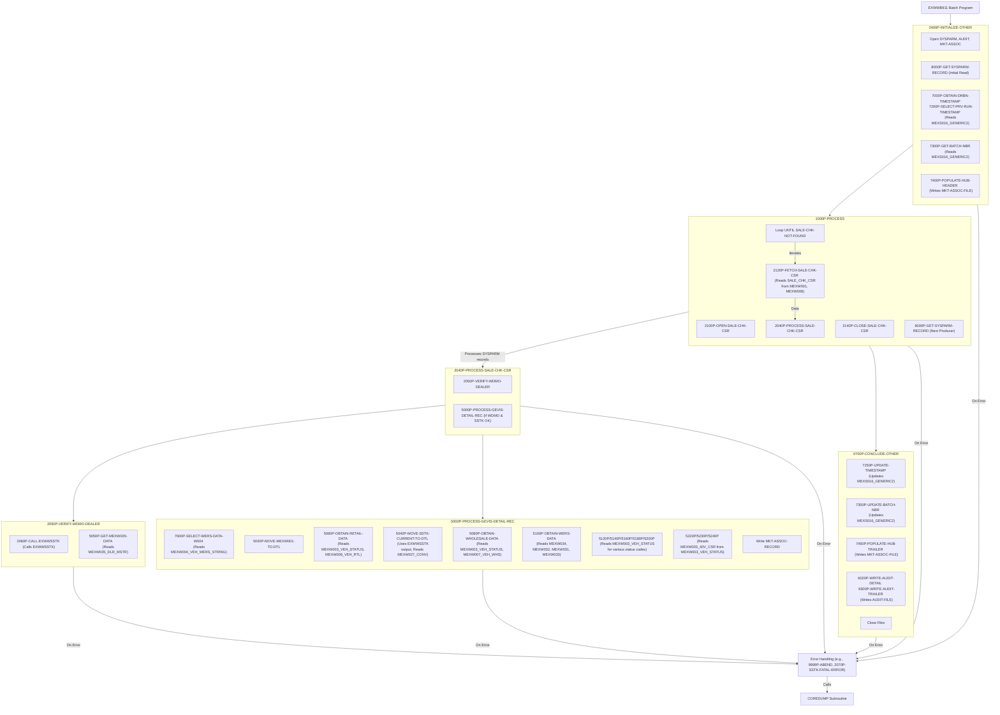

COBOL - Technical Design Specification for Modernization: EXWWB911

---

# 1. Introduction
## 1.1 Purpose
The purpose of program EXWWB911 is to extract vehicle and dealer data from various GEVIS-owned DB2 tables. This data is then used to create an outbound bridge file intended for Marketing Associates.

## 1.2 Scope
EXWWB911 is a batch program. It processes a list of producers from an input SYSPARM file one at a time. For each producer, it reads fleet sales data from `MEXW001_VEH_ORDER` and `MEXW008_VEH_RTL` tables that have been updated since the last program run. Only data associated with a current WDMO (Wholesale Dealer Marketing Organization) dealer is processed and written to the output bridge file. The program handles instances where DB2 fields might be unpopulated by outputting spaces for alphanumeric fields and zeros for numeric fields.

## 1.3 Audience
This document is intended for COBOL developers, system analysts, and testers involved in the maintenance, modernization, or understanding of the EXWWB911 program and its interfaces.

# 2. Overview
## 2.1 Background
EXWWB911 was originally created in November 2011 to provide Marketing Associates with vehicle and dealer data. It has undergone several revisions to modify its processing logic, such as removing a call to subroutine EXWWSWER, changing error handling for missing data in `MEXW027_CONV`, updating SQL queries for `MEXW034_VL_BRAND` and `MEXW032_CATALOG`, and refining criteria for `MEXW003_VEH_STATUS` to pull specific wholesale data. The output file `FDEX.WW.PROD.EXWWB490.MKTASC.FLTSLS` is picked up by Marketing Associates using FTP ID `FDFTPMK`.

## 2.2 Objectives
The primary objective of EXWWB911 is to:
*   Read a list of producers from the SYSPARM file.
*   For each producer, extract relevant vehicle and dealer data from GEVIS DB2 tables, focusing on fleet sales updated since the last run.
*   Filter data to include only records associated with current WDMO dealers.
*   Create an outbound bridge file formatted for Marketing Associates.
*   Maintain run control information (timestamp, batch number) in `MEXS016_GENERIC2`.
*   Provide an audit trail of its processing.

## 2.3 Assumptions and Constraints
*   The input SYSPARM file (`PARMFILE`) contains a list of producers to be processed.
*   DB2 tables (`MEXW001_VEH_ORDER`, `MEXW008_VEH_RTL`, `MEXW003_VEH_STATUS`, `MEXW004_VEH_WERS_STRING`, `MEXW007_VEH_WHS`, `MEXS016_GENERIC2`, `MEXW021_SUBLVL_ASG`, `MEXW027_CONV`, `MEXW031_CATMAP`, `MEXW032_CATALOG`, `MEXW033_BODY_TYPE`, `MEXW034_VL_BRAND`, `MEXW035_DLR_MSTR`) are accessible and populated.
*   The subroutine `EXWWSSTK` is available for determining current stocking dealer information.
*   The subroutine `COREDUMP` is available for abend processing.
*   The output file for Marketing Associates is `FDEX.WW.PROD.EXWWB490.MKTASC.FLTSLS` and is transferred via FTP using ID `FDFTPMK`.
*   If a status row is not found on `MEXW027_CONV` for source 'VI', the job will end with condition code 3, and an email will be sent. The transaction will not be written to the output file.
*   Unpopulated alphanumeric fields in DB2 will be output as spaces; unpopulated numeric fields will be output as zeros.

# 3. System Architecture
## 3.1 System Context Diagram
```mermaid
graph LR
    subgraph EXWWB911_System
        P[EXWWB911]
    end

    SYSPARM[SYSPARM File]
    MKTASSOC[MKT-ASSOC-FILE <br> (FDEX.WW.PROD.EXWWB490.MKTASC.FLTSLS)]
    AUDIT[AUDIT-FILE]
    DB2[(DB2 Database)]
    EXWWSSTK[EXWWSSTK Subroutine]
    COREDUMP[COREDUMP Subroutine]
    FTP[Marketing Associates FTP]

    SYSPARM -- Reads --> P
    P -- Reads/Updates --> DB2
    P -- Calls --> EXWWSSTK
    P -- Calls --> COREDUMP
    P -- Writes --> MKTASSOC
    P -- Writes --> AUDIT
    MKTASSOC --> FTP
```
## 3.2 Component Diagram


# 4. Detailed Design
## 4.1 Program Structure
The program EXWWB911 follows a standard batch processing structure:
1.  **Initialization Phase (`0400P-INITIALIZE-OTHER`)**:
    *   Opens input `SYSPARM-FILE`, output `MKT-ASSOC-FILE`, and extends `AUDIT-FILE`.
    *   Initializes program switches, variables, and the output record layout.
    *   Obtains the current Dearborn timestamp (`7000P-OBTAIN-DRBN-TIMESTAMP`).
    *   Retrieves the previous run's timestamp and batch number from `MEXS016_GENERIC2` (`7200P-SELECT-PRV-RUN-TIMESTAMP`, `7300P-GET-BATCH-NBR`).
    *   Calculates the current batch number.
    *   Writes audit headers (`9200P-WRITE-AUDIT-HEADER`).
    *   Reads the first record from `SYSPARM-FILE` (`8000P-GET-SYSPARM-RECORD`).
    *   Populates and writes the HUB header to `MKT-ASSOC-FILE` (`7400P-POPULATE-HUB-HEADER`).

2.  **Main Processing Phase (`1000P-PROCESS`)**:
    *   This phase is performed in a loop for each producer read from `SYSPARM-FILE` until `END-OF-SYSPARM-FILE` is true.
    *   Opens the main driving cursor `SALE_CHK_CSR` (`2100P-OPEN-SALE-CHK-CSR`). This cursor joins `MEXW001_VEH_ORDER` and `MEXW008_VEH_RTL` for fleet sales updated since the last run for the current producer.
    *   Fetches records from `SALE_CHK_CSR` (`2120P-FETCH-SALE-CHK-CSR`).
    *   For each fetched record, it processes the data via `2040P-PROCESS-SALE-CHK-CSR`:
        *   Verifies if the dealer is WDMO based by calling subroutine `EXWWSSTK` to get the current stocking dealer, then checks `MEXW035_DLR_MSTR` (`2050P-VERIFY-WDMO-DEALER`).
        *   If it's a WDMO dealer and `EXWWSSTK` call was successful, it performs `5000P-PROCESS-GEVIS-DETAIL-REC`.
            *   This involves gathering additional data by selecting from various DB2 tables (`MEXW004`, `MEXW003`, `MEXW008`, `MEXW007`, `MEXW027`, `MEXW031`, `MEXW032`, `MEXW033`, `MEXW034`) and using cursors `MEXW031_CSR` and `MEXW003_40V_CSR`.
            *   Formats and moves data to `WS-MKT-ASSOC-DETAIL-RECORD`.
            *   Writes the record to `MKT-ASSOC-FILE`.
    *   Closes `SALE_CHK_CSR` (`2140P-CLOSE-SALE-CHK-CSR`).
    *   Reads the next producer record from `SYSPARM-FILE` (`8000P-GET-SYSPARM-RECORD`).

3.  **Conclusion Phase (`0700P-CONCLUDE-OTHER`)**:
    *   Updates the run timestamp and batch number in `MEXS016_GENERIC2` (`7250P-UPDATE-TIMESTAMP`, `7350P-UPDATE-BATCH-NBR`).
    *   Populates and writes the HUB trailer to `MKT-ASSOC-FILE` (`7450P-POPULATE-HUB-TRAILER`).
    *   Writes audit detail and trailer records to `AUDIT-FILE` (`6020P-WRITE-AUDIT-DETAIL`, `9300P-WRITE-AUDIT-TRAILER`).
    *   Closes all files.
    *   Sets `RETURN-CODE` to 3 if `SEND-EMAIL` switch is 'Y' (e.g., due to missing `MEXW027` row or `EXWWSSTK` +100 error).

Error handling is performed throughout the program. SQL errors typically lead to `9999P-ABEND`, which calls `COREDUMP`. Specific conditions like missing `MEXW027` data or `EXWWSSTK` errors may set flags to send an email and set a specific return code.

## 4.2 Data Structures

### File Record Layouts:

*   **AUDIT-RECORD** (Output File `AUDIT-FILE`): Used for writing audit trail information.
    ```COBOL
    FD  AUDIT-FILE.
    01  AUDIT-RECORD.
        05  AUDIT-LABEL             PIC X(30).
        05  AUDIT-DATA              PIC X(50).
    ```
    *   Copybooks referenced: None for this specific FD, but `CPESEBWS` is used for audit message formatting.

*   **SYSPARM-RECORD** (Input File `SYSPARM-FILE`): Contains producer information to be processed.
    ```COBOL
    FD  SYSPARM-FILE.
    01  SYSPARM-RECORD              PIC X(80).
    ```
    The program uses `WS-SYSPARM-DETAIL` to structure this input:
    ```COBOL
    01  WS-SYSPARM-DETAIL.
        05  WS-SYSPARM-DATA-SRC             PIC X(02).
        05  FILLER                          PIC X(78).
    ```
    *   Copybooks referenced: None.

*   **MKT-ASSOC-RECORD** (Output File `MKT-ASSOC-FILE`): The main output bridge file for Marketing Associates.
    ```COBOL
    FD  MKT-ASSOC-FILE.
    01  MKT-ASSOC-RECORD            PIC X(1000).
    ```
    The actual data is structured using `WS-MKT-ASSOC-DETAIL-RECORD` and also HUB records from `CPEWHUB`.
    `WS-MKT-ASSOC-DETAIL-RECORD` hierarchical outline:
    ```
    01  WS-MKT-ASSOC-DETAIL-RECORD.
        05  WS-DTL-HUB-LINE-NBR             PIC 9(06).
        05  WS-DTL-HUB-REC-ID               PIC X(25).
        05  WS-DTL-HUB-REC-ID-NBR REDEFINES WS-DTL-HUB-REC-ID.
            10  WS-DTL-REC-ID-ZEROS         PIC 9(16).
            10  WS-DTL-REC-ID-NBR           PIC 9(09).
        05  WS-DTL-HUB-REC-TYPE             PIC X(03).
        05  WS-DTL-HUB-REC-SEQ-NBR          PIC 9(03).
        05  WS-DTL-VIN-FULL-C               PIC X(17).
        05  WS-DTL-DTA-DATA-SRC-C           PIC X(02).
        05  WS-DTL-BDT-MDL-YR-Y             PIC X(02).
        05  WS-DTL-GEVIS-VEH-LINE-C         PIC X(02).
        05  WS-DTL-LCL-BDYTYP-C             PIC X(05).
        05  WS-DTL-CUR-STA-STATUS-C         PIC X(03).
        05  WS-DTL-VEH-DIVISION-C           PIC X(01).
        05  WS-DTL-WMI-WMI-C                PIC X(03).
        05  WS-DTL-LCL-PLT-C                PIC X(03).
        05  WS-DTL-VWS-TOT-US-A             PIC S9(07)V99 COMP-3.
        05  WS-DTL-VEH-GBL-DLR-C            PIC X(06).
        05  WS-DTL-ORIG-VST-GBL-LOC-C       PIC X(06).
        05  WS-DTL-CURR-VST-GBL-LOC-C       PIC X(06).
        05  WS-DTL-SHIP-TO-DLR-C            PIC X(06).
        05  WS-DTL-CURR-STOCKING-DLR-C      PIC X(06).
        05  WS-DTL-CURR-DLR-C               PIC X(06).
        05  WS-DTL-WDMO-FLEET-C             PIC X(05).
        05  WS-DTL-VRS-LCL-FLEET-C          PIC X(06).
        05  WS-DTL-VRS-CST-FIRST-N          PIC X(30).
        05  WS-DTL-VRS-CST-MID-INIT-X       PIC X(01).
        05  WS-DTL-VRS-CST-LAST-N           PIC X(30).
        05  WS-DTL-VRS-CST-ADDR-1-X         PIC X(40).
        05  WS-DTL-VRS-CST-ADD-DIV2-N       PIC X(40).
        05  WS-DTL-VRS-CST-ADD-DIV1-C       PIC X(02).
        05  WS-DTL-VRS-CST-POSTAL-C         PIC X(10).
        05  WS-DTL-VRS-SALESPERSON-C        PIC X(11).
        05  WS-DTL-VRS-TYP-LCL-CUST-C       PIC X(01).
        05  WS-DTL-VEH-WDMO-ORD-TYP         PIC X(01).
        05  WS-DTL-VEH-ORD-RCPT-Y           PIC X(08).
        05  WS-DTL-VEH-SCHD-VST-TARGET-Y    PIC X(08).
        05  WS-DTL-VEH-PRODUCE-VST-STAT-Y   PIC X(08).
        05  WS-DTL-VEH-RELEASE-VST-STAT-Y   PIC X(08).
        05  WS-DTL-VEH-ARRIVAL-VST-STAT-Y   PIC X(08).
        05  WS-DTL-VEH-INVOICE-VST-STAT-Y   PIC X(08).
        05  WS-DTL-VEH-STOCK-VST-STAT-Y     PIC X(08).
        05  WS-DTL-VEH-RETAIL-VST-STAT-Y    PIC X(08).
        05  WS-DTL-VEH-DELIVER-VST-STAT-Y   PIC X(08).
        05  WS-DTL-VEH-SLSRCPT-VST-STAT-Y   PIC X(08).
        05  WS-DTL-VEH-WARRANT-VST-STAT-Y   PIC X(08).
        05  WS-DTL-VEH-CATALOG-C            PIC X(15).
        05  WS-DTL-WERS-VEH-LINE-C          PIC X(02).
        05  WS-DTL-WERS-BODY-STYLE-C        PIC X(03).
        05  WS-DTL-WERS-BRAND-C             PIC X(01).
        05  WS-DTL-VEH-PO-Y                 PIC X(08).
        05  WS-DTL-VLN-GEVIS-VL-N           PIC X(40).
        05  WS-DTL-FILLER-01                PIC X(550).
    ```
    *   Copybooks referenced: `CPEWHUB` for HUB header/trailer records written to this file.

### Called Program Interface Structures:

*   **SSTK-I-O-DATA** (for `EXWWSSTK` Subroutine): Used to pass input parameters to and receive output data from the `EXWWSSTK` subroutine.
    Hierarchical outline:
    ```
    01  SSTK-I-O-DATA.
        05  SSTK-INPUT-DATA.
            10   SSTK-MODE                    PIC X(01).
                88  SSTK-INQUIRY-MODE        VALUE "I".
                88  SSTK-UPDATE-MODE         VALUE "U".
            10   SSTK-DTA-DATA-SRC-C          PIC X(02).
            10   SSTK-VEH-ORD-ID-C            PIC X(25).
        05  SSTK-OUTPUT-DATA.
            10  SSTK-GBL-STK-DLR-C            PIC X(06).
            10  SSTK-LCL-STK-DLR-C            PIC X(07).
            10  SSTK-STK-DLR-STAT-C           PIC X(03).
            10  SSTK-STK-DLR-STAT-Y           PIC X(10).
            10  SSTK-STK-DLR-CNTRY-ISO3-C     PIC X(03).
            10  SSTK-CUR-STAT-C               PIC X(03).
            10  SSTK-CUR-LCL-STAT-C           PIC X(06).
            10  SSTK-CUR-STAT-Y               PIC X(10).
            10  SSTK-DIV-DIV-C                PIC X(02).
        05  SSTK-OUT-DATA-MSG.
            10  SSTK-PGM-ID                   PIC X(08).
            10  SSTK-RETURN-CD                PIC X(01).
                88  SSTK-SUCCESSFUL           VALUE "0".
                88  SSTK-INPUT-ERROR          VALUE "1".
                88  SSTK-DB2-ERROR            VALUE "2".
            10  SSTK-PARAGRAPH                PIC X(06).
            10  SSTK-DB2-AREA.
                15  SSTK-HOST-VAR1            PIC X(80).
                15  SSTK-HOST-VAR2            PIC X(80).
                15  SSTK-HOST-VAR3            PIC X(80).
                15  SSTK-HOST-VAR4            PIC X(80).
                15  SSTK-HOST-VAR5            PIC X(80).
                15  SSTK-HOST-VAR6            PIC X(80).
                15  SSTK-HOST-VAR7            PIC X(80).
                15  SSTK-HOST-VAR8            PIC X(80).
                15  SSTK-DB2-TABLES.
                    20  SSTK-DB2-TABLE1       PIC X(18).
                    20  SSTK-DB2-TABLE2       PIC X(18).
                    20  SSTK-DB2-TABLE3       PIC X(18).
                    20  SSTK-DB2-TABLE4       PIC X(18).
                    20  SSTK-DB2-TABLE5       PIC X(18).
                15  SSTK-SQL-FUNCTION         PIC X(12).
                15  SSTK-SQL-RETURN-CODE      PIC S9(04) COMP-3.
                15  SSTK-SQL-WARNING          PIC X(08).
                15  SSTK-SQL-ERROR-MESSAGE    PIC X(70).
                15  SSTK-SQL-FULL-ERROR.
                    20  SSTK-SQL-MSG1         PIC X(72).
                    20  SSTK-SQL-MSG2         PIC X(72).
                    20  SSTK-SQL-MSG3         PIC X(72).
                    20  SSTK-SQL-MSG4         PIC X(72).
                15  SSTK-SQLCA                PIC X(200).
        05  SSTK-FILLER                       PIC X(1596).
    ```
    *   Copybooks referenced: `CPEWSSTK`.

### Other Significant Working-Storage Structures:
The program uses numerous DCLGEN copybooks for DB2 table layouts (e.g., `CPEWD001` for `MEXW001-VEH-ORDER`, `CPEWD003` for `MEXW003-VEH-STATUS`, etc.). These define the host variables used in SQL statements.

## 4.3 Algorithms
### 4.3.1 Overall Program Logic (Condensed Pseudocode)
```
START PROGRAM EXWWB911

PERFORM 0400P-INITIALIZE-OTHER
    Open SYSPARM-FILE, AUDIT-FILE, MKT-ASSOC-FILE
    Initialize switches and variables
    PERFORM 7000P-OBTAIN-DRBN-TIMESTAMP (DB2 CURRENT TIMESTAMP)
    PERFORM 7200P-SELECT-PRV-RUN-TIMESTAMP (DB2 SELECT from MEXS016_GENERIC2 for previous timestamp)
    PERFORM 7300P-GET-BATCH-NBR (DB2 SELECT from MEXS016_GENERIC2 for previous batch number)
    Calculate PV-CURRENT-BATCH-NBR
    PERFORM 9100P-GET-CURRENT-DATE-TIME
    PERFORM 9200P-WRITE-AUDIT-HEADER
    PERFORM 8000P-GET-SYSPARM-RECORD (Read first SYSPARM record)
    PERFORM 7400P-POPULATE-HUB-HEADER (Write MKT-ASSOC-FILE header)

PERFORM 1000P-PROCESS UNTIL END-OF-SYSPARM-FILE
    PERFORM 2100P-OPEN-SALE-CHK-CSR (Open main DB2 cursor)
    PERFORM 2120P-FETCH-SALE-CHK-CSR (Fetch first record from cursor)
    PERFORM 2040P-PROCESS-SALE-CHK-CSR UNTIL SALE-CHK-NOT-FOUND
        PERFORM 2050P-VERIFY-WDMO-DEALER
            PERFORM 2060P-CALL-EXWWSSTK (Call EXWWSSTK subroutine)
            IF SSTK-SUCCESSFUL THEN
                Use SSTK-GBL-STK-DLR-C
                PERFORM 5050P-GET-MEXW035-DATA (DB2 SELECT from MEXW035_DLR_MSTR)
                IF MEXW035-FOUND AND DLR-SUB-SUBLVL1-C = 'WDM' THEN
                    SET WDMO-DEALER TO TRUE
                ELSE
                    SET NOT-WDMO-DEALER TO TRUE
                END-IF
            END-IF
        IF WDMO-DEALER AND SSTK-SUCCESSFUL THEN
            PERFORM 5000P-PROCESS-GEVIS-DETAIL-REC
                (Gather data from various DB2 tables: MEXW004, MEXW003, MEXW008, MEXW007, MEXW027, MEXW031, MEXW032, MEXW033, MEXW034)
                (Populate WS-MKT-ASSOC-DETAIL-RECORD)
                (Write MKT-ASSOC-RECORD)
        END-IF
        PERFORM 2120P-FETCH-SALE-CHK-CSR (Fetch next record from cursor)
    END-PERFORM
    PERFORM 2140P-CLOSE-SALE-CHK-CSR (Close main DB2 cursor)
    PERFORM 8000P-GET-SYSPARM-RECORD (Read next SYSPARM record)
END-PERFORM

PERFORM 0700P-CONCLUDE-OTHER
    PERFORM 7250P-UPDATE-TIMESTAMP (DB2 UPDATE MEXS016_GENERIC2 with current timestamp)
    PERFORM 7350P-UPDATE-BATCH-NBR (DB2 UPDATE MEXS016_GENERIC2 with current batch number)
    PERFORM 7450P-POPULATE-HUB-TRAILER (Write MKT-ASSOC-FILE trailer)
    PERFORM 6020P-WRITE-AUDIT-DETAIL
    PERFORM 9100P-GET-CURRENT-DATE-TIME
    PERFORM 9300P-WRITE-AUDIT-TRAILER
    Close SYSPARM-FILE, AUDIT-FILE, MKT-ASSOC-FILE

IF SEND-EMAIL THEN
    SET RETURN-CODE TO 3
END-IF
GOBACK
END PROGRAM EXWWB911
```

### 4.3.2 Key Algorithmic Details
*   **Producer Processing**: The program iterates through producer codes supplied in the `SYSPARM-FILE`. For each producer, it re-opens and processes the `SALE_CHK_CSR`.
*   **Main Data Extraction (`SALE_CHK_CSR`)**: This cursor selects fleet sales data from `MEXW001_VEH_ORDER` (aliased as `VEH`) and `MEXW008_VEH_RTL` (aliased as `VRS`). It filters by `VRS.DTA_DATA_SRC_C` (from SYSPARM), `VRS.VRS_UPDT_S` (greater than previous run timestamp), `VRS.VRS_ACTIVE_F` ('Y'), and specific `VRS.VRS_TYP_LCL_CUST_C` values. It also ensures `VEH.VEH_VIN_FULL_C` is not blank and `VEH.VEH_ACTIVE_F` is 'Y'.
*   **WDMO Dealer Verification (`2050P-VERIFY-WDMO-DEALER`)**:
    1.  Calls `EXWWSSTK` (`2060P-CALL-EXWWSSTK`) with the vehicle order ID and data source to get current stocking dealer (`SSTK-GBL-STK-DLR-C`).
    2.  If `EXWWSSTK` is successful, it uses `SSTK-GBL-STK-DLR-C` to query `MEXW035_DLR_MSTR` (`5050P-GET-MEXW035-DATA`).
    3.  If a record is found in `MEXW035_DLR_MSTR` and `DLR-SUB-SUBLVL1-C` is 'WDM', the dealer is considered a WDMO dealer.
*   **GEVIS Detail Record Processing (`5000P-PROCESS-GEVIS-DETAIL-REC`)**:
    1.  Initializes WERS string data and attempts to select WERS data from `MEXW004_VEH_WERS_STRING` (`7600P-SELECT-WERS-DATA-W004`).
    2.  Moves data from the `SALE_CHK_CSR` (from `MEXW001_VEH_ORDER` fields) to the output record (`5020P-MOVE-MEXW001-TO-DTL`). This includes deriving body style from WERS string if available, or from `MEXW031_CATMAP` or `VEH-LCL-BDYTYP-C`.
    3.  Obtains retail data from `MEXW003_VEH_STATUS` and `MEXW008_VEH_RTL` for '90V' status (`5060P-OBTAIN-RETAIL-DATA`).
    4.  Moves current stocking dealer info (from `EXWWSSTK` output) and converts status code using `MEXW027_CONV` (`5040P-MOVE-SSTK-CURRENT-TO-DTL`). Handles special logic for status '800' vs '801' or '600'.
    5.  Obtains wholesale data from `MEXW003_VEH_STATUS` and `MEXW007_VEH_WHS` for '40V' status (`5080P-OBTAIN-WHOLESALE-DATA`).
    6.  Obtains detailed WERS data (`5100P-OBTAIN-WERS-DATA`) by conditionally selecting from `MEXW034_VL_BRAND`, `MEXW032_CATALOG`, `MEXW031_CATMAP`, and `MEXW033_BODY_TYPE` based on data source and availability of WERS string from `MEXW004`.
    7.  Obtains various vehicle status dates (Scheduled Target '20T', Produced '30R' or '30P', Released '30T', Arrived '80F') by selecting from `MEXW003_VEH_STATUS` (`5120P`, `5140P`, `5160P`, `5180P`, `5200P`).
    8.  Obtains original invoicing dealer using `MEXW003_40V_CSR` (`5220P` to `5240P`).
    9.  If `MEXW027_CONV` lookup was successful, increments counters, populates HUB record IDs, and writes `WS-MKT-ASSOC-DETAIL-RECORD` to `MKT-ASSOC-FILE`.
*   **Timestamp and Batch Number Management**:
    *   At startup, reads previous run timestamp and batch number from `MEXS016_GENERIC2`.
    *   At conclusion, updates `MEXS016_GENERIC2` with the current run's start timestamp and the incremented batch number.
*   **WERS Body Style Derivation (`5020P`, `5100P`)**:
    *   If WERS string found (`WERS-STRING-FOUND-SW` from `7600P`): `WS-DTL-LCL-BDYTYP-C` = `VWR-WERS-STRING-X-TEXT(10:2)`. `WS-DTL-WERS-BODY-STYLE-C` = `VWR-WERS-PRD-TP-C` + `VWR-WERS-STRING-X-TEXT(10:2)`.
    *   Else (No WERS string):
        *   Open/Fetch/Close `MEXW031_CSR` (`5300P` to `5340P`).
        *   If `MEXW031_FOUND`: `WS-DTL-LCL-BDYTYP-C` = `CTM-OPT-OPTION-C`. `WS-DTL-WERS-BODY-STYLE-C` = `CTM-VPT-PROD-TYP-C` + `CTM-OPT-OPTION-C`.
        *   Else (`MEXW031_NOT_FOUND`): `WS-DTL-LCL-BDYTYP-C` = `VEH-LCL-BDYTYP-C`.
            *   If data source is 'EA' or 'NA': Perform `5115P-SELECT-MEXW033-DATA`. If found and `BDT-WERS-BDY-TYP-C` > SPACES: `WS-DTL-WERS-BODY-STYLE-C` = `VLN-WERS-PRD-TP-C` (from `MEXW034` via `5110P`) + `BDT-WERS-BDY-TYP-C`.

## 4.4 Input/Output Specifications
*   **Input Files**:
    *   `SYSPARM-FILE` (Logical name: `PARMFILE`): Sequential file containing producer codes (data source codes) to process. Record layout: `SYSPARM-RECORD PIC X(80)`, structured by `WS-SYSPARM-DETAIL`.
*   **Output Files**:
    *   `MKT-ASSOC-FILE` (Logical name: `MKTASSOC`): Sequential file, the primary output bridge file. Record layout: `MKT-ASSOC-RECORD PIC X(1000)`. Contains HUB header, detail records from `WS-MKT-ASSOC-DETAIL-RECORD`, and HUB trailer. Dataset name: `FDEX.WW.PROD.EXWWB490.MKTASC.FLTSLS`.
    *   `AUDIT-FILE` (Logical name: `AUDIT`): Sequential file for audit trail messages. Record layout: `AUDIT-RECORD` (label `PIC X(30)`, data `PIC X(50)`).
*   **External Interfaces**:
    *   DB2 Tables: See section 4.5.
    *   Called Subroutines: See section 4.7.
    *   FTP: The `MKT-ASSOC-FILE` is picked up by Marketing Associates using FTP ID `FDFTPMK`.

## 4.5 DB2 Database Details

### Cursors:

1.  **`SALE_CHK_CSR`**: Main driving cursor to select fleet sales data.
    ```SQL
    EXEC SQL
    DECLARE  SALE_CHK_CSR CURSOR FOR
    SELECT  VEH.VEH_VIN_FULL_C
           ,VEH.VEH_ORD_ID_C
           ,VEH.DTA_DATA_SRC_C
           ,VEH.BDT_MDL_YR_Y
           ,VEH.WMI_WMI_C
           ,VEH.VEH_LCL_PLT_C
           ,VEH.VEH_LCL_BDYTYP_C
           ,VEH.VEH_GBL_ORD_DLR_C
           ,VEH.VEH_GBL_SHIP_TO_C
           ,VEH.VEH_ORD_RCPT_Y
           ,VEH.VEH_WDMO_FLEET_C
           ,VEH.VEH_WDMO_ORD_TYP
           ,VEH.VEH_CATALOG_C
           ,VEH.VEH_GBL_CATALOG_C
           ,VEH.VEH_PO_Y
           ,VEH.VEH_GEVIS_VL_C
           ,VEH.COUNTRY_ISO3_C
    FROM  MEXW001_VEH_ORDER VEH
         ,MEXW008_VEH_RTL   VRS
    WHERE  VRS.DTA_DATA_SRC_C = :VRS-DTA-DATA-SRC-C
      AND  VRS.VRS_UPDT_S     > :PV-PREV-RUN-TIMESTAMP
      AND  VRS.VRS_ACTIVE_F   = :PL-Y
      AND  VRS.VRS_TYP_LCL_CUST_C IN (:PL-F1,
                                      :PL-7,
                                      :PL-F2,
                                      :PL-3,
                                      :PL-F3,
                                      :PL-T,
                                      :PL-F4,
                                      :PL-4,
                                      :PL-L2,
                                      :PL-L4,
                                      :PL-D)
      AND  VEH.VEH_ORD_ID_C   = VRS.VEH_ORD_ID_C
      AND  VEH.DTA_DATA_SRC_C = VRS.DTA_DATA_SRC_C
      AND  VEH.VEH_VIN_FULL_C > :PL-VEH-VIN-BLANK
      AND  VEH.VEH_ACTIVE_F   = :PL-Y
    END-EXEC
    ```
    *   Tables Referenced: `MEXW001_VEH_ORDER`, `MEXW008_VEH_RTL`

2.  **`MEXW031_CSR`**: Selects option and product type from `MEXW031_CATMAP`.
    ```SQL
    EXEC SQL
    DECLARE  MEXW031_CSR CURSOR FOR
    SELECT  OPT_OPTION_C
           ,VPT_PROD_TYP_C
    FROM  MEXW031_CATMAP
    WHERE  DTA_DATA_SRC_C    = :CTM-DTA-DATA-SRC-C
      AND  CTM_LCL_CATALOG_C = :CTM-LCL-CATALOG-C
      AND  OFM_OPTION_FAM_C IN (:PL-BS, :PL-CA)
    OPTIMIZE FOR 1 ROW
    END-EXEC
    ```
    *   Tables Referenced: `MEXW031_CATMAP`

3.  **`MEXW003_40V_CSR`**: Retrieves original invoicing dealer from `MEXW003_VEH_STATUS`.
    ```SQL
    EXEC SQL
    DECLARE  MEXW003_40V_CSR CURSOR FOR
    SELECT  VST_GBL_LOC_C
    FROM  MEXW003_VEH_STATUS
    WHERE  VEH_ORD_ID_C       = :VST-VEH-ORD-ID-C
      AND  DTA_DATA_SRC_C     = :VST-DTA-DATA-SRC-C
      AND  STA_STATUS_C       = :VST-STA-STATUS-C  -- Expected :PL-40V
      AND  VST_ACTIVE_F       = :VST-ACTIVE-F      -- Expected :PL-Y
      AND  VST_STAT_TYP_C     = :VST-STAT-TYP-C    -- Expected :PL-D
      AND  VST_CUR_DATA_SRC_C = :VST-CUR-DATA-SRC-C -- Expected :PL-WD
    ORDER BY  VST_STAT_Y  DESC
             ,VST_STATIC_ISRT_REC_S  DESC
    END-EXEC
    ```
    *   Tables Referenced: `MEXW003_VEH_STATUS`

### Singleton SQL Statements:

1.  **Get Current Timestamp (`7000P-OBTAIN-DRBN-TIMESTAMP`)**:
    ```SQL
    EXEC SQL
    SET  :PV-CURR-DRBN-TIMESTAMP  = CURRENT TIMESTAMP
    END-EXEC
    ```
    *   Tables Referenced: None (DB2 special register)

2.  **Select Previous Run Timestamp (`7200P-SELECT-PRV-RUN-TIMESTAMP`)**:
    ```SQL
    EXEC SQL
    SELECT GNT_ATTRIBUTE_DATA
    INTO  :GNT-ATTRIBUTE-DATA
    FROM   MEXS016_GENERIC2
    WHERE  GNT_SYSTEM_CD    = :GNT-SYSTEM-CD         -- Input: PL-SYSTEM-ID
    AND    GNT_TABLE_ID     = :GNT-TABLE-ID          -- Input: PL-TABLE-ID
    AND    GNT_KEY_DATA     = :GNT-KEY-DATA          -- Input: PL-KEY-DATA-TIMESTAMP
    AND    GNT_SW_ACTIVE LIKE :GNT-SW-ACTIVE         -- Input: PL-Y
    END-EXEC
    ```
    *   Tables Referenced: `MEXS016_GENERIC2`

3.  **Update Run Timestamp (`7250P-UPDATE-TIMESTAMP`)**:
    ```SQL
    EXEC SQL
    UPDATE MEXS016_GENERIC2
    SET    GNT_ATTRIBUTE_DATA = :GNT-ATTRIBUTE-DATA  -- Input: PV-CURR-DRBN-TIMESTAMP
    WHERE  GNT_SYSTEM_CD      = :GNT-SYSTEM-CD       -- Input: PL-SYSTEM-ID
    AND    GNT_TABLE_ID       = :GNT-TABLE-ID        -- Input: PL-TABLE-ID
    AND    GNT_KEY_DATA       = :GNT-KEY-DATA        -- Input: PL-KEY-DATA-TIMESTAMP
    END-EXEC
    ```
    *   Tables Referenced: `MEXS016_GENERIC2`

4.  **Select Previous Batch Number (`7300P-GET-BATCH-NBR`)**:
    ```SQL
    EXEC SQL
    SELECT GNT_ATTRIBUTE_DATA
    INTO  :GNT-ATTRIBUTE-DATA
    FROM   MEXS016_GENERIC2
    WHERE  GNT_SYSTEM_CD    = :GNT-SYSTEM-CD         -- Input: PL-SYSTEM-ID
    AND    GNT_TABLE_ID     = :GNT-TABLE-ID          -- Input: PL-TABLE-ID
    AND    GNT_KEY_DATA     = :GNT-KEY-DATA          -- Input: PL-KEY-DATA-BATCHCTL
    AND    GNT_SW_ACTIVE LIKE :GNT-SW-ACTIVE         -- Input: PL-Y
    END-EXEC
    ```
    *   Tables Referenced: `MEXS016_GENERIC2`

5.  **Update Batch Number (`7350P-UPDATE-BATCH-NBR`)**:
    ```SQL
    EXEC SQL
    UPDATE MEXS016_GENERIC2
    SET    GNT_ATTRIBUTE_DATA = :GNT-ATTRIBUTE-DATA  -- Input: PV-CURRENT-BATCH-NBR
    WHERE  GNT_SYSTEM_CD      = :GNT-SYSTEM-CD       -- Input: PL-SYSTEM-ID
    AND    GNT_TABLE_ID       = :GNT-TABLE-ID        -- Input: PL-TABLE-ID
    AND    GNT_KEY_DATA       = :GNT-KEY-DATA        -- Input: PL-KEY-DATA-BATCHCTL
    END-EXEC
    ```
    *   Tables Referenced: `MEXS016_GENERIC2`

6.  **Select WERS Data from MEXW004 (`7600P-SELECT-WERS-DATA-W004`)**:
    ```SQL
    EXEC SQL
    SELECT  VWR_WERS_STRING_X
           ,VWR_WERS_VL_C
           ,VWR_WERS_PRD_TP_C
           ,VWR_MAJ_FEAT_DFNED_F
    INTO :VWR-WERS-STRING-X
        ,:VWR-WERS-VL-C
        ,:VWR-WERS-PRD-TP-C
        ,:VWR-MAJ-FEAT-DFNED-F
    FROM  MEXW004_VEH_WERS_STRING
    WHERE  VEH_ORD_ID_C     =  :VWR-VEH-ORD-ID-C
      AND  DTA_DATA_SRC_C   =  :VWR-DTA-DATA-SRC-C
    END-EXEC
    ```
    *   Tables Referenced: `MEXW004_VEH_WERS_STRING`

7.  **Select from MEXW027_CONV (`5045P-SELECT-MEXW027-DATA`)**:
    ```SQL
    EXEC SQL
    SELECT  CNT_LCL_DATA_X
    INTO :CNT-LCL-DATA-X
    FROM  MEXW027_CONV
    WHERE  CND_CNV_TYP_C     = :CNT-CND-CNV-TYP-C   -- Input: PL-STATUS
      AND  DTA_DATA_SRC_C    = :CNT-DTA-DATA-SRC-C  -- Input: PL-VI
      AND  CNT_GBL_DATA_X    = :CNT-GBL-DATA-X    -- Input: SSTK-CUR-STAT-C
    END-EXEC
    ```
    *   Tables Referenced: `MEXW027_CONV`

8.  **Select from MEXW035_DLR_MSTR (`5050P-GET-MEXW035-DATA`)**:
    ```SQL
    EXEC SQL
    SELECT  SUB_SUBLVL1_C
           ,DLR_SUPER_DLR_C
    INTO :DLR-SUB-SUBLVL1-C
        ,:DLR-SUPER-DLR-C
    FROM  MEXW035_DLR_MSTR
    WHERE  DLR_DLR_C           = :DLR-DLR-DLR-C
    END-EXEC
    ```
    *   Tables Referenced: `MEXW035_DLR_MSTR`

9.  **Select Retail Data from MEXW003/MEXW008 (`5065P-SELECT-MEXW008-90V-DATA`)**:
    ```SQL
    EXEC SQL
    SELECT  A.VST_STAT_Y
           ,B.VRS_LCL_FLEET_C
           ,B.VRS_CST_FIRST_N
           ,B.VRS_CST_BUS_1_N
           ,B.VRS_CST_BUS_2_N
           ,B.VRS_CST_MID_INIT_X
           ,B.VRS_CST_LAST_N
           ,B.VRS_CST_ADDR_1_X
           ,B.VRS_CST_ADD_DIV2_N
           ,B.VRS_CST_ADD_DIV1_C
           ,B.VRS_CST_POSTAL_C
           ,B.VRS_SALESPERSON_C
           ,B.VRS_TYP_LCL_CUST_C
           ,B.VRS_RPT_SALE_Y
           ,B.VRS_WARR_STRT_Y
    INTO  :VST-STAT-Y
         ,:VRS-LCL-FLEET-C
         ,:VRS-CST-FIRST-N
         ,:VRS-CST-BUS-1-N
         ,:VRS-CST-BUS-2-N
         ,:VRS-CST-MID-INIT-X
         ,:VRS-CST-LAST-N
         ,:VRS-CST-ADDR-1-X
         ,:VRS-CST-ADD-DIV2-N
         ,:VRS-CST-ADD-DIV1-C
         ,:VRS-CST-POSTAL-C
         ,:VRS-SALESPERSON-C
         ,:VRS-TYP-LCL-CUST-C
         ,:VRS-RPT-SALE-Y
         ,:VRS-WARR-STRT-Y
    FROM  MEXW003_VEH_STATUS A
         ,MEXW008_VEH_RTL B
    WHERE  A.VEH_ORD_ID_C      = :VST-VEH-ORD-ID-C
      AND  A.DTA_DATA_SRC_C    = :VST-DTA-DATA-SRC-C
      AND  A.STA_STATUS_C      = :VST-STA-STATUS-C    -- Input: PL-90V
      AND  A.VST_LAST_OCCUR_F  = :VST-LAST-OCCUR-F    -- Input: PL-Y
      AND  A.VST_ACTIVE_F      = :VST-ACTIVE-F        -- Input: PL-Y
      AND  A.VST_ACTIVE_F      = B.VRS_ACTIVE_F
      AND  A.STA_STATUS_C      = B.STA_STATUS_C
      AND  A.VEH_ORD_ID_C      = B.VEH_ORD_ID_C
      AND  A.DTA_DATA_SRC_C    = B.DTA_DATA_SRC_C
      AND  SUBSTR(A.VST_LCL_LOC_C, 1,7) = B.VRS_LCL_DLR_C
      AND  A.VST_STAT_Y        = B.VRS_RETAIL_Y
    END-EXEC
    ```
    *   Tables Referenced: `MEXW003_VEH_STATUS`, `MEXW008_VEH_RTL`

10. **Select Wholesale Data from MEXW003/MEXW007 (`5085P-SELECT-MEXW003-40V`)**:
    ```SQL
    EXEC SQL
    SELECT A.VST_GBL_LOC_C
          ,A.VST_STAT_Y
          ,B.VWS_TOT_LCL_A
          ,B.CUR_CURRENCY_C
    INTO  :VST-GBL-LOC-C
         ,:VST-STAT-Y
         ,:VWS-TOT-LCL-A
         ,:VWS-CUR-CURRENCY-C
    FROM  MEXW003_VEH_STATUS A
         ,MEXW007_VEH_WHS B
    WHERE  A.VEH_ORD_ID_C      = :VST-VEH-ORD-ID-C
      AND  A.DTA_DATA_SRC_C    = :VST-DTA-DATA-SRC-C
      AND  A.STA_STATUS_C      = :VST-STA-STATUS-C    -- Input: PL-40V
      AND  A.VST_LAST_OCCUR_F  = :VST-LAST-OCCUR-F    -- Input: PL-Y
      AND  A.VST_ACTIVE_F      = :VST-ACTIVE-F        -- Input: PL-Y
      AND  A.VST_ACTIVE_F      = B.VWS_ACTIVE_F
      AND  A.STA_STATUS_C      = B.STA_STATUS_C
      AND  A.VEH_ORD_ID_C      = B.VEH_ORD_ID_C
      AND  A.DTA_DATA_SRC_C    = B.DTA_DATA_SRC_C
      AND  A.VST_STAT_Y        = B.VWS_DATE_Y
      AND  SUBSTR(A.VST_LCL_LOC_C, 1,7) = B.VWS_LCL_DLR_C
    END-EXEC
    ```
    *   Tables Referenced: `MEXW003_VEH_STATUS`, `MEXW007_VEH_WHS`

11. **Select from MEXW034_VL_BRAND (`5110P-SELECT-W034-DATA`)**:
    ```SQL
    EXEC SQL
    SELECT   VLN_WERS_VL_C
            ,VLN_WERS_PRD_TP_C
            ,VLN_WERS_BRAND_C
            ,VLN_GEVIS_VL_N
    INTO  :VLN-WERS-VL-C
         ,:VLN-WERS-PRD-TP-C
         ,:VLN-WERS-BRAND-C
         ,:VLN-GEVIS-VL-N
    FROM  MEXW034_VL_BRAND
    WHERE  DTA_DATA_SRC_C    = :VLN-DTA-DATA-SRC-C
      AND  VLN_GEVIS_VL_C    = :VLN-GEVIS-VL-C
      AND  VLN_ACTIVE_F      = :VLN-ACTIVE-F      -- Input: PL-Y
    END-EXEC
    ```
    *   Tables Referenced: `MEXW034_VL_BRAND`

12. **Select from MEXW032_CATALOG (`5112P-SELECT-MEXW032-WERS-VL`)**:
    ```SQL
    EXEC SQL
    SELECT  VHL_VEH_LINE_C
           ,VPT_PROD_TYP_C
    INTO :CTG-VHL-VEH-LINE-C
        ,:CTG-VPT-PROD-TYP-C
    FROM  MEXW032_CATALOG
    WHERE DTA_DATA_SRC_C    =  :CTG-DTA-DATA-SRC-C
      AND CTG_LCL_CATALOG_C =  :CTG-LCL-CATALOG-C
    END-EXEC
    ```
    *   Tables Referenced: `MEXW032_CATALOG`

13. **Select from MEXW034_VL_BRAND (`5114P-SELECT-MEXW034-GEVIS-VL`)**:
    ```SQL
    EXEC SQL
    SELECT  VLN_GEVIS_VL_C
           ,VLN_WERS_PRD_TP_C
           ,VLN_WERS_BRAND_C
           ,VLN_GEVIS_VL_N
    INTO :VLN-GEVIS-VL-C
        ,:VLN-WERS-PRD-TP-C
        ,:VLN-WERS-BRAND-C
        ,:VLN-GEVIS-VL-N
    FROM  MEXW034_VL_BRAND
    WHERE  DTA_DATA_SRC_C    = :VLN-DTA-DATA-SRC-C
      AND  VLN_WERS_VL_C     = :VLN-WERS-VL-C
      AND  VLN_ACTIVE_F      = :VLN-ACTIVE-F          -- Input: PL-Y
      AND  VLN_WERS_PRD_TP_C = :VLN-WERS-PRD-TP-C
    END-EXEC
    ```
    *   Tables Referenced: `MEXW034_VL_BRAND`

14. **Select from MEXW033_BODY_TYPE (`5115P-SELECT-MEXW033-DATA`)**:
    ```SQL
    EXEC SQL
    SELECT  BDT_WERS_BDY_TYP_C
    INTO :BDT-WERS-BDY-TYP-C
    FROM  MEXW033_BODY_TYPE
    WHERE  BDT_PROD_SRC_C  = :BDT-PROD-SRC-C
      AND  BDT_BDY_TYP_C   = :BDT-BDY-TYP-C
      AND  BDT_START_YR_R <= :BDT-START-YR-R
      AND  BDT_END_YR_R   >= :BDT-END-YR-R
    END-EXEC
    ```
    *   Tables Referenced: `MEXW033_BODY_TYPE`

15. **Select MEXW003 Status 20T (`5120P-OBTAIN-MEXW003-20T`)**:
    ```SQL
    EXEC SQL
    SELECT  VST_STAT_Y
    INTO :VST-STAT-Y
    FROM  MEXW003_VEH_STATUS
    WHERE  VEH_ORD_ID_C      = :VST-VEH-ORD-ID-C
      AND  DTA_DATA_SRC_C    = :VST-DTA-DATA-SRC-C
      AND  STA_STATUS_C      = :VST-STA-STATUS-C    -- Input: PL-20T
      AND  VST_LAST_OCCUR_F  = :VST-LAST-OCCUR-F    -- Input: PL-Y
      AND  VST_ACTIVE_F      = :VST-ACTIVE-F        -- Input: PL-Y
    END-EXEC
    ```
    *   Tables Referenced: `MEXW003_VEH_STATUS`
    *(Similar SQL statements exist for statuses 30R, 30P, 30T, 80F in paragraphs `5140P`, `5160P`, `5180P`, `5200P` respectively, changing `:VST-STA-STATUS-C` value.)*

## 4.6 IMS Database Details
No IMS databases are referenced in the program.

## 4.7 Called Sub-routine/Program Details
*   **EXWWSSTK**:
    *   **Purpose**: Called in `2060P-CALL-EXWWSSTK` to obtain the current stocking dealer (`SSTK-GBL-STK-DLR-C`), current stocking dealer status code (`SSTK-CUR-STAT-C`), and current stocking dealer status date (`SSTK-CUR-STAT-Y`) for a given vehicle order ID and data source.
    *   **Interface**: Uses `SSTK-I-O-DATA` (defined in `CPEWSSTK` copybook).
        *   Input: `SSTK-MODE` (set to 'I' for inquiry), `SSTK-DTA-DATA-SRC-C`, `SSTK-VEH-ORD-ID-C`.
        *   Output: `SSTK-GBL-STK-DLR-C`, `SSTK-LCL-STK-DLR-C`, `SSTK-STK-DLR-STAT-C`, `SSTK-STK-DLR-STAT-Y`, `SSTK-CUR-STAT-C`, `SSTK-CUR-STAT-Y`, etc., and error/status fields in `SSTK-OUT-DATA-MSG`.
*   **COREDUMP**:
    *   **Purpose**: Called in `9999P-ABEND` and `2070P-SSTK-FATAL-ERROR` (if `SSTK-SQL-RETURN-CODE` is not +100) to force a program abend.
    *   **Interface**: No parameters explicitly shown in the CALL statement within `EXWWB911`. Standard system abend.

## 4.8 VSAM File Details
No VSAM files are referenced in the program.

## 4.9 IBM MQ Details
No IBM MQ interfaces are referenced in the program.

## 4.10 CICS Details
This program is a batch program and does not involve CICS transactions.

## 4.11 Error Handling

*   **Paragraph Name**: `0000P-MAINLINE`
    *   **Trigger Condition(s):**
        *   `SEND-EMAIL` switch is 'Y' at the end of processing. This switch is set by `2070P-SSTK-FATAL-ERROR` if `EXWWSSTK` returns SQLCODE +100, or by `9050P-MISSING-MEXW027-ROW` if `MEXW027_CONV` lookup fails.
    *   **Action Taken:**
        *   Sets `RETURN-CODE` to 3.
    *   **Status Codes / Messages / Variables affected:**
        *   `RETURN-CODE = 3`

*   **Paragraph Name**: `2070P-SSTK-FATAL-ERROR` (Called when `EXWWSSTK` returns `SSTK-DB2-ERROR`)
    *   **Trigger Condition(s):**
        *   `EXWWSSTK` subroutine call results in `SSTK-DB2-ERROR`.
    *   **Action Taken:**
        *   Writes detailed error information from `SSTK-I-O-DATA` (program ID, return code, paragraph, table names, host variables, SQL code, SQL messages) to `AUDIT-FILE`.
        *   If `SSTK-SQL-RETURN-CODE` = +100:
            *   Sets `SEND-EMAIL` switch to 'Y'.
            *   Increments `PV-NBR-EXWWSSTK-NOTFOUND-CALLS`.
        *   Else (other SQL errors from `EXWWSSTK`):
            *   Performs `9999C-CALL-COREDUMP` to abend the program.
    *   **Status Codes / Messages / Variables affected:**
        *   `AUDIT-FILE` receives error details.
        *   `SEND-EMAIL` = 'Y' (if +100).
        *   `PV-NBR-EXWWSSTK-NOTFOUND-CALLS` incremented (if +100).
        *   Program abend (if not +100).

*   **Paragraph Name**: `2100P-OPEN-SALE-CHK-CSR`
    *   **Trigger Condition(s):**
        *   `SQLCODE` is not OK after `OPEN SALE_CHK_CSR`.
    *   **Action Taken:**
        *   Populates `DB2-ABEND-SQLCODE`, `DB2-ABEND-FUNCTION` ("OPEN"), `DB2-ABEND-TABLE` (`PL-SALE-CHK-CSR`).
        *   Moves `DB2-ABEND-MSG` to `ABEND-MSG`.
        *   Sets `ABEND-PARAGRAPH` to "2100P".
        *   Performs `9999P-ABEND`.
    *   **Status Codes / Messages / Variables affected:**
        *   Abend process initiated.

*   **Paragraph Name**: `2120P-FETCH-SALE-CHK-CSR`
    *   **Trigger Condition(s):**
        *   `SQLCODE` is not OK and not +100 (END-OF-CURSOR) after `FETCH SALE_CHK_CSR`.
    *   **Action Taken:**
        *   Populates `DB2-ABEND-SQLCODE`, `DB2-ABEND-FUNCTION` ("FETCH"), `DB2-ABEND-TABLE` (`PL-SALE-CHK-CSR`).
        *   Moves `DB2-ABEND-MSG` to `ABEND-MSG`.
        *   Sets `ABEND-PARAGRAPH` to "2120P".
        *   Performs `9999P-ABEND`.
    *   **Status Codes / Messages / Variables affected:**
        *   Abend process initiated.

*   **Paragraph Name**: `2140P-CLOSE-SALE-CHK-CSR`
    *   **Trigger Condition(s):**
        *   `SQLCODE` is not OK after `CLOSE SALE_CHK_CSR`.
    *   **Action Taken:**
        *   Populates `DB2-ABEND-SQLCODE`, `DB2-ABEND-FUNCTION` ("CLOSE"), `DB2-ABEND-TABLE` (`PL-SALE-CHK-CSR`).
        *   Moves `DB2-ABEND-MSG` to `ABEND-MSG`.
        *   Sets `ABEND-PARAGRAPH` to "2140P".
        *   Performs `9999P-ABEND`.
    *   **Status Codes / Messages / Variables affected:**
        *   Abend process initiated.

*   **Paragraph Name**: `5045P-SELECT-MEXW027-DATA`
    *   **Trigger Condition(s):**
        *   `SQLCODE` is not OK and not +100 (NOT-FOUND) after `SELECT` from `MEXW027_CONV`.
    *   **Action Taken:**
        *   Populates `DB2-ABEND-SQLCODE`, `DB2-ABEND-FUNCTION` ("SELECT"), `DB2-ABEND-TABLE` (`PL-TBL-CONV`).
        *   Moves `DB2-ABEND-MSG` to `ABEND-MSG`.
        *   Sets `ABEND-PARAGRAPH` to "5045P".
        *   Performs `9999P-ABEND`.
    *   **Status Codes / Messages / Variables affected:**
        *   Abend process initiated.
    *   **Trigger Condition(s):** `SQLCODE` = +100 (NOT-FOUND)
    *   **Action Taken:** Sets `MEXW027-NOT-FOUND` to TRUE. This is handled in `5040P-MOVE-SSTK-CURRENT-TO-DTL` which then calls `9050P-MISSING-MEXW027-ROW`.

*   **Paragraph Name**: `5050P-GET-MEXW035-DATA`
    *   **Trigger Condition(s):**
        *   `SQLCODE` is not OK and not +100 (NOT-FOUND) after `SELECT` from `MEXW035_DLR_MSTR`.
    *   **Action Taken:**
        *   Populates `DB2-ABEND-SQLCODE`, `DB2-ABEND-FUNCTION` ("SELECT"), `DB2-ABEND-TABLE` (`PL-TBL-DLR-MSTR`).
        *   Moves `DB2-ABEND-MSG` to `ABEND-MSG`.
        *   Sets `ABEND-PARAGRAPH` to "5050P".
        *   Performs `9999P-ABEND`.
    *   **Status Codes / Messages / Variables affected:**
        *   Abend process initiated.
    *   **Trigger Condition(s):** `SQLCODE` = +100 (NOT-FOUND)
    *   **Action Taken:** Sets `MEXW035-NOT-FOUND` to TRUE. Performs `9000P-MISSING-MEXW035-ROW`.

*   **Paragraph Name**: `5065P-SELECT-MEXW008-90V-DATA` (and similar DB2 SELECT paragraphs like `5085P`, `5110P`, `5112P`, `5114P`, `5115P`, `5120P`, `5140P`, `5160P`, `5180P`, `5200P`, `5220P` (OPEN), `5230P` (FETCH), `5240P` (CLOSE), `5300P` (OPEN), `5320P` (FETCH), `5340P` (CLOSE), `7000P`, `7200P`, `7250P` (UPDATE), `7300P`, `7350P` (UPDATE), `7600P`)
    *   **Trigger Condition(s):**
        *   DB2 `SQLCODE` is not OK and not +100 (NOT-FOUND or END-OF-CURSOR).
    *   **Action Taken:**
        *   Populates `DB2-ABEND-SQLCODE`, `DB2-ABEND-FUNCTION` (e.g., "SELECT", "OPEN", "FETCH", "CLOSE", "UPDATE"), `DB2-ABEND-TABLE` (specific table literal).
        *   Moves `DB2-ABEND-MSG` to `ABEND-MSG`.
        *   Sets `ABEND-PARAGRAPH` to the current paragraph name.
        *   Performs `9999P-ABEND`.
    *   **Status Codes / Messages / Variables affected:**
        *   Abend process initiated.

*   **Paragraph Name**: `8000P-GET-SYSPARM-RECORD`
    *   **Trigger Condition(s):**
        *   `END-OF-SYSPARM-FILE` is true and `PV-NBR-SYSPARM-RECS-READ` is zero (empty SYSPARM file).
    *   **Action Taken:**
        *   Moves "MISSING SYSPARM" to `ABEND-MSG`.
        *   Moves "8000P" to `ABEND-MSG-2`.
        *   Performs `9999P-ABEND`.
    *   **Status Codes / Messages / Variables affected:**
        *   Abend process initiated.

*   **Paragraph Name**: `9000P-MISSING-MEXW035-ROW`
    *   **Trigger Condition(s):**
        *   Called when `MEXW035_DLR_MSTR` SELECT results in SQLCODE +100.
    *   **Action Taken:**
        *   Writes "MISSING DEALER ON MEXW035: ", "DEALER CODE: <DLR-DLR-DLR-C>", "ASSOCIATED VIN: <VEH-VIN-FULL-C>" to `AUDIT-FILE`.
        *   Increments `PV-NBR-MEXW035-NOTFOUND-CALLS`.
    *   **Status Codes / Messages / Variables affected:**
        *   `AUDIT-FILE` updated. `PV-NBR-MEXW035-NOTFOUND-CALLS` incremented.

*   **Paragraph Name**: `9050P-MISSING-MEXW027-ROW`
    *   **Trigger Condition(s):**
        *   Called when `MEXW027_CONV` SELECT results in SQLCODE +100 (via `5040P`).
    *   **Action Taken:**
        *   Writes "MISSING STATUS ON MEXW027: ", "STATUS CODE: <CNT-GBL-DATA-X>", "ASSOCIATED VIN: <VEH-VIN-FULL-C>" to `AUDIT-FILE`.
        *   Sets `SEND-EMAIL` switch to 'Y'.
        *   Increments `PV-NBR-MEXW027-NOTFOUND-CALLS`.
    *   **Status Codes / Messages / Variables affected:**
        *   `AUDIT-FILE` updated. `SEND-EMAIL` = 'Y'. `PV-NBR-MEXW027-NOTFOUND-CALLS` incremented.

*   **Paragraph Name**: `9999P-ABEND`
    *   **Trigger Condition(s):**
        *   Called by various paragraphs upon detecting unrecoverable errors (e.g., DB2 errors, missing critical input).
    *   **Action Taken:**
        *   Ensures `ABEND-PROGRAM` is set (defaults to `PL-PGM-NAME`).
        *   Writes `ABEND-MSG` and `ABEND-MSG-2` (containing program and paragraph info) to `AUDIT-FILE`.
        *   Performs `9999C-CALL-COREDUMP` to force an abend.
    *   **Status Codes / Messages / Variables affected:**
        *   `AUDIT-FILE` updated with abend messages. Program abends.

# 5. Interface Design
## 5.1 External Interfaces
*   **Input SYSPARM File (`PARMFILE`)**: A sequential file providing a list of producer codes (data sources) for processing. Each record specifies a `DTA_DATA_SRC_C`.
*   **Output Marketing Associates File (`MKTASSOC`)**:
    *   Dataset Name: `FDEX.WW.PROD.EXWWB490.MKTASC.FLTSLS`
    *   Format: A sequential file with a 1000-byte record length. Contains a HUB header record, multiple detail records based on `WS-MKT-ASSOC-DETAIL-RECORD`, and a HUB trailer record.
    *   Transfer: Picked up by Marketing Associates via FTP using FTP ID `FDFTPMK`.
*   **Audit File (`AUDIT`)**: A sequential file used for logging processing statistics, error messages, and abend information.
*   **DB2 Database**: The program extensively reads from and updates (control table `MEXS016_GENERIC2`) several DB2 tables. Key tables include `MEXW001_VEH_ORDER`, `MEXW008_VEH_RTL`, `MEXW003_VEH_STATUS`, `MEXW035_DLR_MSTR`, `MEXW027_CONV`, and others as detailed in section 4.5.
*   **Sub-programs**:
    *   `EXWWSSTK`: Called to retrieve current stocking dealer information.
    *   `COREDUMP`: Called to force a program abend in case of severe errors.

## 5.2 User Interface
This is a batch program and has no direct user interface.

# 6. Testing Strategy
## 6.1 Test Plan
*   **Unit Testing**: Test individual paragraphs, especially those with complex logic or DB2 interactions (e.g., `2050P-VERIFY-WDMO-DEALER`, `5000P-PROCESS-GEVIS-DETAIL-REC`, individual DB2 access paragraphs). Mock `EXWWSSTK` calls. Use varied SYSPARM inputs and DB2 test data to cover different scenarios, including empty tables, data not found, and various status code combinations.
*   **Integration Testing**: Test the interaction between EXWWB911 and the `EXWWSSTK` subroutine. Test DB2 interactions with a populated test database reflecting production-like data. Verify `MEXS016_GENERIC2` update logic.
*   **System Testing**: Process sample SYSPARM files and verify the correctness of the `MKT-ASSOC-FILE` content and format, including HUB headers/trailers. Validate audit file content and error handling, including the generation of CC3 and email trigger for specific error conditions. Ensure FTP process can pick up the file.
*   **Regression Testing**: Use existing test cases (if available) and create new ones to ensure existing functionality is not broken by changes.

## 6.2 Testing Environment
Testing will be conducted in a mainframe test environment with:
*   Access to a test DB2 subsystem with copies of required tables (`MEXW001`, `MEXW008`, `MEXW003`, etc.).
*   Test versions of input `SYSPARM-FILE`.
*   The `EXWWSSTK` and `COREDUMP` subroutines available in the test load libraries.
*   JCL to execute the EXWWB911 batch program.
*   Tools to view and validate output files (`MKT-ASSOC-FILE`, `AUDIT-FILE`) and DB2 table contents.

# 7. Appendices
## 7.1 Glossary
*   **GEVIS**: Acronym for a system providing vehicle data (likely Global EXport Vehicle Information System or similar).
*   **WDMO**: Wholesale Dealer Marketing Organization. A classification for dealers.
*   **SYSPARM**: System Parameter file, used here to input producer codes.
*   **MKT-ASSOC-FILE**: The primary output file for Marketing Associates.
*   **SALE_CHK_CSR**: Main DB2 cursor driving the extraction logic.
*   **EXWWSSTK**: Subroutine to get current stocking dealer information.
*   **WERS**: WERS (Worldwide Engineering Release System) string or related data, vehicle configuration/feature information.
*   **FTP**: File Transfer Protocol, used by Marketing Associates to retrieve the output file.
*   **HUB Header/Trailer**: Standardized header and trailer records for data exchange files.
*   **DCLGEN**: DB2 Declaration Generator, used to create COBOL copybooks for DB2 table layouts.

## 7.2 References
*   COBOL Program: `EXWWB911`
*   Copybooks:
    *   `CPEWD001` (MEXW001_VEH_ORDER DCLGEN)
    *   `CPEWD003` (MEXW003_VEH_STATUS DCLGEN)
    *   `CPEWD004` (MEXW004_VEH_WERS_STRING DCLGEN)
    *   `CPEWD007` (MEXW007_VEH_WHS DCLGEN)
    *   `CPEWD008` (MEXW008_VEH_RTL DCLGEN)
    *   `CPESD016` (MEXS016_GENERIC2 DCLGEN)
    *   `CPEWD021` (MEXW021_SUBLVL_ASG DCLGEN)
    *   `CPEWD027` (MEXW027_CONV DCLGEN)
    *   `CPEWD031` (MEXW031_CATMAP DCLGEN)
    *   `CPEWD032` (MEXW032_CATALOG DCLGEN)
    *   `CPEWD033` (MEXW033_BODY_TYPE DCLGEN)
    *   `CPEWD034` (MEXW034_VL_BRAND DCLGEN)
    *   `CPEWD035` (MEXW035_DLR_MSTR DCLGEN)
    *   `CPESDB2` (SQLCA and SQLCODES)
    *   `CPESGNTB` (Generic Table Layouts - EXSE System)
    *   `CPEWGNTB` (Generic Table Layout - EXWW System)
    *   `CPESEBWS` (BMPSHELL Working Storage, Audit Formatting)
    *   `CPEWSSTK` (I/O Parameters for Subroutine EXWWSSTK)
    *   `CPEWHUB` (E & G HUB Header/Trailer Layout)
*   Called Subroutines: `EXWWSSTK`, `COREDUMP`

---
End of COBOL Technical Design Specification for Modernization
---