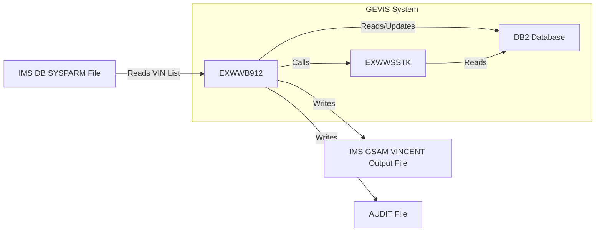
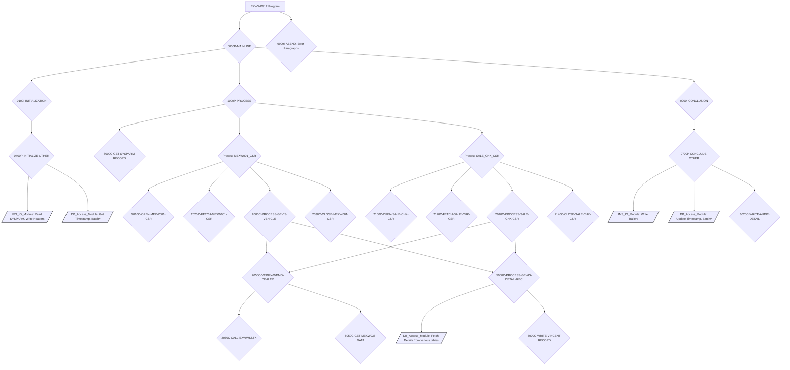

COBOL - Technical Design Specification for Modernization: EXWWB912

---

# 1. Introduction
## 1.1 Purpose
The EXWWB912 program is a one-shot utility designed to extract specific vehicle information for the Vincent Sales mini file. It processes a predefined list of Vehicle Identification Numbers (VINs).

## 1.2 Scope
The program reads a list of VINs from an input SYSPARM file. For each VIN, it queries the DB2 table MEXW001_VEH_ORDER for vehicle order details. The selection criteria for MEXW001 records, as per the program description, targets model years one year prior and two years forward from the processing date, although the primary driving cursor `MEXW001_CSR` filters directly by VIN. It further processes only those vehicles associated with a current WDMO (Wholesale Distributor Marketing Organization) dealer. The extracted and processed data is then written to an outbound bridge file, which includes standard E&G (Enterprise & Global) headers/trailers and Vincent-specific headers/trailers. The program also handles cases where data fields from GEVIS DB2 tables might be unpopulated, outputting spaces for alphanumeric fields and zeros for numeric fields.

## 1.3 Audience
This document is intended for COBOL developers, system analysts, and testers involved in the maintenance, modernization, or understanding of the EXWWB912 program and its interactions within the GEVIS system.

# 2. Overview
## 2.1 Background
EXWWB912 was created in May 2015 to fulfill a specific data extraction requirement for Vincent Sales, using a provided list of VINs to generate a targeted mini file. It interfaces with several GEVIS DB2 tables to gather comprehensive vehicle data.

## 2.2 Objectives
*   Read a list of VINs from an input SYSPARM file.
*   For each VIN, retrieve vehicle order information from the MEXW001_VEH_ORDER table.
*   Filter records to include only those associated with a current WDMO dealer.
*   Extract additional vehicle details from various GEVIS DB2 tables (e.g., MEXW003, MEXW007, MEXW008, MEXW035).
*   Call subroutine EXWWSSTK to obtain current stocking dealer information.
*   Output the processed data to a bridge file formatted with E&G and Vincent headers and trailers.
*   Provide an audit trail of its processing.
*   Handle potential missing data in DB2 fields by populating output with spaces or zeros.

## 2.3 Assumptions and Constraints
*   The input SYSPARM file contains a valid list of VINs.
*   DB2 tables (MEXW001, MEXW003, MEXW004, MEXW007, MEXW008, MEXS016, MEXW021, MEXW027, MEXW031, MEXW032, MEXW033, MEXW034, MEXW035) are accessible and contain the necessary data.
*   The subroutine EXWWSSTK is available and functions as expected.
*   IMS services are available for SYSPARM input and bridge file output.
*   The program runs as a BMP (Batch Message Processing) program.
*   If certain fields from GEVIS DB2 tables are not populated, alphanumeric fields will be output as spaces, and numeric fields as zeros.

# 3. System Architecture
## 3.1 System Context Diagram


## 3.2 Component Diagram


# 4. Detailed Design
## 4.1 Program Structure
The program executes in a batch environment, initiated via `ENTRY "DLITCBL"`. Its structure can be summarized in the following phases:

1.  **Initialization (0000P-MAINLINE -> 0100I-INITIALIZATION -> 0400P-INITIALIZE-OTHER)**:
    *   Opens the AUDIT-FILE.
    *   Retrieves current timestamp and compile timestamp for auditing.
    *   Performs IMS Restart logic (`9600I-IMS-RESTART`) and handles checkpoint initialization.
    *   Initializes working storage variables, switches, and flags.
    *   Obtains the current Dearborn timestamp (`7000C-OBTAIN-DRBN-TIMESTAMP`).
    *   Retrieves the previous batch number from `MEXS016_GENERIC2` and calculates the current batch number (`7300C-GET-BATCH-NBR`).
    *   Reads the first SYSPARM record containing a VIN (`8000C-GET-SYSPARM-RECORD`). If no records, it abends.
    *   Populates and writes HUB Header (`7400C-POPULATE-HUB-HEADER`) and Vincent Header (`7500C-POPULATE-VINCENT-HEADER`) to the output file.

2.  **Main Processing Loop (0000P-MAINLINE -> 1000P-PROCESS)**:
    *   This phase loops `UNTIL END-OF-SYSPARM-FILE`.
    *   For each VIN read from the SYSPARM file:
        *   **Process MEXW001 Data**: Opens `MEXW001_CSR` (`2010C-OPEN-MEXW001-CSR`) using the current VIN. It then fetches (`2020C-FETCH-MEXW001-CSR`) and processes (`2000C-PROCESS-GEVIS-VEHICLE`) each matching record from `MEXW001_VEH_ORDER`. This inner loop continues `UNTIL MEXW001-NOT-FOUND`. The cursor is then closed (`2030C-CLOSE-MEXW001-CSR`).
        *   **Process Sales Check Data**: Opens `SALE_CHK_CSR` (`2100C-OPEN-SALE-CHK-CSR`) which joins `MEXW001_VEH_ORDER` and `MEXW008_VEH_RTL` for the current VIN. It fetches (`2120C-FETCH-SALE-CHK-CSR`) and processes (`2040C-PROCESS-SALE-CHK-CSR`) each matching record. This inner loop continues `UNTIL SALE-CHK-NOT-FOUND`. The cursor is then closed (`2140C-CLOSE-SALE-CHK-CSR`).
        *   **Vehicle Detail Processing (within 2000C-PROCESS-GEVIS-VEHICLE & 2040C-PROCESS-SALE-CHK-CSR)**:
            *   For each record retrieved from the cursors, it verifies if the associated dealer is a WDMO dealer (`2050C-VERIFY-WDMO-DEALER`). This involves calling subroutine `EXWWSSTK` (`2060C-CALL-EXWWSSTK`) to get the current stocking dealer and then querying `MEXW035_DLR_MSTR` (`5050C-GET-MEXW035-DATA`).
            *   If the dealer is WDMO and `EXWWSSTK` call was successful, `5000C-PROCESS-GEVIS-DETAIL-REC` is performed. This paragraph gathers extensive data by querying multiple DB2 tables (MEXW004, MEXW003 for various statuses, MEXW008, MEXW007, MEXW031, MEXW032, MEXW033, MEXW034, MEXW027), formats the data into `WS-VINCENT-DETAIL-RECORD`, moves it to `WS-VINCENT-OUTPUT-RECORD`, and writes it to the Vincent output file (`6000C-WRITE-VINCENT-RECORD`). IMS checkpointing is performed via `9400I-INCREMENT-CHKP-COUNT`.
        *   Reads the next SYSPARM record (`8000C-GET-SYSPARM-RECORD`).

3.  **Conclusion (0000P-MAINLINE -> 0200I-CONCLUSION -> 0700P-CONCLUDE-OTHER)**:
    *   Updates the run timestamp (`7250C-UPDATE-TIMESTAMP`) and batch number (`7350C-UPDATE-BATCH-NBR`) in `MEXS016_GENERIC2`.
    *   Populates and writes Vincent Trailer (`7550C-POPULATE-VINCENT-TRAILER`) and HUB Trailer (`7450C-POPULATE-HUB-TRAILER`) to the output file.
    *   Writes audit trail summary information (`6020C-WRITE-AUDIT-DETAIL`).
    *   Closes the AUDIT-FILE.
    *   Sets RETURN-CODE to 3 if an email notification is required (e.g., `SSTK-SQL-RETURN-CODE = 100`).
    *   Terminates the program (`GOBACK`).

Error handling and abend procedures (`9999I-ABEND`, `2070C-SSTK-FATAL-ERROR`, etc.) are invoked upon encountering critical errors during DB2 operations or IMS calls.

## 4.2 Data Structures

This section describes the key data structures used for file I/O, inter-program communication (CALL USING), and Linkage Section PCBs.

*   **AUDIT-RECORD**
    *   Purpose: Defines the record layout for the `AUDIT-FILE`, used for writing processing statistics and error messages.
    *   Record Layout:
        ```COBOL
        FD  AUDIT-FILE.
        01  AUDIT-RECORD.
            05  AUDIT-LABEL             PIC X(30).
            05  AUDIT-DATA              PIC X(50).
        ```
    *   Copybooks Referenced: None for this specific FD.

*   **SYSPARM-RECORD**
    *   Purpose: Defines the input record read from the SYSPARM file (IMS DB), containing the VIN to be processed.
    *   Record Layout:
        ```COBOL
        01  SYSPARM-RECORD.
            05  SYSPARM-VIN                     PIC X(17).
            05  FILLER                          PIC X(63).
        ```
    *   Copybooks Referenced: None for this specific record structure.

*   **WS-VINCENT-OUTPUT-RECORD**
    *   Purpose: A generic 1000-byte record used to hold various formatted output records (headers, details, trailers) before writing to the Vincent bridge file (IMS GSAM).
    *   Record Layout:
        ```COBOL
        01  WS-VINCENT-OUTPUT-RECORD            PIC X(1000).
        ```
    *   Copybooks Referenced: None directly, but data from `WS-VINCENT-DETAIL-RECORD`, `HUB-HEADER`, `HUB-TRAILER`, `VINCENT-HEADER`, `VINCENT-TRAILER` is moved into it.

*   **WS-VINCENT-DETAIL-RECORD**
    *   Purpose: Defines the detailed structure of a single Vincent output data record. This record is populated with data extracted from various DB2 tables.
    *   Record Layout (Hierarchical Outline due to length):
        ```
        01  WS-VINCENT-DETAIL-RECORD.
            05  WS-DTL-HUB-LINE-NBR             PIC 9(06).
            05  WS-DTL-HUB-REC-ID               PIC X(25).
                10  WS-DTL-REC-ID-ZEROS         PIC 9(16).
                10  WS-DTL-REC-ID-NBR           PIC 9(09). (REDEFINES WS-DTL-HUB-REC-ID)
            05  WS-DTL-HUB-REC-TYPE             PIC X(03).
            05  WS-DTL-HUB-REC-SEQ-NBR          PIC 9(03).
            05  WS-DTL-VIN-FULL-C               PIC X(17).
            05  WS-DTL-DTA-DATA-SRC-C           PIC X(02).
            05  WS-DTL-BDT-MDL-YR-Y             PIC X(02).
            05  WS-DTL-GEVIS-VEH-LINE-C         PIC X(02).
            05  WS-DTL-LCL-BDYTYP-C             PIC X(05).
            05  WS-DTL-CUR-STA-STATUS-C         PIC X(03).
            05  WS-DTL-VEH-DIVISION-C           PIC X(01).
            05  WS-DTL-WMI-WMI-C                PIC X(03).
            05  WS-DTL-LCL-PLT-C                PIC X(03).
            05  WS-DTL-VWS-TOT-US-A             PIC S9(07)V99 COMP-3.
            05  WS-DTL-VEH-GBL-DLR-C            PIC X(06).
            05  WS-DTL-LAST-QAD-VST-GBL-LOC-C   PIC X(06).
            05  WS-DTL-CURR-VST-GBL-LOC-C       PIC X(06).
            05  WS-DTL-SHIP-TO-DLR-C            PIC X(06).
            05  WS-DTL-CURR-STOCKING-DLR-C      PIC X(06).
            05  WS-DTL-CURR-DLR-C               PIC X(06).
            05  WS-DTL-WDMO-FLEET-C             PIC X(05).
            05  WS-DTL-VRS-LCL-FLEET-C          PIC X(06).
            05  WS-DTL-VRS-CST-FIRST-N          PIC X(30).
            05  WS-DTL-VRS-CST-MID-INIT-X       PIC X(01).
            05  WS-DTL-VRS-CST-LAST-N           PIC X(30).
            05  WS-DTL-VRS-CST-ADDR-1-X         PIC X(40).
            05  WS-DTL-VRS-CST-ADD-DIV2-N       PIC X(40).
            05  WS-DTL-VRS-CST-ADD-DIV1-C       PIC X(02).
            05  WS-DTL-VRS-CST-POSTAL-C         PIC X(10).
            05  WS-DTL-VRS-SALESPERSON-C        PIC X(11).
            05  WS-DTL-VRS-TYP-LCL-CUST-C       PIC X(01).
            05  WS-DTL-VEH-WDMO-ORD-TYP         PIC X(01).
            05  WS-DTL-VEH-ORD-RCPT-Y           PIC X(08).
            05  WS-DTL-VEH-SCHD-VST-TARGET-Y    PIC X(08).
            05  WS-DTL-VEH-PRODUCE-VST-STAT-Y   PIC X(08).
            05  WS-DTL-VEH-RELEASE-VST-STAT-Y   PIC X(08).
            05  WS-DTL-VEH-ARRIVAL-VST-STAT-Y   PIC X(08).
            05  WS-DTL-VEH-INVOICE-VST-STAT-Y   PIC X(08).
            05  WS-DTL-VEH-STOCK-VST-STAT-Y     PIC X(08).
            05  WS-DTL-VEH-RETAIL-VST-STAT-Y    PIC X(08).
            05  WS-DTL-VEH-DELIVER-VST-STAT-Y   PIC X(08).
            05  WS-DTL-VEH-SLSRCPT-VST-STAT-Y   PIC X(08).
            05  WS-DTL-VEH-WARRANT-VST-STAT-Y   PIC X(08).
            05  WS-DTL-VEH-CATALOG-C            PIC X(15).
            05  WS-DTL-WERS-VEH-LINE-C          PIC X(02).
            05  WS-DTL-WERS-BODY-STYLE-C        PIC X(03).
            05  WS-DTL-WERS-BRAND-C             PIC X(01).
            05  WS-DTL-VEH-PO-Y                 PIC X(08).
            05  WS-DTL-FILLER-01                PIC X(590).
        ```
    *   Note: The `INPUT-OUTPUT-PARAMETERS PIC X(4020)` seems to be a leftover or placeholder and not part of the actual Vincent detail record structure as described by the preceding fields. The sum of preceding fields is much less than 1000 bytes. The `WS-VINCENT-OUTPUT-RECORD PIC X(1000)` implies the effective output record is 1000 bytes. The detail record fields listed sum up to 410 bytes + 590 filler = 1000 bytes. The `INPUT-OUTPUT-PARAMETERS` is defined after the cursors.
    *   Copybooks Referenced: None for this specific record structure, fields are populated from various DB2 DCLGEN copybooks.

*   **HUB-HEADER and HUB-TRAILER**
    *   Purpose: Standard E&G (Enterprise & Global) header and trailer records for the output file.
    *   Record Layout: Defined in `CPEWHUB`.
        ```COBOL
        *   E & G GENERIC HEADER AND TRAILER USED FOR THE HUB AND GEVIS  *
        05  HUB-HEADER.
            10  HUB-HDR-RECORD-TYPE     PIC X(07) VALUE " HEADER".
            10  FILLER                  PIC X(01) VALUE SPACES.
            10  HUB-HDR-ENTITY-CODE     PIC X(05).
            10  FILLER                  PIC X(01) VALUE SPACES.
            10  HUB-HDR-LAYOUT-ID       PIC X(20).
            10  FILLER                  PIC X(01) VALUE SPACES.
            10  HUB-HDR-TIMESTAMP       PIC X(26).
            10  FILLER                  PIC X(02) VALUE SPACES.
            10  HUB-HDR-BATCH-NBR       PIC 9(10).
            10  FILLER                  PIC X(01) VALUE SPACES.
            10  HUB-HDR-PROCESS-ID      PIC X(20).
            10  FILLER                  PIC X(01) VALUE SPACES.
            10  HUB-HDR-TOTAL-REC-CNT   PIC 9(07).
            10  FILLER                  PIC X(22) VALUE SPACES.
            10  HUB-HDR-PRIMARY-CONTACT PIC X(60).
            10  FILLER                  PIC X(01) VALUE SPACES.
            10  HUB-HDR-SECOND-CONTACT  PIC X(60).
            10  FILLER                  PIC X(755) VALUE SPACES.
        05  HUB-TRAILER.
            10  HUB-TRL-RECORD-TYPE     PIC X(07) VALUE "9TRAILR".
            10  FILLER                  PIC X(01) VALUE SPACES.
            10  HUB-TRL-ENTITY-CODE     PIC X(05).
            10  FILLER                  PIC X(01) VALUE SPACES.
            10  HUB-TRL-LAYOUT-ID       PIC X(20).
            10  FILLER                  PIC X(01) VALUE SPACES.
            10  HUB-TRL-TIMESTAMP       PIC X(26).
            10  FILLER                  PIC X(02) VALUE SPACES.
            10  HUB-TRL-BATCH-NBR       PIC 9(10).
            10  FILLER                  PIC X(01) VALUE SPACES.
            10  HUB-TRL-PROCESS-ID      PIC X(20).
            10  FILLER                  PIC X(01) VALUE SPACES.
            10  HUB-TRL-TOTAL-REC-CNT   PIC 9(07).
            10  FILLER                  PIC X(22) VALUE SPACES.
            10  HUB-TRL-PRIMARY-CONTACT PIC X(60).
            10  FILLER                  PIC X(01) VALUE SPACES.
            10  HUB-TRL-SECOND-CONTACT  PIC X(60).
            10  FILLER                  PIC X(755) VALUE SPACES.
        ```
    *   Copybooks Referenced: `CPEWHUB`

*   **VINCENT-HEADER and VINCENT-TRAILER**
    *   Purpose: Vincent-specific header and trailer records for the output file.
    *   Record Layout: Defined in `CPEWVNCT`.
        ```COBOL
        05  VINCENT-HEADER.
            10  VNT-HDR-HUB-LINE-NBR     PIC 9(06).
            10  VNT-HDR-HUB-REC-ID       PIC X(25).
            10  VNT-HDR-HUB-REC-ID-NBR REDEFINES
                VNT-HDR-HUB-REC-ID.
                15  VNT-HDR-REC-ID-ZEROES PIC 9(16).
                15  VNT-HDR-REC-ID-NBR    PIC 9(09).
            10  VNT-HDR-HUB-REC-TYPE     PIC X(03) VALUE "001".
            10  VNT-HDR-HUB-SEQ-NBR      PIC X(03) VALUE "001".
            10  VNT-HDR-ID               PIC X(04) VALUE "1HDR".
            10  VNT-HDR-REC-TYPE         PIC X(08).
            10  VNT-HDR-CURR-BATCH-NBR   PIC 9(05).
            10  VNT-HDR-PREV-BATCH-NBR   PIC 9(05).
            10  VNT-HDR-LOW-VALUES       PIC X(02) VALUE LOW-VALUES.
            10  VNT-HDR-CURR-DATE        PIC 9(08).
            10  VNT-HDR-CURR-TIME        PIC 9(06).
            10  FILLER                   PIC X(925) VALUE SPACES.
        05  VINCENT-TRAILER.
            10  VNT-TRL-HUB-LINE-NBR     PIC 9(06).
            10  VNT-TRL-HUB-REC-ID       PIC X(25).
            10  VNT-TRL-HUB-REC-ID-NBR REDEFINES
                VNT-TRL-HUB-REC-ID.
                15  VNT-TRL-REC-ID-ZEROES PIC 9(16).
                15  VNT-TRL-REC-ID-NBR    PIC 9(09).
            10  VNT-TRL-HUB-REC-TYPE     PIC X(03) VALUE "999".
            10  VNT-TRL-HUB-SEQ-NBR      PIC X(03) VALUE "001".
            10  VNT-TRL-ID               PIC X(04) VALUE "9TRL".
            10  VNT-TRL-REC-TYPE         PIC X(08).
            10  VNT-TRL-CURR-BATCH-NBR   PIC 9(05).
            10  FILLER                   PIC X(05) VALUE SPACES.
            10  VNT-TRL-COUNTER          PIC 9(07).
            10  VNT-TRL-HIGH-VALUES      PIC X(02) VALUE HIGH-VALUES.
            10  FILLER                   PIC X(932) VALUE SPACES.
        ```
    *   Copybooks Referenced: `CPEWVNCT`

*   **IO-PCB**
    *   Purpose: Standard IMS I/O Program Communication Block, used for checkpoint/restart and ROLB calls.
    *   Record Layout:
        ```COBOL
        01  IO-PCB.
            05  IO-PCB-LTERM            PIC X(08).
            05  FILLER                  PIC X(02).
            05  IO-PCB-STATUS           PIC X(02).
            05  FILLER                  PIC X(28).
        ```
    *   Copybooks Referenced: None for this specific layout, standard IMS structure.

*   **SYSPARM-PCB**
    *   Purpose: IMS Program Communication Block for accessing the input SYSPARM file.
    *   Record Layout:
        ```COBOL
        01  SYSPARM-PCB.
            05  SYSPARM-PCB-NAME        PIC X(08).
            05  FILLER                  PIC X(02).
            05  SYSPARM-PCB-STATUS      PIC X(02).
            05  FILLER                  PIC X(28).
        ```
    *   Copybooks Referenced: None for this specific layout, standard IMS structure.

*   **VINCENT-PCB**
    *   Purpose: IMS Program Communication Block for writing to the output Vincent bridge file (GSAM).
    *   Record Layout:
        ```COBOL
        01  VINCENT-PCB.
            05  VINCENT-PCB-NAME        PIC X(08).
            05  FILLER                  PIC X(02).
            05  VINCENT-PCB-STATUS      PIC X(02).
            05  FILLER                  PIC X(28).
        ```
    *   Copybooks Referenced: None for this specific layout, standard IMS structure.

*   **SSTK-I-O-DATA (for EXWWSSTK call)**
    *   Purpose: Data structure used for passing parameters to and receiving results from the `EXWWSSTK` subroutine.
    *   Record Layout: Defined in `CPEWSSTK`.
        ```COBOL
        01  SSTK-I-O-DATA.
            05  SSTK-INPUT-DATA.
                10   SSTK-MODE                    PIC X(01).
                    88  SSTK-INQUIRY-MODE        VALUE "I".
                    88  SSTK-UPDATE-MODE         VALUE "U".
                10   SSTK-DTA-DATA-SRC-C          PIC X(02).
                10   SSTK-VEH-ORD-ID-C            PIC X(25).
            05  SSTK-OUTPUT-DATA.
                10  SSTK-GBL-STK-DLR-C            PIC X(06).
                10  SSTK-LCL-STK-DLR-C            PIC X(07).
                10  SSTK-STK-DLR-STAT-C           PIC X(03).
                10  SSTK-STK-DLR-STAT-Y           PIC X(10).
                10  SSTK-STK-DLR-CNTRY-ISO3-C     PIC X(03).
                10  SSTK-CUR-STAT-C               PIC X(03).
                10  SSTK-CUR-LCL-STAT-C           PIC X(06).
                10  SSTK-CUR-STAT-Y               PIC X(10).
                10  SSTK-DIV-DIV-C                PIC X(02).
            05  SSTK-OUT-DATA-MSG.
                10  SSTK-PGM-ID                   PIC X(08).
                10  SSTK-RETURN-CD                PIC X(01).
                    88  SSTK-SUCCESSFUL           VALUE "0".
                    88  SSTK-INPUT-ERROR          VALUE "1".
                    88  SSTK-DB2-ERROR            VALUE "2".
                10  SSTK-PARAGRAPH                PIC X(06).
                10  SSTK-DB2-AREA.
                    15  SSTK-HOST-VAR1            PIC X(80).
                    15  SSTK-HOST-VAR2            PIC X(80).
                    15  SSTK-HOST-VAR3            PIC X(80).
                    15  SSTK-HOST-VAR4            PIC X(80).
                    15  SSTK-HOST-VAR5            PIC X(80).
                    15  SSTK-HOST-VAR6            PIC X(80).
                    15  SSTK-HOST-VAR7            PIC X(80).
                    15  SSTK-HOST-VAR8            PIC X(80).
                    15  SSTK-DB2-TABLES.
                        20  SSTK-DB2-TABLE1       PIC X(18).
                        20  SSTK-DB2-TABLE2       PIC X(18).
                        20  SSTK-DB2-TABLE3       PIC X(18).
                        20  SSTK-DB2-TABLE4       PIC X(18).
                        20  SSTK-DB2-TABLE5       PIC X(18).
                    15  SSTK-SQL-FUNCTION        PIC X(12).
                    15  SSTK-SQL-RETURN-CODE     PIC S9(04) COMP-3.
                    15  SSTK-SQL-WARNING         PIC X(08).
                    15  SSTK-SQL-ERROR-MESSAGE   PIC X(70).
                    15  SSTK-SQL-FULL-ERROR.
                        20  SSTK-SQL-MSG1        PIC X(72).
                        20  SSTK-SQL-MSG2        PIC X(72).
                        20  SSTK-SQL-MSG3        PIC X(72).
                        20  SSTK-SQL-MSG4        PIC X(72).
                    15  SSTK-SQLCA               PIC X(200).
            05  SSTK-FILLER                       PIC X(1596).
        ```
    *   Copybooks Referenced: `CPEWSSTK`

*   **CHKP-SAVE-AREA**
    *   Purpose: Working storage area saved during IMS checkpoints.
    *   Record Layout: `01 CHKP-SAVE-AREA.` (Contains various literals, switches, and variables defined from line 81 to 315 in the main program, but its structure is not explicitly detailed as a single record layout for external interface beyond its usage with `CHKP-SAVE-AREA-LEN` in IMS calls). It is used by `9500I-IMS-CHECKPOINT` and `9600I-IMS-RESTART`.
    *   Copybooks Referenced: None.

## 4.3 Algorithms
### 4.3.1 Overall Program Logic (Condensed Pseudocode)
```
PROGRAM EXWWB912

  PERFORM INITIALIZATION
    Open AUDIT-FILE
    Get current timestamp, batch number
    Read first SYSPARM-VIN from SYSPARM-PCB
    IF no SYSPARM records THEN
      ABEND
    END-IF
    Populate and Write HUB-HEADER to VINCENT-OUTPUT-RECORD
    Populate and Write VINCENT-HEADER to VINCENT-OUTPUT-RECORD
    Initialize prior run timestamp for model year check logic (e.g. WS-CURR-DRBN-TMSTMP-LESS-1)

  PERFORM MAIN-PROCESSING UNTIL END-OF-SYSPARM-FILE
    // Process data for current SYSPARM-VIN from MEXW001_VEH_ORDER
    OPEN MEXW001_CSR USING SYSPARM-VIN
    PERFORM PROCESS-MEXW001-RECORDS UNTIL MEXW001-NOT-FOUND
      FETCH MEXW001_CSR INTO MEXW001-VEH-ORDER fields
      IF successful FETCH THEN
        Increment MEXW001 read counter
        PERFORM VERIFY-WDMO-DEALER (using MEXW001 data)
        IF WDMO-DEALER AND SSTK-SUCCESSFUL THEN
          PERFORM PROCESS-GEVIS-DETAIL-RECORD (using MEXW001 data)
        END-IF
      END-IF
    END-PERFORM
    CLOSE MEXW001_CSR

    // Process data for current SYSPARM-VIN from SALE_CHK_CSR (MEXW001 JOIN MEXW008)
    OPEN SALE_CHK_CSR USING SYSPARM-VIN
    PERFORM PROCESS-SALE-CHK-RECORDS UNTIL SALE-CHK-NOT-FOUND
      FETCH SALE_CHK_CSR INTO MEXW001-VEH-ORDER fields (from joined view)
      IF successful FETCH THEN
        Increment SALE-CHK read counter
        PERFORM VERIFY-WDMO-DEALER (using SALE_CHK data)
        IF WDMO-DEALER AND SSTK-SUCCESSFUL THEN
          PERFORM PROCESS-GEVIS-DETAIL-RECORD (using SALE_CHK data)
        END-IF
      END-IF
    END-PERFORM
    CLOSE SALE_CHK_CSR

    Read next SYSPARM-VIN from SYSPARM-PCB
  END-PERFORM

  PERFORM CONCLUSION
    Update run timestamp and batch number in MEXS016_GENERIC2
    Populate and Write VINCENT-TRAILER to VINCENT-OUTPUT-RECORD
    Populate and Write HUB-TRAILER to VINCENT-OUTPUT-RECORD
    Write AUDIT summary
    Close AUDIT-FILE
    IF email flag is set THEN
      Set RETURN-CODE = 3
    END-IF
  GOBACK

VERIFY-WDMO-DEALER (using VEH-ORD-ID-C, VEH-DTA-DATA-SRC-C):
  CALL "EXWWSSTK" USING SSTK-I-O-DATA (VEH-ORD-ID-C, VEH-DTA-DATA-SRC-C)
  IF SSTK-SUCCESSFUL THEN
    Use SSTK-GBL-STK-DLR-C to query MEXW035_DLR_MSTR for DLR-SUB-SUBLVL1-C
    IF MEXW035 found AND DLR-SUB-SUBLVL1-C = "WDM" THEN
      Set WDMO-DEALER = TRUE
    ELSE
      Set WDMO-DEALER = FALSE
    END-IF
  ELSE
    Set WDMO-DEALER = FALSE (or handle SSTK error)
  END-IF

PROCESS-GEVIS-DETAIL-RECORD (using current vehicle data from MEXW001 or SALE_CHK):
  Initialize WS-VINCENT-DETAIL-RECORD
  Query MEXW004_VEH_WERS_STRING for WERS string
  Move common data from MEXW001 fields to WS-DTL-* fields
  Query MEXW031_CATMAP for body style if not 'NA'/'EA' source & WERS string not found
  Query MEXW035_DLR_MSTR for super dealer code for ordering dealer
  Move SSTK current stocking dealer info to WS-DTL-* fields
  Query MEXW027_CONV to convert current status code to Vincent equivalent
  Query MEXW008_VEH_RTL (joined with MEXW003) for retail data (90V status)
  Query MEXW007_VEH_WHS (joined with MEXW003) for wholesale data (40V status)
  Query MEXW034_VL_BRAND, MEXW032_CATALOG, MEXW033_BODY_TYPE for WERS data
  Query MEXW003_VEH_STATUS for various specific status dates (20T, 30R, 30P, 30T, 80F)
  Query MEXW003_VEH_STATUS using MEXW003_40V_CSR for last QAD wholesale global dealer
  Increment output record counters
  Move WS-VINCENT-DETAIL-RECORD to WS-VINCENT-OUTPUT-RECORD
  WRITE VINCENT-OUTPUT-RECORD
  PERFORM IMS-CHECKPOINT if count reached
END-PROCESS-GEVIS-DETAIL-RECORD.
```

### 4.3.2 Key Algorithmic Details
*   **VIN Processing**: The program iterates through a list of VINs provided in the `SYSPARM-FILE`. For each VIN, it performs two main data retrieval passes: one against `MEXW001_VEH_ORDER` directly (`MEXW001_CSR`), and another against a join of `MEXW001_VEH_ORDER` and `MEXW008_VEH_RTL` (`SALE_CHK_CSR`).
*   **WDMO Dealer Verification (2050C-VERIFY-WDMO-DEALER)**:
    1.  Calls subroutine `EXWWSSTK` with the vehicle order ID and data source code to get the current global stocking dealer (`SSTK-GBL-STK-DLR-C`).
    2.  If `EXWWSSTK` is successful, it uses the returned `SSTK-GBL-STK-DLR-C` to query `MEXW035_DLR_MSTR`.
    3.  It checks if `DLR-SUB-SUBLVL1-C` from `MEXW035_DLR_MSTR` is "WDM". If yes, the dealer is considered a WDMO dealer (`WDMO-DEALER` switch is set to 'Y'). Otherwise, or if `MEXW035` is not found, it's not a WDMO dealer.
*   **Data Aggregation (5000C-PROCESS-GEVIS-DETAIL-REC)**: If a vehicle record qualifies (is WDMO), this extensive paragraph is performed:
    *   Retrieves WERS string data from `MEXW004_VEH_WERS_STRING`.
    *   Populates basic vehicle data from the current cursor record (either `MEXW001_CSR` or `SALE_CHK_CSR` data).
    *   Determines local body type (`WS-DTL-LCL-BDYTYP-C`):
        *   If WERS string is found, uses `VWR-WERS-STRING-X-TEXT(10:2)`.
        *   Else, for non-'NA'/'EA' sources, queries `MEXW031_CATMAP` (`MEXW031_CSR`) for `CTM-OPT-OPTION-C`.
        *   Else, uses `VEH-LCL-BDYTYP-C` from `MEXW001`.
    *   Retrieves various status dates by querying `MEXW003_VEH_STATUS` for specific status codes:
        *   `20T` (Scheduled VST Target Date) in `5120C-OBTAIN-MEXW003-20T`.
        *   `30R` or `30P` (Produce VST Status Date) in `5140C-OBTAIN-MEXW003-30R` and `5160C-OBTAIN-MEXW003-30P`.
        *   `30T` (Release VST Status Date) in `5180C-OBTAIN-MEXW003-30T`.
        *   `80F` (Arrival VST Status Date) in `5200C-OBTAIN-MEXW003-80F`.
    *   Retrieves retail sales data by joining `MEXW003_VEH_STATUS` and `MEXW008_VEH_RTL` for status `90V` (`5065C-SELECT-MEXW008-90V-DATA`). Converts GEVIS customer type to CONCEPS sales type (`5075C-POPULATE-CONCEPS-SLSTYP`).
    *   Retrieves wholesale data by joining `MEXW003_VEH_STATUS` and `MEXW007_VEH_WHS` for status `40V` (`5085C-SELECT-MEXW003-40V`).
    *   Retrieves WERS vehicle line, brand, and body style data through a complex logic involving `MEXW034_VL_BRAND`, `MEXW004_VEH_WERS_STRING`, `MEXW032_CATALOG`, and `MEXW033_BODY_TYPE` based on data source and availability (`5100C-OBTAIN-WERS-DATA` and its sub-paragraphs).
    *   Retrieves the most recent wholesale global dealer from `MEXW003_VEH_STATUS` for status `40V` and current data source `WD` using `MEXW003_40V_CSR` (`5220C-OPEN-40V-CSR`, `5230C-FETCH-40V-ROW`, `5240C-CLOSE-40V-CSR`).
    *   The current status code (`SSTK-CUR-STAT-C`) from `EXWWSSTK` is converted to a Vincent status code by querying `MEXW027_CONV` (`5045C-SELECT-MEXW027-DATA`). Special handling for status `800` based on `VRS-TYP-LCL-CUST-C` or missing sales data.
*   **Timestamp and Batch Control**: The program maintains its last run timestamp and output batch number in `MEXS016_GENERIC2`. These are retrieved during initialization and updated during conclusion.
*   **Output Record Formatting**: Header, detail, and trailer records are formatted according to `CPEWHUB` (E&G) and `CPEWVNCT` (Vincent) layouts, and written to `WS-VINCENT-OUTPUT-RECORD`.

## 4.4 Input/Output Specifications
*   **Input Files/Sources**:
    *   **SYSPARM File (IMS DB)**: Sequential input file providing a list of VINs. Accessed via `SYSPARM-PCB`. Record: `SYSPARM-RECORD`.
    *   **DB2 Database**: Multiple tables are read. See section 4.5 for details.
*   **Output Files/Destinations**:
    *   **VINCENT Bridge File (IMS GSAM)**: Main output file containing extracted vehicle data with E&G and Vincent headers/trailers. Accessed via `VINCENT-PCB`. Record: `WS-VINCENT-OUTPUT-RECORD` (1000 bytes).
    *   **AUDIT-FILE**: Sequential file for audit trail messages and processing counts. Record: `AUDIT-RECORD`.
*   **Called Subroutines (I/O)**:
    *   `EXWWSSTK`: Takes `SSTK-INPUT-DATA` and returns `SSTK-OUTPUT-DATA` and status messages. (See 4.2 for `SSTK-I-O-DATA` layout).

## 4.5 DB2 Database Details
The program interacts extensively with DB2 tables using SQL statements, primarily through cursors and single SELECT/UPDATE statements.

*   **Cursors**:
    *   **MEXW001_CSR**: Selects vehicle order data from `MEXW001_VEH_ORDER` for a specific VIN.
        ```sql
        DECLARE  MEXW001_CSR CURSOR WITH HOLD FOR
        SELECT  VEH_VIN_FULL_C
        ,VEH_ORD_ID_C
        ,DTA_DATA_SRC_C
        ,BDT_MDL_YR_Y
        ,WMI_WMI_C
        ,VEH_LCL_PLT_C
        ,VEH_LCL_BDYTYP_C
        ,VEH_GBL_ORD_DLR_C
        ,VEH_GBL_SHIP_TO_C
        ,VEH_ORD_RCPT_Y
        ,VEH_WDMO_FLEET_C
        ,VEH_WDMO_ORD_TYP
        ,VEH_CATALOG_C
        ,VEH_GBL_CATALOG_C
        ,VEH_PO_Y
        ,VEH_GEVIS_VL_C
        ,COUNTRY_ISO3_C
        FROM  MEXW001_VEH_ORDER
        WHERE VEH_VIN_FULL_C     = :VEH-VIN-FULL-C
        AND VEH_ACTIVE_F       = :VEH-ACTIVE-F
        ORDER BY VEH_ORD_ID_C
        , DTA_DATA_SRC_C
        FOR READ ONLY
        ```
    *   **SALE_CHK_CSR**: Selects vehicle data by joining `MEXW001_VEH_ORDER` and `MEXW008_VEH_RTL` for a specific VIN.
        ```sql
        DECLARE  SALE_CHK_CSR CURSOR WITH HOLD FOR
        SELECT  VEH.VEH_VIN_FULL_C
        ,VEH.VEH_ORD_ID_C
        ,VEH.DTA_DATA_SRC_C
        ,VEH.BDT_MDL_YR_Y
        ,VEH.WMI_WMI_C
        ,VEH.VEH_LCL_PLT_C
        ,VEH.VEH_LCL_BDYTYP_C
        ,VEH.VEH_GBL_ORD_DLR_C
        ,VEH.VEH_GBL_SHIP_TO_C
        ,VEH.VEH_ORD_RCPT_Y
        ,VEH.VEH_WDMO_FLEET_C
        ,VEH.VEH_WDMO_ORD_TYP
        ,VEH.VEH_CATALOG_C
        ,VEH.VEH_GBL_CATALOG_C
        ,VEH.VEH_PO_Y
        ,VEH.VEH_GEVIS_VL_C
        ,VEH.COUNTRY_ISO3_C
        FROM  MEXW001_VEH_ORDER VEH
        ,MEXW008_VEH_RTL   VRS
        WHERE  VRS.VRS_ACTIVE_F   = :VRS-ACTIVE-F
        AND  VEH.VEH_VIN_FULL_C = :VEH-VIN-FULL-C
        AND  VEH.VEH_ORD_ID_C   = VRS.VEH_ORD_ID_C
        AND  VEH.DTA_DATA_SRC_C = VRS.DTA_DATA_SRC_C
        FOR READ ONLY
        ```
    *   **MEXW031_CSR**: Selects option and product type from `MEXW031_CATMAP` for non-'NA'/'EA' data sources.
        ```sql
        DECLARE  MEXW031_CSR CURSOR WITH HOLD FOR
        SELECT  OPT_OPTION_C
        ,VPT_PROD_TYP_C
        FROM  MEXW031_CATMAP
        WHERE  DTA_DATA_SRC_C    = :CTM-DTA-DATA-SRC-C
        AND  CTM_LCL_CATALOG_C = :CTM-LCL-CATALOG-C
        AND  OFM_OPTION_FAM_C IN ("BS", "CA")
        OPTIMIZE FOR 1 ROW
        FOR READ ONLY
        ```
    *   **MEXW003_40V_CSR**: Selects the most recent wholesale global dealer location from `MEXW003_VEH_STATUS` for status '40V'.
        ```sql
        DECLARE  MEXW003_40V_CSR CURSOR WITH HOLD FOR
        SELECT  VST_GBL_LOC_C
        FROM  MEXW003_VEH_STATUS
        WHERE  VEH_ORD_ID_C       = :VST-VEH-ORD-ID-C
        AND  DTA_DATA_SRC_C     = :VST-DTA-DATA-SRC-C
        AND  STA_STATUS_C       = :VST-STA-STATUS-C
        AND  VST_ACTIVE_F       = :VST-ACTIVE-F
        AND  VST_STAT_TYP_C     = :VST-STAT-TYP-C
        AND  VST_CUR_DATA_SRC_C = :VST-CUR-DATA-SRC-C
        ORDER BY  VST_STAT_Y  DESC
        ,VST_STATIC_ISRT_REC_S  DESC
        FOR READ ONLY
        ```

*   **Singleton SQL Statements**:
    *   Set current timestamp (7000C-OBTAIN-DRBN-TIMESTAMP):
        ```sql
        SET  :WS-CURR-DRBN-TIMESTAMP  = CURRENT TIMESTAMP
        ```
    *   Update timestamp in `MEXS016_GENERIC2` (7250C-UPDATE-TIMESTAMP):
        ```sql
        UPDATE MEXS016_GENERIC2
        SET    GNT_ATTRIBUTE_DATA = :WS-CURR-DRBN-TIMESTAMP
        WHERE  GNT_SYSTEM_CD      = :GNT-SYSTEM-CD
        AND    GNT_TABLE_ID       = :GNT-TABLE-ID
        AND    GNT_KEY_DATA       = :GNT-KEY-DATA
        ```
    *   Select batch number from `MEXS016_GENERIC2` (7300C-GET-BATCH-NBR):
        ```sql
        SELECT GNT_ATTRIBUTE_DATA
        INTO  :GNT-ATTRIBUTE-DATA
        FROM   MEXS016_GENERIC2
        WHERE  GNT_SYSTEM_CD = :GNT-SYSTEM-CD
        AND    GNT_TABLE_ID  = :GNT-TABLE-ID
        AND    GNT_KEY_DATA  = :GNT-KEY-DATA
        ```
    *   Update batch number in `MEXS016_GENERIC2` (7350C-UPDATE-BATCH-NBR):
        ```sql
        UPDATE MEXS016_GENERIC2
        SET    GNT_ATTRIBUTE_DATA = :GNT-ATTRIBUTE-DATA
        WHERE  GNT_SYSTEM_CD      = :GNT-SYSTEM-CD
        AND    GNT_TABLE_ID       = :GNT-TABLE-ID
        AND    GNT_KEY_DATA       = :GNT-KEY-DATA
        ```
    *   Select WERS data from `MEXW004_VEH_WERS_STRING` (7600C-SELECT-WERS-DATA-W004):
        ```sql
        SELECT  VWR_WERS_STRING_X
        ,VWR_WERS_VL_C
        ,VWR_WERS_PRD_TP_C
        ,VWR_MAJ_FEAT_DFNED_F
        INTO :VWR-WERS-STRING-X
        ,:VWR-WERS-VL-C
        ,:VWR-WERS-PRD-TP-C
        ,:VWR-MAJ-FEAT-DFNED-F
        FROM  MEXW004_VEH_WERS_STRING
        WHERE  VEH_ORD_ID_C     =  :VWR-VEH-ORD-ID-C
        AND  DTA_DATA_SRC_C   =  :VWR-DTA-DATA-SRC-C
        ```
    *   Select dealer master data from `MEXW035_DLR_MSTR` (5050C-GET-MEXW035-DATA):
        ```sql
        SELECT
        SUB_SUBLVL1_C
        ,DLR_SUPER_DLR_C
        INTO
        :DLR-SUB-SUBLVL1-C
        ,:DLR-SUPER-DLR-C
        FROM  MEXW035_DLR_MSTR
        WHERE  DLR_DLR_C           = :DLR-DLR-DLR-C
        ```
    *   Select conversion data from `MEXW027_CONV` (5045C-SELECT-MEXW027-DATA):
        ```sql
        SELECT  CNT_LCL_DATA_X
        INTO
        :CNT-LCL-DATA-X
        FROM  MEXW027_CONV
        WHERE  CND_CNV_TYP_C     = :CNT-CND-CNV-TYP-C
        AND  DTA_DATA_SRC_C    = :CNT-DTA-DATA-SRC-C
        AND  CNT_GBL_DATA_X    = :CNT-GBL-DATA-X
        ```
    *   Select retail data from `MEXW003_VEH_STATUS` and `MEXW008_VEH_RTL` (5065C-SELECT-MEXW008-90V-DATA):
        ```sql
        SELECT
        A.VST_STAT_Y
        ,B.VRS_LCL_FLEET_C
        ,B.VRS_CST_FIRST_N
        ,B.VRS_CST_BUS_1_N
        ,B.VRS_CST_BUS_2_N
        ,B.VRS_CST_MID_INIT_X
        ,B.VRS_CST_LAST_N
        ,B.VRS_CST_ADDR_1_X
        ,B.VRS_CST_ADD_DIV2_N
        ,B.VRS_CST_ADD_DIV1_C
        ,B.VRS_CST_POSTAL_C
        ,B.VRS_SALESPERSON_C
        ,B.VRS_TYP_LCL_CUST_C
        ,B.VRS_RPT_SALE_Y
        ,B.VRS_WARR_STRT_Y
        INTO
        :VST-STAT-Y
        ,:VRS-LCL-FLEET-C
        ,:VRS-CST-FIRST-N
        ,:VRS-CST-BUS-1-N
        ,:VRS-CST-BUS-2-N
        ,:VRS-CST-MID-INIT-X
        ,:VRS-CST-LAST-N
        ,:VRS-CST-ADDR-1-X
        ,:VRS-CST-ADD-DIV2-N
        ,:VRS-CST-ADD-DIV1-C
        ,:VRS-CST-POSTAL-C
        ,:VRS-SALESPERSON-C
        ,:VRS-TYP-LCL-CUST-C
        ,:VRS-RPT-SALE-Y
        ,:VRS-WARR-STRT-Y
        FROM  MEXW003_VEH_STATUS A
        ,MEXW008_VEH_RTL B
        WHERE  A.VEH_ORD_ID_C      = :VST-VEH-ORD-ID-C
        AND  A.DTA_DATA_SRC_C    = :VST-DTA-DATA-SRC-C
        AND  A.STA_STATUS_C      = :VST-STA-STATUS-C
        AND  A.VST_LAST_OCCUR_F  = :VST-LAST-OCCUR-F
        AND  A.VST_ACTIVE_F      = :VST-ACTIVE-F
        AND  A.VST_ACTIVE_F      = B.VRS_ACTIVE_F
        AND  A.STA_STATUS_C      = B.STA_STATUS_C
        AND  A.VEH_ORD_ID_C      = B.VEH_ORD_ID_C
        AND  A.DTA_DATA_SRC_C    = B.DTA_DATA_SRC_C
        AND  SUBSTR(A.VST_LCL_LOC_C, 1,7)
        = B.VRS_LCL_DLR_C
        AND  A.VST_STAT_Y        = B.VRS_RETAIL_Y
        ```
    *   Select wholesale data from `MEXW003_VEH_STATUS` and `MEXW007_VEH_WHS` (5085C-SELECT-MEXW003-40V):
        ```sql
        SELECT A.VST_GBL_LOC_C
        ,A.VST_STAT_Y
        ,B.VWS_TOT_LCL_A
        ,B.CUR_CURRENCY_C
        INTO
        :VST-GBL-LOC-C
        ,:VST-STAT-Y
        ,:VWS-TOT-LCL-A
        ,:VWS-CUR-CURRENCY-C
        FROM  MEXW003_VEH_STATUS A
        ,MEXW007_VEH_WHS B
        WHERE  A.VEH_ORD_ID_C      = :VST-VEH-ORD-ID-C
        AND  A.DTA_DATA_SRC_C    = :VST-DTA-DATA-SRC-C
        AND  A.STA_STATUS_C      = :VST-STA-STATUS-C
        AND  A.VST_LAST_OCCUR_F  = :VST-LAST-OCCUR-F
        AND  A.VST_ACTIVE_F      = :VST-ACTIVE-F
        AND  A.VST_ACTIVE_F      = B.VWS_ACTIVE_F
        AND  A.STA_STATUS_C      = B.STA_STATUS_C
        AND  A.VEH_ORD_ID_C      = B.VEH_ORD_ID_C
        AND  A.DTA_DATA_SRC_C    = B.DTA_DATA_SRC_C
        AND  A.VST_STAT_Y        = B.VWS_DATE_Y
        AND  SUBSTR(A.VST_LCL_LOC_C, 1,7)
        = B.VWS_LCL_DLR_C
        ```
    *   Select WERS vehicle line data from `MEXW034_VL_BRAND` (5110C-SELECT-W034-DATA):
        ```sql
        SELECT   VLN_WERS_VL_C
        ,VLN_WERS_PRD_TP_C
        ,VLN_WERS_BRAND_C
        INTO
        :VLN-WERS-VL-C
        ,:VLN-WERS-PRD-TP-C
        ,:VLN-WERS-BRAND-C
        FROM  MEXW034_VL_BRAND
        WHERE  DTA_DATA_SRC_C    = :VLN-DTA-DATA-SRC-C
        AND  VLN_GEVIS_VL_C    = :VLN-GEVIS-VL-C
        AND  VLN_ACTIVE_F      = :VLN-ACTIVE-F
        ```
    *   Select WERS vehicle line from `MEXW032_CATALOG` (5112C-SELECT-MEXW032-WERS-VL):
        ```sql
        SELECT  VHL_VEH_LINE_C
        INTO :CTG-VHL-VEH-LINE-C
        FROM  MEXW032_CATALOG
        WHERE DTA_DATA_SRC_C    =  :CTG-DTA-DATA-SRC-C
        AND CTG_LCL_CATALOG_C =  :CTG-LCL-CATALOG-C
        ```
    *   Select GEVIS vehicle line data from `MEXW034_VL_BRAND` (5114C-SELECT-MEXW034-GEVIS-VL):
        ```sql
        SELECT  VLN_GEVIS_VL_C
        ,VLN_WERS_PRD_TP_C
        ,VLN_WERS_BRAND_C
        INTO
        :VLN-GEVIS-VL-C
        ,:VLN-WERS-PRD-TP-C
        ,:VLN-WERS-BRAND-C
        FROM  MEXW034_VL_BRAND
        WHERE  DTA_DATA_SRC_C    = :VLN-DTA-DATA-SRC-C
        AND  VLN_WERS_VL_C     = :VLN-WERS-VL-C
        AND  VLN_ACTIVE_F      = :VLN-ACTIVE-F
        ```
    *   Select WERS body type from `MEXW033_BODY_TYPE` (5115C-SELECT-MEXW033-DATA):
        ```sql
        SELECT  BDT_WERS_BDY_TYP_C
        INTO
        :BDT-WERS-BDY-TYP-C
        FROM  MEXW033_BODY_TYPE
        WHERE  BDT_PROD_SRC_C  = :BDT-PROD-SRC-C
        AND  BDT_BDY_TYP_C   = :BDT-BDY-TYP-C
        AND  BDT_START_YR_R <= :BDT-START-YR-R
        AND  BDT_END_YR_R   >= :BDT-END-YR-R
        ```
    *   Select status date from `MEXW003_VEH_STATUS` for status '20T' (5120C-OBTAIN-MEXW003-20T):
        ```sql
        SELECT  VST_STAT_Y
        INTO
        :VST-STAT-Y
        FROM  MEXW003_VEH_STATUS
        WHERE  VEH_ORD_ID_C      = :VST-VEH-ORD-ID-C
        AND  DTA_DATA_SRC_C    = :VST-DTA-DATA-SRC-C
        AND  STA_STATUS_C      = :VST-STA-STATUS-C
        AND  VST_LAST_OCCUR_F  = :VST-LAST-OCCUR-F
        AND  VST_ACTIVE_F      = :VST-ACTIVE-F
        ```
    *   (Similar SELECT statements for statuses '30R', '30P', '30T', '80F' in paragraphs 5140C, 5160C, 5180C, 5200C respectively, querying `MEXW003_VEH_STATUS` with different `:VST-STA-STATUS-C` values).

*   **Tables Referenced**:
    *   MEXW001_VEH_ORDER
    *   MEXW008_VEH_RTL
    *   MEXW031_CATMAP
    *   MEXW003_VEH_STATUS
    *   MEXS016_GENERIC2
    *   MEXW004_VEH_WERS_STRING
    *   MEXW035_DLR_MSTR
    *   MEXW027_CONV
    *   MEXW007_VEH_WHS
    *   MEXW034_VL_BRAND
    *   MEXW032_CATALOG
    *   MEXW033_BODY_TYPE

## 4.6 IMS Database Details
The program interacts with IMS databases for input and output.

*   **Input - SYSPARM File**:
    *   PCB: `SYSPARM-PCB`
    *   Operation: Read sequential (`GN` - Get Next)
    *   DL/I Call in `8000C-GET-SYSPARM-RECORD`:
        ```COBOL
        CALL "CBLTDLI" USING SL-FUNC-GN
                               SYSPARM-PCB
                               SYSPARM-RECORD
        ```
    *   Purpose: To read VINs one by one from the input SYSPARM file.
    *   End of File: Status code `GB` in `SYSPARM-PCB-STATUS` sets `END-OF-SYSPARM-FILE` switch.

*   **Output - VINCENT Bridge File (GSAM)**:
    *   PCB: `VINCENT-PCB`
    *   Operation: Insert sequential (`ISRT`)
    *   DL/I Call in `6000C-WRITE-VINCENT-RECORD`:
        ```COBOL
        CALL "CBLTDLI" USING SL-FUNC-ISRT
                               VINCENT-PCB
                               WS-VINCENT-OUTPUT-RECORD
        ```
    *   Purpose: To write formatted header, detail, and trailer records to the outbound bridge file.

*   **IMS Checkpoint/Restart and Rollback**:
    *   PCB: `IO-PCB`
    *   Operations:
        *   `CHKP` (Checkpoint) in `9500I-IMS-CHECKPOINT` (from `CPESEBCR` via `CPESEBIC`):
            ```COBOL
            CALL "CBLTDLI" USING SL-FUNC-CHKP
                                   IO-PCB
                                   CHKP-ID-LEN
                                   CHKP-ID
                                   CHKP-SAVE-AREA-LEN
                                   CHKP-SAVE-AREA
            ```
        *   `XRST` (Extended Restart) in `9600I-IMS-RESTART` (from `CPESEBCR` via `CPESEBIC`):
            ```COBOL
            CALL "CBLTDLI" USING SL-FUNC-XRST
                                   IO-PCB
                                   XRST-ID-LEN
                                   XRST-ID
                                   CHKP-SAVE-AREA-LEN
                                   CHKP-SAVE-AREA
            ```
        *   `ROLB` (Rollback) in `9999I-ABEND` (from `CPESEBCR`):
            ```COBOL
            CALL "CBLTDLI" USING SL-FUNC-ROLB
                                   IO-PCB
            ```
    *   Purpose: To facilitate program restartability and data integrity in case of abends. Checkpoint data is stored in `CHKP-SAVE-AREA`.

## 4.7 Called Sub-routine/Program Details
*   **EXWWSSTK**:
    *   Called in: `2060C-CALL-EXWWSSTK`
    *   `CALL "EXWWSSTK" USING SSTK-I-O-DATA`
    *   Purpose: To obtain the current stocking dealer, current stocking dealer status code, and current stocking dealer status date for a given vehicle order ID and data source.
    *   Interface: `SSTK-I-O-DATA` (defined in `CPEWSSTK` copybook). Input includes mode ('I' for inquiry), data source, and vehicle order ID. Output includes dealer codes, status codes/dates, and error/status messages.
*   **CBLTDLI**:
    *   Called in: `6000C-WRITE-VINCENT-RECORD`, `8000C-GET-SYSPARM-RECORD`, `9500I-IMS-CHECKPOINT`, `9600I-IMS-RESTART`, `9999I-ABEND`.
    *   Purpose: Standard IMS interface module for database operations (GN, ISRT) and system services (CHKP, XRST, ROLB).
    *   Interface: Uses standard IMS function codes, PCBs, and I/O areas.
*   **COREDUMP**:
    *   Called in: `2070C-SSTK-FATAL-ERROR` (if `SSTK-SQL-RETURN-CODE` is not +100), `9999I-ABEND`.
    *   `CALL "COREDUMP"`
    *   Purpose: To force a system dump (abend) for diagnostic purposes when a critical error occurs.
    *   Interface: No parameters passed directly in these calls.
*   **CPESEBIC (BMPSHELL INITIALIZATION AND CONCLUSION)**: Included via `COPY CPESEBIC.` in `0000P-MAINLINE`.
    *   Provides standard initialization (`0100I-INITIALIZATION`) and conclusion (`0200I-CONCLUSION`) logic for BMP programs. This includes handling audit headers/trailers, checkpoint/restart logic by calling routines from `CPESEBCR`.
*   **CPESEBCR (BMPSHELL CALLED ROUTINES)**: Included via `COPY CPESEBCR.` at the end of `9999C-CALL-COREDUMP`.
    *   Contains common BMP shell routines like `9000I-GET-CURRENT-DATE-TIME`, `9100I-WRITE-AUDIT-HEADER`, `9500I-IMS-CHECKPOINT`, `9600I-IMS-RESTART`, `9999I-ABEND`, DB2 interactions with `MEXS016_GENERIC2` (`9200I-SELECT-MEXS016-GENERIC2`, `9210I-UPDATE-MEXS016-GENERIC2`), and `9400I-INCREMENT-CHKP-COUNT`.

## 4.8 VSAM File Details
No VSAM files are referenced in the program.

## 4.9 IBM MQ Details
No IBM MQ interactions are present in this program.

## 4.10 CICS Details
This program is a batch (BMP) program and does not operate under CICS.

## 4.11 Error Handling

*   **Paragraph Name**: `0400P-INITIALIZE-OTHER`
    *   **Trigger Condition(s):**
        *   `END-OF-SYSPARM-FILE` is true after the first attempt to read (`8000C-GET-SYSPARM-RECORD`).
    *   **Action Taken:**
        *   `ABEND-MSG` is set to "MISSING SYSPARM RECORDS".
        *   `ABEND-MSG-2` is set to "PARAGRAPH 0400P".
        *   `PERFORM 9999I-ABEND`.
    *   **Status Codes / Messages / Variables affected:**
        *   `ABEND-MSG`, `ABEND-MSG-2`.

*   **Paragraph Name**: `2010C-OPEN-MEXW001-CSR` (and similar cursor OPEN paragraphs: `2100C-OPEN-SALE-CHK-CSR`, `5220C-OPEN-40V-CSR`, `5300C-OPEN-MEXW031-CSR`)
    *   **Trigger Condition(s):**
        *   `SQLCODE` is not `SC-DB2-SQLCODE-OK` after `OPEN` cursor.
    *   **Action Taken:**
        *   Populates `DB2-ABEND-MSG` with SQLCODE, function ("OPEN"), and table name.
        *   Moves `DB2-ABEND-MSG` to `ABEND-MSG`.
        *   Sets `ABEND-PARAGRAPH` to the current paragraph name.
        *   `PERFORM 9999I-ABEND`.
    *   **Status Codes / Messages / Variables affected:**
        *   `SC-DB2-SQLCODE`, `DB2-ABEND-SQLCODE`, `DB2-ABEND-FUNCTION`, `DB2-ABEND-TABLE`, `ABEND-MSG`, `ABEND-PARAGRAPH`.

*   **Paragraph Name**: `2020C-FETCH-MEXW001-CSR` (and similar cursor FETCH paragraphs: `2120C-FETCH-SALE-CHK-CSR`, `5230C-FETCH-40V-ROW`, `5320C-FETCH-MEXW031-CSR`)
    *   **Trigger Condition(s):**
        *   `SQLCODE` is not `SC-DB2-SQLCODE-OK` and not `SC-DB2-SQLCODE-END-OF-CURSOR` after `FETCH`.
    *   **Action Taken:**
        *   Populates `DB2-ABEND-MSG` with SQLCODE, function ("FETCH"), and table name.
        *   Moves `DB2-ABEND-MSG` to `ABEND-MSG`.
        *   Sets `ABEND-PARAGRAPH` to the current paragraph name.
        *   `PERFORM 9999I-ABEND`.
    *   **Status Codes / Messages / Variables affected:**
        *   `SC-DB2-SQLCODE`, `DB2-ABEND-SQLCODE`, `DB2-ABEND-FUNCTION`, `DB2-ABEND-TABLE`, `ABEND-MSG`, `ABEND-PARAGRAPH`.
        *   Sets `MEXW001-NOT-FOUND` (or equivalent switch for other cursors) if `SC-DB2-SQLCODE-END-OF-CURSOR`.

*   **Paragraph Name**: `2030C-CLOSE-MEXW001-CSR` (and similar cursor CLOSE paragraphs: `2140C-CLOSE-SALE-CHK-CSR`, `5240C-CLOSE-40V-CSR`, `5340C-CLOSE-MEXW031-CSR`)
    *   **Trigger Condition(s):**
        *   `SQLCODE` is not `SC-DB2-SQLCODE-OK` after `CLOSE` cursor.
    *   **Action Taken:**
        *   Populates `DB2-ABEND-MSG` with SQLCODE, function ("CLOSE"), and table name.
        *   Moves `DB2-ABEND-MSG` to `ABEND-MSG`.
        *   Sets `ABEND-PARAGRAPH` to the current paragraph name.
        *   `PERFORM 9999I-ABEND`.
    *   **Status Codes / Messages / Variables affected:**
        *   `SC-DB2-SQLCODE`, `DB2-ABEND-SQLCODE`, `DB2-ABEND-FUNCTION`, `DB2-ABEND-TABLE`, `ABEND-MSG`, `ABEND-PARAGRAPH`.

*   **Paragraph Name**: `2060C-CALL-EXWWSSTK`
    *   **Trigger Condition(s):**
        *   `SSTK-DB2-ERROR` is true after calling `EXWWSSTK`.
    *   **Action Taken:**
        *   `PERFORM 2070C-SSTK-FATAL-ERROR`.
    *   **Status Codes / Messages / Variables affected:**
        *   `SSTK-RETURN-CD`.

*   **Paragraph Name**: `2070C-SSTK-FATAL-ERROR`
    *   **Trigger Condition(s):**
        *   Called when `EXWWSSTK` returns `SSTK-DB2-ERROR`.
    *   **Action Taken:**
        *   Writes detailed error information from `SSTK-OUT-DATA-MSG` to `AUDIT-FILE`.
        *   If `SSTK-SQL-RETURN-CODE = 100`:
            *   Sets `SEND-EMAIL` to TRUE.
            *   Increments `WS-NBR-EXWWSSTK-NOTFOUND-CALLS`.
        *   Else (other SQL errors from SSTK):
            *   `PERFORM 9999C-CALL-COREDUMP` (which calls `COREDUMP`).
    *   **Status Codes / Messages / Variables affected:**
        *   `AUDIT-RECORD`, `SEND-EMAIL`, `WS-NBR-EXWWSSTK-NOTFOUND-CALLS`.

*   **Paragraph Name**: `5045C-SELECT-MEXW027-DATA` (and similar singleton SELECT paragraphs)
    *   **Trigger Condition(s):**
        *   `SQLCODE` is `SC-DB2-SQLCODE-NOT-FOUND`.
        *   `SQLCODE` is neither `SC-DB2-SQLCODE-OK` nor `SC-DB2-SQLCODE-NOT-FOUND`.
    *   **Action Taken:**
        *   If `NOT-FOUND`: Sets `MEXW027-NOT-FOUND` switch to TRUE. (In `5040C`, this leads to `9100C-MISSING-MEXW027-ROW`).
        *   If other error: Populates `DB2-ABEND-MSG`, moves to `ABEND-MSG`, sets `ABEND-PARAGRAPH`, `PERFORM 9999I-ABEND`.
    *   **Status Codes / Messages / Variables affected:**
        *   `SC-DB2-SQLCODE`, `MEXW027-SW` (or relevant table switch), `DB2-ABEND-SQLCODE`, `ABEND-MSG`.

*   **Paragraph Name**: `5050C-GET-MEXW035-DATA`
    *   **Trigger Condition(s):**
        *   `SQLCODE` is `SC-DB2-SQLCODE-NOT-FOUND` after `SELECT` from `MEXW035_DLR_MSTR`.
    *   **Action Taken:**
        *   Sets `MEXW035-NOT-FOUND` to TRUE.
        *   `PERFORM 9000C-MISSING-MEXW035-ROW`.
    *   **Status Codes / Messages / Variables affected:**
        *   `SC-DB2-SQLCODE`, `MEXW035-SW`.

*   **Paragraph Name**: `6000C-WRITE-VINCENT-RECORD`
    *   **Trigger Condition(s):**
        *   `VINCENT-PCB-STATUS` is not `SC-IMS-STAT-OK` after `ISRT` call to `CBLTDLI`.
    *   **Action Taken:**
        *   Populates `IMS-ABEND-MSG` with PCB status, function ("ISRT"), and PCB name.
        *   Moves `IMS-ABEND-MSG` to `ABEND-MSG`.
        *   Sets `ABEND-PARAGRAPH` to "6000C".
        *   `PERFORM 9999I-ABEND`.
    *   **Status Codes / Messages / Variables affected:**
        *   `VINCENT-PCB-STATUS`, `IMS-ABEND-STATUS`, `IMS-ABEND-FUNCTION`, `IMS-ABEND-PCB-NAME`, `ABEND-MSG`.

*   **Paragraph Name**: `7000C-OBTAIN-DRBN-TIMESTAMP` (and similar SQL error checks in 7250C, 7300C, 7350C, 7600C)
    *   **Trigger Condition(s):**
        *   `SQLCODE` is not `SC-DB2-SQLCODE-OK` (or other specific allowed codes like -180, -181 for `7300C`).
    *   **Action Taken:**
        *   Populates `DB2-ABEND-MSG` with SQLCODE, function (e.g., "SELECT", "UPDATE"), and table name (`LIT-TBL-GENERIC` or `LIT-TBL-MEXW004`).
        *   Moves `DB2-ABEND-MSG` to `ABEND-MSG`.
        *   Sets `ABEND-PARAGRAPH` to the current paragraph name.
        *   `PERFORM 9999I-ABEND`.
    *   **Status Codes / Messages / Variables affected:**
        *   `SC-DB2-SQLCODE`, `DB2-ABEND-SQLCODE`, `DB2-ABEND-FUNCTION`, `DB2-ABEND-TABLE`, `ABEND-MSG`, `ABEND-PARAGRAPH`.

*   **Paragraph Name**: `8000C-GET-SYSPARM-RECORD`
    *   **Trigger Condition(s):**
        *   `SYSPARM-PCB-STATUS` is not `SC-IMS-STAT-OK` and not `SC-IMS-STAT-END-OF-DB` after `GN` call.
    *   **Action Taken:**
        *   Populates `IMS-ABEND-MSG` with PCB status, function ("GN"), and PCB name.
        *   Moves `IMS-ABEND-MSG` to `ABEND-MSG`.
        *   Sets `ABEND-PARAGRAPH` to "8000C".
        *   `PERFORM 9999I-ABEND`.
    *   **Status Codes / Messages / Variables affected:**
        *   `SYSPARM-PCB-STATUS`, `IMS-ABEND-STATUS`, `IMS-ABEND-FUNCTION`, `IMS-ABEND-PCB-NAME`, `ABEND-MSG`.

*   **Paragraph Name**: `9000C-MISSING-MEXW035-ROW`
    *   **Trigger Condition(s):**
        *   Called when a record is not found in `MEXW035_DLR_MSTR`.
    *   **Action Taken:**
        *   Writes "MISSING DEALER ON MEXW035", dealer code, and associated VIN to `AUDIT-FILE`.
        *   Increments `WS-NBR-MEXW035-NOTFOUND-CALLS`.
    *   **Status Codes / Messages / Variables affected:**
        *   `AUDIT-RECORD`, `WS-NBR-MEXW035-NOTFOUND-CALLS`.

*   **Paragraph Name**: `9100C-MISSING-MEXW027-ROW`
    *   **Trigger Condition(s):**
        *   Called when a status code conversion is not found in `MEXW027_CONV`.
    *   **Action Taken:**
        *   Writes "MISSING STATUS ON MEXW027", status code, and associated VIN to `AUDIT-FILE`.
        *   Increments `WS-NBR-MEXW027-NOTFOUND-CALLS`.
    *   **Status Codes / Messages / Variables affected:**
        *   `AUDIT-RECORD`, `WS-NBR-MEXW027-NOTFOUND-CALLS`.

*   **Paragraph Name**: `9999I-ABEND` (from `CPESEBCR`)
    *   **Trigger Condition(s):**
        *   Performed when a critical/unrecoverable error occurs.
    *   **Action Taken:**
        *   Writes `ABEND-MSG` and `ABEND-MSG-2` to `AUDIT-FILE`.
        *   Calls `CBLTDLI` with `SL-FUNC-ROLB` to rollback IMS changes.
        *   Calls `COREDUMP` to force a program dump.
    *   **Status Codes / Messages / Variables affected:**
        *   `AUDIT-RECORD`. Program terminates.

# 5. Interface Design
## 5.1 External Interfaces
*   **Input SYSPARM File (IMS DB)**: The program reads VINs sequentially from this file. Each record is expected to contain a VIN. (See 4.2 for `SYSPARM-RECORD` and 4.6 for IMS details).
*   **DB2 Database**: The program reads data from multiple DB2 tables (MEXW001, MEXW003, MEXW004, MEXW007, MEXW008, MEXW021, MEXW027, MEXW031, MEXW032, MEXW033, MEXW034, MEXW035) and reads/updates `MEXS016_GENERIC2`. (See 4.5 for SQL details).
*   **Output VINCENT Bridge File (IMS GSAM)**: The program writes formatted vehicle data, including E&G and Vincent headers/trailers, to this sequential file. (See 4.2 for `WS-VINCENT-OUTPUT-RECORD`, `HUB-HEADER/TRAILER`, `VINCENT-HEADER/TRAILER` and 4.6 for IMS details).
*   **AUDIT-FILE**: A sequential file used to log processing statistics, error messages, and abend information. (See 4.2 for `AUDIT-RECORD`).
*   **Subroutine EXWWSSTK**: Called to retrieve current stocking dealer information. (See 4.7 and 4.2 for `SSTK-I-O-DATA`).

## 5.2 User Interface
This is a batch program and does not have a direct user interface. Program execution is controlled via JCL, and feedback is provided through the AUDIT-FILE and standard job logs.

# 6. Testing Strategy
## 6.1 Test Plan
*   **Unit Testing**:
    *   Test with an empty SYSPARM file.
    *   Test with SYSPARM file containing VINs that exist in MEXW001 and some that do not.
    *   Test with VINs that have corresponding WDMO dealers and some that do not.
    *   Test scenarios where EXWWSSTK returns success, not found (+100), and other errors.
    *   Test data conditions leading to all DB2 tables being accessed (MEXW001, MEXW003, MEXW004, etc.).
    *   Test scenarios with missing data in optional DB2 fields to ensure correct default output (spaces/zeros).
    *   Verify correct formatting of HUB and Vincent headers, details, and trailers.
    *   Verify correct calculation and reporting of audit totals.
    *   Test DB2 error conditions (e.g., table not available - though hard to simulate in unit) to ensure abend logic is invoked.
    *   Test IMS error conditions for input (SYSPARM) and output (VINCENT) files.
    *   Test checkpoint and restart functionality.
*   **Integration Testing**:
    *   Verify interaction with EXWWSSTK subroutine with real or simulated data.
    *   Ensure proper data flow from SYSPARM input, through DB2 lookups, to VINCENT output.
*   **System Testing**:
    *   Process a representative volume of VINs.
    *   Verify the generated output file against expected results based on source data.

## 6.2 Testing Environment
*   Standard Mainframe Batch environment with access to IMS and DB2.
*   Test SYSPARM file with various VINs.
*   Test DB2 databases populated with data covering different scenarios.
*   Access to EXWWSSTK subroutine (test version or production).
*   JCL to execute the program.
*   File comparison utilities to verify output.
*   Dump analysis tools for abend diagnosis.

# 7. Appendices
## 7.1 Glossary
*   **VIN**: Vehicle Identification Number.
*   **WDMO**: Wholesale Distributor Marketing Organization.
*   **GEVIS**: Global Enterprise Vehicle Information System (implied name for the system context).
*   **SYSPARM File**: An input file providing parameters or data (in this case, a list of VINs) to the program.
*   **Bridge File**: An output file used to transfer data to another system or process.
*   **E&G**: Enterprise & Global (likely a standard for headers/trailers).
*   **PCB**: Program Communication Block (IMS).
*   **GSAM**: Generalized Sequential Access Method (IMS file type).
*   **BMP**: Batch Message Processing program (IMS).
*   **DCLGEN**: Declaration Generator (for DB2 table structures in COBOL).
*   **SSTK**: Abbreviation for EXWWSSTK subroutine, likely related to Stocking Dealer information.

## 7.2 References
*   **COBOL Program**: EXWWB912
*   **Copybooks**:
    *   CPEWD001 (MEXW001_VEH_ORDER DCLGEN)
    *   CPEWD003 (MEXW003_VEH_STATUS DCLGEN)
    *   CPEWD004 (MEXW004_VEH_WERS_STRING DCLGEN)
    *   CPEWD007 (MEXW007_VEH_WHS DCLGEN)
    *   CPEWD008 (MEXW008_VEH_RTL DCLGEN)
    *   CPESD016 (MEXS016_GENERIC2 DCLGEN)
    *   CPEWD021 (MEXW021_SUBLVL_ASG DCLGEN)
    *   CPEWD027 (MEXW027_CONV DCLGEN)
    *   CPEWD031 (MEXW031_CATMAP DCLGEN)
    *   CPEWD032 (MEXW032_CATALOG DCLGEN)
    *   CPEWD033 (MEXW033_BODY_TYPE DCLGEN)
    *   CPEWD034 (MEXW034_VL_BRAND DCLGEN)
    *   CPEWD035 (MEXW035_DLR_MSTR DCLGEN)
    *   CPESDB2 (SQLCA and SQLCODES)
    *   CPESIMSB (IMS Functions and Status Codes)
    *   CPESGNTB (Generic Table Layouts - EXSE System)
    *   CPEWGNTB (Generic Table Layout - EXWW System)
    *   CPESEBWS (BMPSHELL Working Storage)
    *   CPEWSSTK (I/O Parameters for Subroutine EXWWSSTK)
    *   CPEWHUB (E & G HUB Header/Trailer Layout)
    *   CPEWVNCT (Vincent Header/Trailer Layout)
    *   CPESEBIC (BMPSHELL Initialization and Conclusion)
    *   CPESEBCR (BMPSHELL Called Routines)
*   **Called Subroutines**:
    *   EXWWSSTK
    *   CBLTDLI
    *   COREDUMP

---
End of COBOL Technical Design Specification for Modernization
---