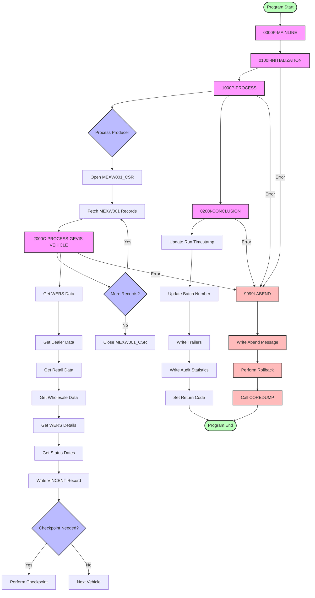

# EXWWB910 Control Flow Diagram

## Key Components

1. **Initialization Phase**
   - Opens AUDIT-FILE
   - Gets current timestamp
   - Initializes checkpoint/restart
   - Initializes working storage
   - Gets/updates batch number
   - Reads first SYSPARM record
   - Writes HUB/VINCENT headers

2. **Main Processing Loop**
   - Processes each producer from SYSPARM
   - Opens MEXW001_CSR for current model year vehicles
   - Opens SALE_CHK_CSR for older sold vehicles
   - Processes each vehicle record
   - Handles error conditions

3. **Vehicle Processing**
   - Gets WERS data
   - Gets dealer data
   - Gets retail data
   - Gets wholesale data
   - Gets WERS details
   - Gets status dates
   - Writes VINCENT record
   - Performs checkpoint if needed

4. **Conclusion Phase**
   - Updates run timestamp
   - Updates batch number
   - Writes trailers
   - Writes audit statistics
   - Sets return code

5. **Error Handling**
   - Handles DB2 errors
   - Handles IMS errors
   - Performs rollback
   - Calls COREDUMP
   - Writes abend messages

## Database Interactions

1. **Main Cursors**
   - MEXW001_CSR: Current model year vehicles
   - SALE_CHK_CSR: Older sold vehicles
   - MEXW031_CSR: Body style information
   - MEXW003_40V_CSR: Wholesale dealer information

2. **Key Tables**
   - MEXW001_VEH_ORDER: Vehicle order information
   - MEXW003_VEH_STATUS: Vehicle status information
   - MEXW004_VEH_WERS_STRING: WERS string data
   - MEXW007_VEH_WHS: Wholesale information
   - MEXW008_VEH_RTL: Retail information
   - MEXW027_CONV: Status code conversion
   - MEXW031_CATMAP: Body style mapping
   - MEXW032_CATALOG: Catalog information
   - MEXW033_BODY_TYPE: Body type information
   - MEXW034_VL_BRAND: Vehicle line/brand information
   - MEXW035_DLR_MSTR: Dealer master information
   - MEXS016_GENERIC2: Generic table for timestamps/batch numbers