COBOL - Technical Design Specification for Modernization: EXWWB915

---

# 1. Introduction
## 1.1 Purpose
This program, EXWWB915, reads the INVDATA bank file from the Invoicing system, extracts rebill records, and inserts the corresponding data into the GEVIS (Global Export Vehicle Information System) database.

## 1.2 Scope
The scope of this program includes:
*   Reading an input file (`FDIP.INV.INVDATAX.GEVIS(0)`) containing invoice data records (header, detail, trailer).
*   Reading sequential files `INVEHLN` and `INCNTRY` to load vehicle line and country code validation tables.
*   Processing rebill records from the input file.
*   Validating input data, including VINs, header/trailer record consistency, and cross-referencing against loaded tables.
*   Inserting or updating data in DB2 tables: `MEXW046_NAV_INV_VIN` (vehicle invoice details) and `MEXW047_NAO_INV_OPT` (vehicle option details).
*   Interacting with the `MEXS016_GENERIC2` DB2 table for system parameters (e.g., batch control).
*   Generating an audit report (`AUDIT-FILE`).
*   Generating an error report file (`MDEXG101` GSAM file) for records that fail validation or processing.
*   Utilizing IMS services for GSAM file I/O, checkpointing, and restart capabilities.

## 1.3 Audience
This document is intended for COBOL developers, system analysts, testers, and other stakeholders involved in the maintenance, modernization, or understanding of the EXWWB915 program and its interactions within the GEVIS system.

# 2. Overview
## 2.1 Background
EXWWB915 is a batch program that processes invoice data, specifically focusing on rebill records. It acts as an interface between the Invoicing system and the GEVIS database, ensuring that rebill information is accurately captured and stored for downstream processes. The program includes robust validation and error handling to maintain data integrity.

## 2.2 Objectives
*   To accurately extract rebill records from the INVDATA input stream.
*   To validate the extracted data against predefined business rules and reference tables.
*   To populate the GEVIS database tables (`MEXW046_NAV_INV_VIN`, `MEXW047_NAO_INV_OPT`) with the processed rebill data.
*   To provide comprehensive audit and error reporting.
*   To ensure proper batch control and system parameter management via `MEXS016_GENERIC2`.

## 2.3 Assumptions and Constraints
*   The input file `FDIP.INV.INVDATAX.GEVIS(0)` is a GSAM file with a specific header-detail-trailer structure.
*   The `INVEHLN` and `INCNTRY` files are sequential and contain valid vehicle line and country codes respectively.
*   The program operates in a batch IMS/DB2 environment.
*   DB2 tables `MEXW046_NAV_INV_VIN`, `MEXW047_NAO_INV_OPT`, and `MEXS016_GENERIC2` are accessible and have the expected structures.
*   IMS services for GSAM I/O and checkpoint/restart are available.
*   The program relies on several copybooks for record layouts, SQLCA, IMS function codes, and common processing routines.

# 3. System Architecture
## 3.1 System Context Diagram
```mermaid
graph LR
    subgraph EXWWB915_System
        EXWWB915_Program[EXWWB915 Program]
    end

    INVDATA_GSAM_Input[GSAM Input File: FDIP.INV.INVDATAX.GEVIS(0) / MDEXG100] -->|Reads| EXWWB915_Program
    INVEHLN_File[Sequential Input File: INVEHLN] -->|Reads| EXWWB915_Program
    INCNTRY_File[Sequential Input File: INCNTRY] -->|Reads| EXWWB915_Program

    EXWWB915_Program -->|Reads/Updates| DB2_Database[DB2 Database: MEXS016_GENERIC2, MEXW046_NAV_INV_VIN, MEXW047_NAO_INV_OPT]
    EXWWB915_Program -->|Uses for GSAM I/O, CHKP/XRST| IMS_Services[IMS Services]

    EXWWB915_Program -->|Writes| AUDIT_File[Sequential Output File: AUDIT]
    EXWWB915_Program -->|Writes| ERROR_GSAM_Output[GSAM Output Error File: MDEXG101]
```

## 3.2 Component Diagram

```mermaid
graph TD
    EXWWB915[EXWWB915 Program]

    subgraph Main_Logic
        M0000[0000P-MAINLINE]
        M0100[0100I-INITIALIZATION]
        M0500[0500P-LOAD-INVEHLN]
        M0550[0550P-LOAD-INCNTRY]
        M1000[1000P-PROCESS-TRANSACTION]
        M0200[0200I-CONCLUSION]
    end

    subgraph Transaction_Processing
        M1100[1100P-PROCESS-HEADER-RECORD]
        M1200[1200P-PROCESS-TRAILER-RECORD]
        M2000[2000P-PROCESS-OTHER-TRANS]
    end

    subgraph Data_Validation_Population
        M2100[2100P-EDIT-VIN]
        M2200[2200P-SEARCH-VL-TABLE]
        M2300[2300P-MOVE-MEXW046]
        M2400[2400P-GET-MKT-MDL-YR]
        M2600[2600P-GET-DLR-CNTRY]
        M3000[3000P-LOAD-MEXW047]
    end

    subgraph DB_Operations
        M4000[4000P-INSERT-MEXW046]
        M4100[4100P-UPDATE-MEXW046]
        M4200[4200P-INSERT-MEXW047]
        M4300[4300P-DELETE-MEXW047]
    end

    subgraph IMS_File_IO
        M5000[5000P-GET-NEXT-INPUT-RECORD]
        M7000[7000P-WRITE-ERROR-RECORD]
    end

    subgraph Common_Routines_CPESEBIC_CPESEBCR
        C9000[9000I-GET-CURRENT-DATE-TIME]
        C9100[9100I-WRITE-AUDIT-HEADER]
        C9110[9110I-WRITE-AUDIT-CHECKPOINT]
        C9120[9120I-WRITE-AUDIT-TRAILER]
        C9200[9200I-SELECT-MEXS016-GENERIC2]
        C9210[9210I-UPDATE-MEXS016-GENERIC2]
        C9400[9400I-INCREMENT-CHKP-COUNT]
        C9500[9500I-IMS-CHECKPOINT]
        C9600[9600I-IMS-RESTART]
        C9999[9999I-ABEND]
    end

    subgraph Sub_Programs
        CBLTDLI[CBLTDLI]
        COREDUMP[COREDUMP]
    end

    EXWWB915 --> M0000
    M0000 --> M0100
    M0000 --> M0500
    M0000 --> M0550
    M0000 --> M1000
    M0000 --> M0200

    M0100 --> C9000
    M0100 --> C9100
    M0100 --> C9600
    M0100 --> C9500
    M0100 --> C9110
    M0100 --> M0400[0400P-INITIALIZE-OTHER]
    M0400 --> M0410[0410P-SELECT-SYSPARM-BATCHCTL]
    M0410 --> C9200
    M0410 --> C9999
    M0400 --> M5000
    M0400 --> M7000

    M0500 --> C9999
    M0550 --> C9999

    M1000 --> M1100
    M1000 --> M1200
    M1000 --> M2000
    M1000 --> C9400
    M1000 --> M5000
    M1000 --> C9999
    M1000 --> M8000[8000P-WRITE-AUDIT-DETAIL]

    M1100 --> M1120[1120P-EDIT-PROD-SYSTEM]
    M1100 --> M1130[1130P-EDIT-BATCH-NUMBER]
    M1120 --> C9200
    M1120 --> C9999
    M1130 --> C9999

    M1200 --> C9999
    M1200 --> C9210

    M2000 --> M2100
    M2000 --> M2200
    M2000 --> M2300
    M2000 --> M7000

    M2100 --> M2150[2150P-VALIDATE-17-CHAR-VIN]
    M2100 --> M7000
    M2150 --> M7000

    M2200 --> M7000

    M2300 --> M2400
    M2300 --> M2500[2500P-MOVE-DISCOUNT-AMTS]
    M2300 --> M2600
    M2300 --> M4000
    M2300 --> M3000
    M2300 --> M4100
    M2300 --> M4300

    M2400 --> C9200
    M2400 --> M7000

    M2600 --> M7000

    M3000 --> M3100[3100P-LOAD-IDR-OPTS]
    M3000 --> M3200[3200P-LOAD-STANDARD-OPTS]
    M3000 --> M3300[3300P-LOAD-RAPID-SPEC]
    M3100 --> M4200
    M3200 --> M4200
    M3300 --> M4200

    M4000 --> C9999
    M4100 --> C9999
    M4200 --> C9999
    M4300 --> C9999

    M5000 --> CBLTDLI
    M5000 --> C9999
    M7000 --> CBLTDLI
    M7000 --> C9999

    M0200 --> M0700[0700P-CONCLUDE-OTHER]
    M0200 --> C9000
    M0200 --> C9120

    C9200 --> C9999
    C9210 --> C9999
    C9400 --> C9500
    C9500 --> CBLTDLI
    C9500 --> C9999
    C9600 --> CBLTDLI
    C9600 --> C9999
    C9999 --> CBLTDLI
    C9999 --> COREDUMP
```


# 4. Detailed Design
## 4.1 Program Structure
The program EXWWB915 is a batch program structured into several phases:

1.  **Initialization (0000P-MAINLINE, 0100I-INITIALIZATION, CPESEBIC routines):**
    *   The program entry point is `DLITCBL`.
    *   Opens the `AUDIT-FILE`.
    *   Performs standard BMP shell initialization (`0100I-INITIALIZATION` from `CPESEBIC`), which includes getting current date/time, writing audit headers, getting checkpoint parameters from `MEXS016_GENERIC2` (`0110I-GET-CHECKPOINT-PARM`), performing an IMS restart (`9600I-IMS-RESTART`), and taking an initial checkpoint (`9500I-IMS-CHECKPOINT`).
    *   Loads vehicle line data from `INVEHLN-FILE` into `WS-INCLUDED-VEHICLE-LINES` table via `0500P-LOAD-INVEHLN`.
    *   Loads country data from `INCNTRY-FILE` into `WS-INCLUDED-COUNTRY` table via `0550P-LOAD-INCNTRY`.
    *   Performs program-specific initialization (`0400P-INITIALIZE-OTHER`), including selecting system parameters (batch control numbers) from `MEXS016_GENERIC2` via `0410P-SELECT-SYSPARM-BATCHCTL` and reading the first input record via `5000P-GET-NEXT-INPUT-RECORD`.

2.  **Main Processing Loop (0000P-MAINLINE, 1000P-PROCESS-TRANSACTION):**
    *   The program iterates through input records from the GSAM file (`INVDATA-IN-PCB`) until `INPUT-EOF` is true.
    *   `1000P-PROCESS-TRANSACTION` is the core paragraph for each record:
        *   Validates if the record is a Header, Trailer, or Detail record and processes accordingly.
        *   **Header Processing (`1100P-PROCESS-HEADER-RECORD`):** Validates production system and batch number against `MEXS016_GENERIC2` data. Aborts if mismatches occur.
        *   **Trailer Processing (`1200P-PROCESS-TRAILER-RECORD`):** Validates trailer data against header data and processed record counts. Updates `MEXS016_GENERIC2` with the next batch number. Aborts on validation failures.
        *   **Detail Record Processing (`2000P-PROCESS-OTHER-TRANS`):**
            *   Edits the VIN for validity (`2100P-EDIT-VIN`, `2150P-VALIDATE-17-CHAR-VIN`).
            *   Searches for the vehicle line in the loaded `WS-INCLUDED-VEHICLE-LINES` table (`2200P-SEARCH-VL-TABLE`).
            *   If valid and found, and if `IDR-SLD-DC-DIV` is 'F' or 'C', it proceeds to move data to `MEXW046_NAV_INV_VIN` fields (`2300P-MOVE-MEXW046`). This includes:
                *   Getting market model year from `MEXS016_GENERIC2` (`2400P-GET-MKT-MDL-YR`).
                *   Moving discount amounts (`2500P-MOVE-DISCOUNT-AMTS`).
                *   Getting dealer country code from `WS-INCLUDED-COUNTRY` (`2600P-GET-DLR-CNTRY`).
                *   Inserts the record into `MEXW046_NAV_INV_VIN` (`4000P-INSERT-MEXW046`).
                *   If insert is successful, loads options into `MEXW047_NAO_INV_OPT` (`3000P-LOAD-MEXW047` which calls `3100P-LOAD-IDR-OPTS`, `3200P-LOAD-STANDARD-OPTS`, `3300P-LOAD-RAPID-SPEC`, all calling `4200P-INSERT-MEXW047`).
                *   If insert results in a duplicate, it updates `MEXW046_NAV_INV_VIN` (`4100P-UPDATE-MEXW046`), deletes existing options from `MEXW047_NAO_INV_OPT` (`4300P-DELETE-MEXW047`), and then loads new options.
            *   Records failing validation are bypassed, and an error record is written via `7000P-WRITE-ERROR-RECORD`.
        *   Increments checkpoint counter and takes an IMS checkpoint if frequency is met (`9400I-INCREMENT-CHKP-COUNT`).
        *   Reads the next input record (`5000P-GET-NEXT-INPUT-RECORD`).

3.  **Conclusion (0000P-MAINLINE, 0200I-CONCLUSION, CPESEBIC routines):**
    *   Performs program-specific conclusion tasks (`0700P-CONCLUDE-OTHER`).
    *   Performs standard BMP shell conclusion (`0200I-CONCLUSION` from `CPESEBIC`), which includes getting current date/time, writing audit trailer, and closing the `AUDIT-FILE`.
    *   Sets `RETURN-CODE` to `+3` if `SEND-EMAIL` switch is true.
    *   Ends the program with `GOBACK`.

Error handling and abend procedures (`9999I-ABEND`, `7000P-WRITE-ERROR-RECORD`, `8000P-WRITE-AUDIT-DETAIL`) are integrated throughout the processing.

## 4.2 Data Structures
This section details the record layouts for files, Linkage Section items, and key Working-Storage structures used in interfaces.

*   **AUDIT-RECORD (for AUDIT-FILE)**
    *   Purpose: Defines the structure for records written to the sequential audit trail file.
    *   Record Layout:
        ```COBOL
        FD  AUDIT-FILE.
        01  AUDIT-RECORD.
        05  AUDIT-LABEL             PIC X(30).
        05  AUDIT-DATA              PIC X(50).
        ```
    *   Copybooks Referenced: None directly for FD definition.

*   **INVEHLN-REC (for INVEHLN-FILE, data moved to WS-INVOICE-VL)**
    *   Purpose: Defines the input record structure from the vehicle line file. This data is loaded into an internal table.
    *   Record Layout (`INVEHLN-REC`):
        ```COBOL
        FD  INVEHLN-FILE.
        01  INVEHLN-REC                 PIC X(80).
        ```
    *   Working-Storage structure receiving data (`WS-INVOICE-VL`):
        ```COBOL
        01  WS-INVOICE-VL.
        05  INV-VL-CD                     PIC X(02).
        05  FILLER                        PIC X(78)  VALUE SPACES.
        ```
    *   Copybooks Referenced: None directly for FD definition.

*   **INCNTRY-REC (for INCNTRY-FILE, data moved to WS-SOLD-TO-DLR-CTRY)**
    *   Purpose: Defines the input record structure from the country code file. This data is loaded into an internal table.
    *   Record Layout (`INCNTRY-REC`):
        ```COBOL
        FD  INCNTRY-FILE.
        01  INCNTRY-REC                 PIC X(80).
        ```
    *   Working-Storage structure receiving data (`WS-SOLD-TO-DLR-CTRY`):
        ```COBOL
        01  WS-SOLD-TO-DLR-CTRY.
        05  SLD-TO-DLR-CTRY-CD            PIC X(01).
        05  FILLER                        PIC X(01)  VALUE SPACES.
        05  SLD-TO-DLR-ISO-CTRY-CD        PIC X(03).
        05  FILLER                        PIC X(01)  VALUE SPACES.
        ```
    *   Copybooks Referenced: None directly for FD definition.

*   **INVOICE-DATA-RECORD (Primary GSAM Input, defined by CPEWIIDR)**
    *   Purpose: Defines the structure of records read from the main INVDATA GSAM input file, representing header, detail, or trailer invoice information.
    *   Record Layout (Hierarchical Outline due to length, from `CPEWIIDR`):
        ```COBOL
        01  INVOICE-DATA-RECORD.
            05  IDR-VIN.
                10  FILLER                   PIC X(09).
                10  IDR-MDL-YR-DIGIT         PIC X(01).
                10  FILLER                   PIC X(07).
            05  IDR-INV-DATE.
                10  IDR-INV-DATE-YYYY.
                    15  IDR-INV-DATE-CC      PIC X(02).
                    15  IDR-INV-DATE-YY      PIC X(02).
                10  IDR-INV-DATE-MM          PIC X(02).
                10  IDR-INV-DATE-DD          PIC X(02).
            05  IDR-SLD-DLR-CODE.
                10  IDR-SLD-DC-DIV           PIC X.
                10  IDR-SLD-DC-DIST          PIC X(02).
                10  IDR-SLD-DC-DLR           PIC X(03).
            05  IDR-SHP-DLR-CODE           PIC X(06).
            05  IDR-INVOICE-TYPE             PIC X.
            05  IDR-INV-VEH-LINE             PIC X(02).
            05  IDR-PRICE-LEVEL              PIC X(03).
            05  IDR-BATCH                  PIC X(04).
            05  IDR-FUEL-TYPE                PIC X.
            05  IDR-SHIPPING-WGT             PIC 9(06).
            05  IDR-DLR-VEH-DESC           PIC X(38).
            05  IDR-EXT-COLOR                PIC X(20).
            05  IDR-INT-COLOR                PIC X(20).
            05  IDR-BASE-DLR-PRICE           PIC S9(06)V99.
            05  IDR-BASE-UNIT-ADJ-MEMO       PIC S9(06)V99.
            05  IDR-OPTION-TABLE.
                10  IDR-OPTION-GRP OCCURS 87 TIMES INDEXED BY IDR-AG-IDX.
                    15  IDR-OPT-CODE         PIC X(05).
                    15  IDR-OPT-DESC         PIC X(30).
                    15  IDR-OPT-DLR-PRICE    PIC S9(06)V99.
                    15  IDR-OPT-RTL-PRICE    PIC S9(06)V99.
            05  IDR-OPT-TOT-DLR              PIC S9(06)V99.
            05  IDR-OPT-ADJ-MEMO             PIC S9(06)V99.
            05  IDR-BONUS-DISC-TABLE.
                10  IDR-BONUS-DISC-GRP OCCURS 6 TIMES INDEXED BY IDR-BDG-IDX.
                    15  IDR-BONUS-DISC-DESC  PIC X(30).
                    15  IDR-BONUS-DISC-DLR   PIC S9(06)V99.
            05  IDR-DEST-DELIV-CHG           PIC S9(05)V99.
            05  IDR-OPT-HLDBK                PIC S9(05)V99.
            05  IDR-BASE-HLDBK               PIC S9(05)V99.
            05  IDR-FDAF-ASSESS              PIC S9(05)V99.
            05  IDR-FIN-CHG                  PIC S9(05)V99.
            05  IDR-FUEL-CHG                 PIC S9(05)V99.
            05  IDR-INV-TOTAL-AMT            PIC S9(06)V99.
            05  IDR-STD-EQUIP-TABLE.
                10  IDR-STD-EQUIP-GRP OCCURS 64 TIMES INDEXED BY IDR-SE-IDX.
                    15  IDR-STD-EQUIP-DESC   PIC X(28).
            05  IDR-VO-1-160.
                10  IDR-BODY-CD              PIC X(03).
                10  IDR-FTC-DLR              PIC X(06).
                10  IDR-PEP-CD               PIC X(04).
            05  IDR-SLD-PA-CODE              PIC X(05).
            05  IDR-BASE-VEH-AMT             PIC S9(07)V99.
            05  IDR-RAPID-SPEC-TABLE.
                10 IDR-RAPID-SPEC-GRP OCCURS 31 TIMES INDEXED BY IDR-RS-IDX.
                    15 IDR-RAPID-EQUIP        PIC X(28).
                    15 IDR-RAPID-AMT          PIC S9(05)V99.
                    15 IDR-RAPID-MSRP         PIC S9(05)V99.
            05  FILLER                       PIC X(44).
            ... and other fields up to a total length of 10000 bytes.
        ```
    *   Copybooks Referenced: `CPEWIIDR`

*   **INVDATA-RECORD (Working-Storage, with redefines for Header/Trailer)**
    *   Purpose: A Working-Storage area that receives the `INVOICE-DATA-RECORD` from GSAM input. It has redefinitions to easily access header and trailer specific fields.
    *   Record Layout:
        ```COBOL
        01  INVDATA.
        05  INVDATA-RECORD                PIC X(10000) VALUE SPACES.
        05  INVDATA-HEADER-INV REDEFINES INVDATA-RECORD.
        10  FILLER                     PIC X(17).
        10  INVDATA-HD-HEADER-INV      PIC X(03).
        88  INV-HEADER-RECORD      VALUE "HDR".
        10  INVDATA-HDR-ID             PIC X(08).
        10  INVDATA-HDR-CURR-BATCH     PIC 9(05).
        10  INVDATA-HDR-PREV-BATCH     PIC 9(05).
        10  INVDATA-HDR-CURR-DATE      PIC X(06).
        10  INVDATA-HDR-PREV-DATE      PIC X(06).
        10  FILLER                     PIC X(9950).
        05  INVDATA-TRAILER-INV REDEFINES INVDATA-RECORD.
        10  FILLER                     PIC X(17).
        10  INVDATA-TL-TRAILER-INV     PIC X(03).
        88  INV-TRAILER-RECORD     VALUE "TRL".
        10  INVDATA-TLR-ID             PIC X(08).
        10  INVDATA-TLR-CURR-BATCH     PIC 9(05).
        10  FILLER                     PIC X(05).
        10  INVDATA-TLR-CNT            PIC 9(08).
        10  FILLER                     PIC X(9954).
        ```
    *   Copybooks Referenced: None for this specific definition, but its content originates from `CPEWIIDR`.

*   **ERROR-RECORD (Working-Storage, for GSAM Error Output)**
    *   Purpose: Defines the structure for records written to the GSAM error output file (`MDEXG101`).
    *   Record Layout:
        ```COBOL
        01  ERROR-RECORD.
        05  ERROR-VIN                     PIC X(17) VALUE SPACES.
        05  FILLER                        PIC X(01) VALUE SPACES.
        05  ERROR-MESSAGE.
        10  ERROR-MESSAGE-1           PIC X(50) VALUE SPACES.
        10  ERROR-MESSAGE-2           PIC X(38) VALUE SPACES.
        05  ERROR-VALUE                   PIC X(34) VALUE SPACES.
        05  ERROR-HEADER-DATA             REDEFINES ERROR-VALUE.
        10  ERROR-FILE-TYPE           PIC X(01).
        10  ERROR-DATA-SRC            PIC X(02).
        10  ERROR-BATCH-DT            PIC X(10).
        10  FILLER                    PIC X(21).
        05  ERROR-SORT-FIELDS.
        10  ERROR-PROD-SYS           PIC X(02) VALUE SPACES.
        10  ERROR-BATCH-NBR          PIC 9(05) VALUE ZEROES.
        10  ERROR-SORT-BYTE          PIC X(01) VALUE SPACES.
        05  ERROR-PROD-SRC               PIC X(02) VALUE SPACES.
        05  ERROR-FILLER                 PIC X(35) VALUE SPACES.
        ```
    *   Copybooks Referenced: None.

*   **IO-PCB (Linkage Section)**
    *   Purpose: Standard IMS I/O Program Communication Block used for general IMS calls (e.g., CHKP, XRST, ROLB).
    *   Record Layout:
        ```COBOL
        01  IO-PCB.
        05  IO-PCB-LTERM                   PIC X(08).
        05  FILLER                         PIC X(02).
        05  IO-PCB-STATUS                  PIC X(02).
        05  FILLER                         PIC X(28).
        ```
    *   Copybooks Referenced: Implicitly standard IMS structure.

*   **INVDATA-IN-PCB (Linkage Section)**
    *   Purpose: IMS PCB for accessing the input GSAM file (`MDEXG100`, corresponding to `FDIP.INV.INVDATAX.GEVIS(0)`).
    *   Record Layout:
        ```COBOL
        01  INVDATA-IN-PCB.
        05  INVDATA-IN-PCB-NAME            PIC X(08)
        VALUE "MDEXG100".
        05  FILLER                         PIC X(02).
        05  INVDATA-IN-PCB-STATUS          PIC X(02).
        05  FILLER                         PIC X(28).
        ```
    *   Copybooks Referenced: Implicitly standard IMS structure.

*   **ERROR-PCB (Linkage Section)**
    *   Purpose: IMS PCB for writing to the output GSAM error file (`MDEXG101`).
    *   Record Layout:
        ```COBOL
        01  ERROR-PCB.
        05  ERROR-PCB-NAME                 PIC X(08)
        VALUE "MDEXG101".
        05  FILLER                         PIC X(02).
        05  ERROR-PCB-STATUS               PIC X(02).
        05  FILLER                         PIC X(28).
        ```
    *   Copybooks Referenced: Implicitly standard IMS structure.

*   **DB2 Host Variable Structures (DCLGENs):**
    *   `MEXS016-GENERIC2` (for table `MEXS016_GENERIC2`)
        *   Purpose: Defines host variables for interacting with the `MEXS016_GENERIC2` system parameter table.
        *   Record Layout:
            ```COBOL
            01  MEXS016-GENERIC2.
            10 GNT-SYSTEM-CD        PIC X(4).
            10 GNT-TABLE-ID         PIC X(8).
            10 GNT-KEY-DATA         PIC X(20).
            10 GNT-ATTRIBUTE-DATA   PIC X(50).
            10 GNT-SW-ACTIVE        PIC X(1).
            10 GNT-UPDT-ID          PIC X(8).
            10 GNT-UPDT-TIMESTAMP   PIC X(26).
            ```
        *   Copybooks Referenced: `CPESD016`

    *   `MEXW047-NAV-INV-VIN` (for table `MEXW046_NAV_INV_VIN`)
        *   Purpose: Defines host variables for inserting/updating data in the `MEXW046_NAV_INV_VIN` table.
        *   Record Layout: (Key fields shown, full layout in `CPEWD046`)
            ```COBOL
            01  MEXW047-NAV-INV-VIN.
            10 NAV-VIN-C                PIC X(17).
            10 NAV-DLR-VEH-X            PIC X(38).
            10 NAV-INV-VL-C             PIC X(2).
            10 NAV-EXT-CLR-N            PIC X(20).
            10 NAV-INT-CLR-N            PIC X(20).
            10 NAV-BODY-C               PIC X(3).
            10 NAV-PEP-C                PIC X(4).
            10 NAV-MKT-MDL-YR-R         PIC S9(9) USAGE COMP.
            10 NAV-SLD-TO-DLR-C         PIC X(6).
            10 NAV-PA-DLR-C             PIC X(5).
            10 NAV-FTC-DLR-C            PIC X(6).
            10 NAV-INV-TYPE-C           PIC X(1).
            10 NAV-PRICE-LVL-C          PIC X(3).
            10 NAV-BASE-VEH-A           PIC S9(6)V9(2) USAGE COMP-3.
            10 NAV-BASE-DLR-PRICE-A     PIC S9(6)V9(2) USAGE COMP-3.
            10 NAV-BASE-UNIT-ADJ-MEMO-A PIC S9(6)V9(2) USAGE COMP-3.
            10 NAV-TOT-DLR-OPTS-A       PIC S9(6)V9(2) USAGE COMP-3.
            10 NAV-OPT-ADJ-MEMO-A       PIC S9(6)V9(2) USAGE COMP-3.
            10 NAV-DEST-DELIV-CHG-A     PIC S9(5)V9(2) USAGE COMP-3.
            10 NAV-DLR-BONUS-DISC-1-X   PIC X(30).
            10 NAV-DLR-BONUS-DISC-1-A   PIC S9(6)V9(2) USAGE COMP-3.
            ... (continues for 6 bonus discounts)
            10 NAV-OPT-HOLDBACK-A       PIC S9(5)V9(2) USAGE COMP-3.
            10 NAV-BASE-HOLDBACK-A      PIC S9(5)V9(2) USAGE COMP-3.
            10 NAV-FDAF-ASSESS-A        PIC S9(5)V9(2) USAGE COMP-3.
            10 NAV-FIN-COST-A           PIC S9(5)V9(2) USAGE COMP-3.
            10 NAV-FUEL-CHG-A           PIC S9(5)V9(2) USAGE COMP-3.
            10 NAV-INV-TOT-A            PIC S9(6)V9(2) USAGE COMP-3.
            10 NAV-DLR-COUNTRY-ISO3-C   PIC X(3).
            10 NAV-REBILL-F             PIC X(1).
            10 NAV-UPDT-ID-C            PIC X(8).
            10 NAV-UPDT-S               PIC X(26).
            10 NAV-GMT-S                PIC X(26).
            ```
        *   Copybooks Referenced: `CPEWD046`

    *   `MEXW047-NAV-INV-OPT` (for table `MEXW047_NAO_INV_OPT`)
        *   Purpose: Defines host variables for inserting data into the `MEXW047_NAO_INV_OPT` table.
        *   Record Layout:
            ```COBOL
            01  MEXW047-NAV-INV-OPT.
            10 NAO-VIN-C            PIC X(17).
            10 NAO-SEQ-R            PIC S9(9) USAGE COMP.
            10 NAO-OPTION-C         PIC X(05).
            10 NAO-OPTION-N         PIC X(30).
            10 NAO-OPTION-PRICE-A   PIC S9(7)V9(2) USAGE COMP-3.
            10 NAO-SUB-HEADING-N    PIC X(28).
            10 NAO-UPDT-ID-C        PIC X(8).
            10 NAO-UPDT-S           PIC X(26).
            10 NAO-GMT-S            PIC X(26).
            ```
        *   Copybooks Referenced: `CPEWD047`

## 4.3 Algorithms
### 4.3.1 Overall Program Logic (Condensed Pseudocode)
```
PROGRAM EXWWB915
  ENTRY using IO-PCB, INVDATA-IN-PCB, ERROR-PCB

  PERFORM INITIALIZATION
    Open AUDIT-FILE
    Perform standard BMP shell init (get date, audit header, checkpoint parms, IMS restart, initial checkpoint)
    Load Vehicle Line data (INVEHLN-FILE to WS-INCLUDED-VEHICLE-LINES)
    Load Country data (INCNTRY-FILE to WS-INCLUDED-COUNTRY)
    Perform program-specific init (get SYSPARM batch control, read first input record)
    IF input file is empty THEN
        Write error "INPUT FILE IS EMPTY"
        Set SEND-EMAIL flag
    END-IF

  PERFORM PROCESS-TRANSACTION UNTIL INPUT-EOF
    Increment input record count
    EVALUATE TRUE
      WHEN HEADER-NEEDED AND NOT INV-HEADER-RECORD
        ABEND "FIRST RECORD IS NOT HEADER"
      WHEN TRAILER-NEEDED AND INV-HEADER-RECORD
        ABEND "HEADER FOUND WHEN TRAILER EXPECTED"
      WHEN INV-HEADER-RECORD
        PERFORM PROCESS-HEADER-RECORD
        Set TRAILER-NEEDED
      WHEN INV-TRAILER-RECORD
        PERFORM PROCESS-TRAILER-RECORD
        Set HEADER-NEEDED
      WHEN OTHER (Detail Record)
        PERFORM PROCESS-OTHER-TRANS
    END-EVALUATE
    Increment checkpoint counter; if frequency met, PERFORM IMS-CHECKPOINT
    PERFORM GET-NEXT-INPUT-RECORD
    IF INPUT-EOF AND TRAILER-NEEDED THEN
      ABEND "TRAILER RECORD IS MISSING"
    END-IF
  END-PERFORM

  PERFORM CONCLUSION
    Perform program-specific conclusion
    Perform standard BMP shell conclusion (get date, audit trailer, close AUDIT-FILE)
    IF SEND-EMAIL flag is set THEN
      Set RETURN-CODE = +3
    END-IF
  GOBACK.

PROCESS-HEADER-RECORD:
  Edit Production System (using SYSPARM MEXS016)
  Edit Batch Number (against SYSPARM MEXS016)
  IF errors, ABEND.
  Store batch number and date.

PROCESS-TRAILER-RECORD:
  Validate Trailer Batch Number against Header Batch Number
  Validate Trailer Record Count against Processed Count
  IF errors, ABEND.
  Write audit totals for inserted/updated/bypassed records.
  Update SYSPARM MEXS016 with next batch number.

PROCESS-OTHER-TRANS (Detail Record):
  Initialize error flags and error record.
  PERFORM EDIT-VIN
  PERFORM SEARCH-VL-TABLE (Vehicle Line)
  IF VIN valid AND Vehicle Line found AND (IDR-SLD-DC-DIV = 'F' OR 'C') THEN
    PERFORM MOVE-MEXW046-DATA
      Get Market Model Year (from SYSPARM MEXS016)
      Move Discount Amounts
      Get Dealer Country (from loaded country table)
      PERFORM INSERT-MEXW046
      IF successful INSERT THEN
        PERFORM LOAD-MEXW047 (Options)
      ELSE IF duplicate INSERT THEN
        PERFORM UPDATE-MEXW046
        PERFORM DELETE-MEXW047 (Old Options)
        PERFORM LOAD-MEXW047 (New Options)
      ELSE (other DB2 error on INSERT)
        ABEND
      END-IF
  ELSE (VIN invalid OR VL not found OR Div not F/C)
    Increment bypass counter
    Write error record (e.g., "VIN IS SPACES", "VEHICLE LINE NOT FOUND", "DIVISION NOT FOUND")
  END-IF

EDIT-VIN:
  IF VIN is SPACES or HIGH-VALUES THEN
    Write error, Set SEND-EMAIL, Set ERROR-FOUND
  ELSE
    Convert VIN to uppercase
    Validate 17-character VIN (no embedded spaces, no special characters)
    IF errors, Write error, Set SEND-EMAIL, Set ERROR-FOUND
  END-IF

LOAD-MEXW047:
  Initialize sequence number
  Load IDR Options (from IDR-OPTION-TABLE to MEXW047)
  Load Standard Options (from IDR-STD-EQUIP-TABLE to MEXW047)
  Load Rapid Spec (from IDR-RAPID-SPEC-TABLE to MEXW047)

GET-NEXT-INPUT-RECORD:
  CALL "CBLTDLI" to get next record from INVDATA-IN-PCB
  IF end-of-database, SET INPUT-EOF.
  IF other IMS error, ABEND.

WRITE-ERROR-RECORD:
  CALL "CBLTDLI" to insert ERROR-RECORD into ERROR-PCB
  IF IMS error, ABEND.
```

### 4.3.2 Key Algorithmic Details

*   **Batch Control:**
    *   The program retrieves the current expected batch number from the `MEXS016_GENERIC2` table using key `EXWWB915` and `INVDATA ` (paragraph `0410P-SELECT-SYSPARM-BATCHCTL`).
    *   The input file's header record (`INVDATA-HDR-CURR-BATCH`) must match this retrieved batch number (`1130P-EDIT-BATCH-NUMBER`).
    *   Upon successful processing of a trailer record, the program updates `MEXS016_GENERIC2` by incrementing the batch number (`1200P-PROCESS-TRAILER-RECORD`).

*   **VIN Validation (`2100P-EDIT-VIN`, `2150P-VALIDATE-17-CHAR-VIN`):**
    *   VIN must not be spaces or high-values.
    *   VIN is converted to uppercase.
    *   VIN must not contain embedded spaces.
    *   VIN must not contain special characters (`'*', '(', ')', '!', '@', ...`).
    *   Errors result in the record being bypassed, an error message written to the error file, and the `SEND-EMAIL` flag set.

*   **Vehicle Line and Country Validation:**
    *   Vehicle lines are loaded from `INVEHLN-FILE` into `WS-INCLUDED-VEHICLE-LINES` during initialization (`0500P-LOAD-INVEHLN`). Each detail record's `IDR-INV-VEH-LINE` is validated against this table (`2200P-SEARCH-VL-TABLE`). If not found, the record is bypassed and an error is logged.
    *   Country codes are loaded from `INCNTRY-FILE` into `WS-INCLUDED-COUNTRY` (`0550P-LOAD-INCNTRY`). The `IDR-SLD-DC-DIV` is used to look up the `NAV-DLR-COUNTRY-ISO3-C` from this table (`2600P-GET-DLR-CNTRY`). If not found, an error is logged.

*   **Market Model Year Lookup (`2400P-GET-MKT-MDL-YR`):**
    *   The `IDR-MDL-YR-DIGIT` from the input VIN is used as a key to look up the full market model year from `MEXS016_GENERIC2` (table ID `MODELYR`). If not found, an error is logged, and `NAV-MKT-MDL-YR-R` is set to "0000".

*   **DB2 Operations for `MEXW046_NAV_INV_VIN`:**
    *   An `INSERT` is attempted first (`4000P-INSERT-MEXW046`).
    *   If `SQLCODE = 0` (OK), `PV-INS-UPD-REC-CNT` is incremented.
    *   If `SQLCODE = -803` (Duplicate Insert), an `UPDATE` is performed (`4100P-UPDATE-MEXW046`). If update is successful, `PV-INS-UPD-REC-CNT` is incremented.
    *   Other SQL errors during INSERT or UPDATE lead to an abend.

*   **DB2 Operations for `MEXW047_NAO_INV_OPT`:**
    *   If a `MEXW046` record is successfully inserted or updated:
        *   If it was an update to `MEXW046`, existing related records in `MEXW047_NAO_INV_OPT` are first deleted (`4300P-DELETE-MEXW047`).
        *   Option data is loaded:
            *   From `IDR-OPTION-TABLE` (`3100P-LOAD-IDR-OPTS`).
            *   From `IDR-STD-EQUIP-TABLE` (`3200P-LOAD-STANDARD-OPTS`), categorizing them under sub-headings like "EXTERIOR", "INTERIOR", etc.
            *   The first Rapid Spec from `IDR-RAPID-SPEC-TABLE` (`3300P-LOAD-RAPID-SPEC`).
        *   Each option is inserted into `MEXW047_NAO_INV_OPT` (`4200P-INSERT-MEXW047`). SQL errors during insert lead to an abend.

*   **Checkpoint/Restart:**
    *   IMS checkpoint frequency is read from `MEXS016_GENERIC2` (table `BMPCHKP`).
    *   Checkpoints are taken via `9500I-IMS-CHECKPOINT` (CALL `CBLTDLI` with `CHKP` function).
    *   Restart logic is handled by `9600I-IMS-RESTART` (CALL `CBLTDLI` with `XRST` function).

## 4.4 Input/Output Specifications

*   **Input Files:**
    1.  **INVDATA GSAM Input (via `INVDATA-IN-PCB` - DD Name typically `MDEXG100`):**
        *   Source: `FDIP.INV.INVDATAX.GEVIS(0)` (as per program comments).
        *   Description: Main input file containing invoice data records. It follows a header-detail-trailer structure. Each record is defined by the `INVOICE-DATA-RECORD` layout (copybook `CPEWIIDR`), with a length of 10000 bytes. Read using `GN` function of `CBLTDLI`.
    2.  **INVEHLN-FILE (DD Name `INVEHLN`):**
        *   Description: Sequential file containing valid vehicle lines. Records are 80 bytes long, with the vehicle line code in the first 2 bytes (`INV-VL-CD`). Used to populate an internal table for validation.
    3.  **INCNTRY-FILE (DD Name `INCNTRY`):**
        *   Description: Sequential file containing dealer country codes and corresponding ISO country codes. Records are 80 bytes long. `SLD-TO-DLR-CTRY-CD` (PIC X(01)) and `SLD-TO-DLR-ISO-CTRY-CD` (PIC X(03)) are used. Used to populate an internal table for validation and lookup.

*   **Output Files:**
    1.  **AUDIT-FILE (DD Name `AUDIT`):**
        *   Description: Sequential file for audit trail logging. Records are 80 bytes long (`AUDIT-RECORD`). Contains processing summaries, batch information, and error details in case of abends. Opened in `EXTEND` mode.
    2.  **ERROR GSAM Output (via `ERROR-PCB` - DD Name typically `MDEXG101`):**
        *   Description: GSAM file to log records that failed validation or processing. Records are defined by `ERROR-RECORD` layout and contain VIN, error messages, and batch information. Written using `ISRT` function of `CBLTDLI`.

*   **Database I/O:**
    *   **DB2 Tables:**
        *   `MEXS016_GENERIC2`: Read for system parameters (batch control, checkpoint frequency, model year lookup). Updated for batch control.
        *   `MEXW046_NAV_INV_VIN`: Inserted with new rebill vehicle data; updated if a record for the VIN already exists.
        *   `MEXW047_NAO_INV_OPT`: Inserted with vehicle option details. Deleted and re-inserted if the parent `MEXW046` record is updated.
    *   **IMS Database:** Used for GSAM file handling (input and error output) and checkpoint/restart services.

## 4.5 DB2 Database Details
The program interacts with DB2 using embedded SQL statements.

*   **SQL Statements:**

    1.  **SELECT from `MEXS016_GENERIC2` (in `0410P-SELECT-SYSPARM-BATCHCTL` and `1120P-EDIT-PROD-SYSTEM` via `9200I-SELECT-MEXS016-GENERIC2`):**
        ```sql
        SELECT GNT_ATTRIBUTE_DATA
        INTO  :GNT-ATTRIBUTE-DATA
        FROM   MEXS016_GENERIC2
        WHERE  GNT_SYSTEM_CD    = :GNT-SYSTEM-CD
        AND    GNT_TABLE_ID     = :GNT-TABLE-ID
        AND    GNT_KEY_DATA     = :GNT-KEY-DATA
        AND    GNT_SW_ACTIVE LIKE :GNT-SW-ACTIVE
        ```
        *   Host variables used: `GNT-SYSTEM-CD`, `GNT-TABLE-ID`, `GNT-KEY-DATA`, `GNT-SW-ACTIVE`, `GNT-ATTRIBUTE-DATA`.

    2.  **UPDATE `MEXS016_GENERIC2` (in `1200P-PROCESS-TRAILER-RECORD` and `0110I-GET-CHECKPOINT-PARM` via `9210I-UPDATE-MEXS016-GENERIC2`):**
        ```sql
        UPDATE MEXS016_GENERIC2
        SET    GNT_ATTRIBUTE_DATA = :GNT-ATTRIBUTE-DATA
        WHERE  GNT_SYSTEM_CD      = :GNT-SYSTEM-CD
        AND    GNT_TABLE_ID       = :GNT-TABLE-ID
        AND    GNT_KEY_DATA       = :GNT-KEY-DATA
        ```
        *   Host variables used: `GNT-ATTRIBUTE-DATA`, `GNT-SYSTEM-CD`, `GNT-TABLE-ID`, `GNT-KEY-DATA`.

    3.  **SELECT from `MEXS016_GENERIC2` (in `2400P-GET-MKT-MDL-YR` via `9200I-SELECT-MEXS016-GENERIC2`):**
        (Same SQL structure as item 1, with different key values for model year lookup)
        ```sql
        SELECT GNT_ATTRIBUTE_DATA
        INTO  :GNT-ATTRIBUTE-DATA
        FROM   MEXS016_GENERIC2
        WHERE  GNT_SYSTEM_CD    = :GNT-SYSTEM-CD
        AND    GNT_TABLE_ID     = :GNT-TABLE-ID
        AND    GNT_KEY_DATA     = :GNT-KEY-DATA
        AND    GNT_SW_ACTIVE LIKE :GNT-SW-ACTIVE
        ```

    4.  **INSERT into `MEXW046_NAV_INV_VIN` (in `4000P-INSERT-MEXW046`):**
        ```sql
        INSERT INTO MEXW046_NAV_INV_VIN
        ( NAV_VIN_C
        ,NAV_DLR_VEH_X
        ,NAV_INV_VL_C
        ,NAV_EXT_CLR_N
        ,NAV_INT_CLR_N
        ,NAV_BODY_C
        ,NAV_PEP_C
        ,NAV_MKT_MDL_YR_R
        ,NAV_SLD_TO_DLR_C
        ,NAV_PA_DLR_C
        ,NAV_FTC_DLR_C
        ,NAV_INV_TYPE_C
        ,NAV_PRICE_LVL_C
        ,NAV_BASE_VEH_A
        ,NAV_BASE_DLR_PRICE_A
        ,NAV_BASE_UNIT_ADJ_MEMO_A
        ,NAV_TOT_DLR_OPTS_A
        ,NAV_OPT_ADJ_MEMO_A
        ,NAV_DEST_DELIV_CHG_A
        ,NAV_DLR_BONUS_DISC_1_X
        ,NAV_DLR_BONUS_DISC_1_A
        ,NAV_DLR_BONUS_DISC_2_X
        ,NAV_DLR_BONUS_DISC_2_A
        ,NAV_DLR_BONUS_DISC_3_X
        ,NAV_DLR_BONUS_DISC_3_A
        ,NAV_DLR_BONUS_DISC_4_X
        ,NAV_DLR_BONUS_DISC_4_A
        ,NAV_DLR_BONUS_DISC_5_X
        ,NAV_DLR_BONUS_DISC_5_A
        ,NAV_DLR_BONUS_DISC_6_X
        ,NAV_DLR_BONUS_DISC_6_A
        ,NAV_OPT_HOLDBACK_A
        ,NAV_BASE_HOLDBACK_A
        ,NAV_FDAF_ASSESS_A
        ,NAV_FIN_COST_A
        ,NAV_FUEL_CHG_A
        ,NAV_INV_TOT_A
        ,NAV_DLR_COUNTRY_ISO3_C
        ,NAV_REBILL_F
        ,NAV_UPDT_ID_C
        ,NAV_UPDT_S
        ,NAV_GMT_S
        )
        VALUES(:NAV-VIN-C
        ,:NAV-DLR-VEH-X
        ,:NAV-INV-VL-C
        ,:NAV-EXT-CLR-N
        ,:NAV-INT-CLR-N
        ,:NAV-BODY-C
        ,:NAV-PEP-C
        ,:NAV-MKT-MDL-YR-R
        ,:NAV-SLD-TO-DLR-C
        ,:NAV-PA-DLR-C
        ,:NAV-FTC-DLR-C
        ,:NAV-INV-TYPE-C
        ,:NAV-PRICE-LVL-C
        ,:NAV-BASE-VEH-A
        ,:NAV-BASE-DLR-PRICE-A
        ,:NAV-BASE-UNIT-ADJ-MEMO-A
        ,:NAV-TOT-DLR-OPTS-A
        ,:NAV-OPT-ADJ-MEMO-A
        ,:NAV-DEST-DELIV-CHG-A
        ,:NAV-DLR-BONUS-DISC-1-X
        ,:NAV-DLR-BONUS-DISC-1-A
        ,:NAV-DLR-BONUS-DISC-2-X
        ,:NAV-DLR-BONUS-DISC-2-A
        ,:NAV-DLR-BONUS-DISC-3-X
        ,:NAV-DLR-BONUS-DISC-3-A
        ,:NAV-DLR-BONUS-DISC-4-X
        ,:NAV-DLR-BONUS-DISC-4-A
        ,:NAV-DLR-BONUS-DISC-5-X
        ,:NAV-DLR-BONUS-DISC-5-A
        ,:NAV-DLR-BONUS-DISC-6-X
        ,:NAV-DLR-BONUS-DISC-6-A
        ,:NAV-OPT-HOLDBACK-A
        ,:NAV-BASE-HOLDBACK-A
        ,:NAV-FDAF-ASSESS-A
        ,:NAV-FIN-COST-A
        ,:NAV-FUEL-CHG-A
        ,:NAV-INV-TOT-A
        ,:NAV-DLR-COUNTRY-ISO3-C
        ,:NAV-REBILL-F
        ,:NAV-UPDT-ID-C
        , CURRENT TIMESTAMP
        , CURRENT TIMESTAMP - CURRENT TIMEZONE
        )
        ```

    5.  **UPDATE `MEXW046_NAV_INV_VIN` (in `4100P-UPDATE-MEXW046`):**
        ```sql
        UPDATE MEXW046_NAV_INV_VIN
        SET NAV_DLR_VEH_X            = :NAV-DLR-VEH-X
        ,NAV_INV_VL_C             = :NAV-INV-VL-C
        ,NAV_EXT_CLR_N            = :NAV-EXT-CLR-N
        ,NAV_INT_CLR_N            = :NAV-INT-CLR-N
        ,NAV_BODY_C               = :NAV-BODY-C
        ,NAV_PEP_C                = :NAV-PEP-C
        ,NAV_MKT_MDL_YR_R         = :NAV-MKT-MDL-YR-R
        ,NAV_SLD_TO_DLR_C         = :NAV-SLD-TO-DLR-C
        ,NAV_PA_DLR_C             = :NAV-PA-DLR-C
        ,NAV_FTC_DLR_C            = :NAV-FTC-DLR-C
        ,NAV_INV_TYPE_C           = :NAV-INV-TYPE-C
        ,NAV_PRICE_LVL_C          = :NAV-PRICE-LVL-C
        ,NAV_BASE_VEH_A           = :NAV-BASE-VEH-A
        ,NAV_BASE_DLR_PRICE_A     = :NAV-BASE-DLR-PRICE-A
        ,NAV_BASE_UNIT_ADJ_MEMO_A = :NAV-BASE-UNIT-ADJ-MEMO-A
        ,NAV_TOT_DLR_OPTS_A       = :NAV-TOT-DLR-OPTS-A
        ,NAV_OPT_ADJ_MEMO_A       = :NAV-OPT-ADJ-MEMO-A
        ,NAV_DEST_DELIV_CHG_A     = :NAV-DEST-DELIV-CHG-A
        ,NAV_DLR_BONUS_DISC_1_X   = :NAV-DLR-BONUS-DISC-1-X
        ,NAV_DLR_BONUS_DISC_1_A   = :NAV-DLR-BONUS-DISC-1-A
        ,NAV_DLR_BONUS_DISC_2_X   = :NAV-DLR-BONUS-DISC-2-X
        ,NAV_DLR_BONUS_DISC_2_A   = :NAV-DLR-BONUS-DISC-2-A
        ,NAV_DLR_BONUS_DISC_3_X   = :NAV-DLR-BONUS-DISC-3-X
        ,NAV_DLR_BONUS_DISC_3_A   = :NAV-DLR-BONUS-DISC-3-A
        ,NAV_DLR_BONUS_DISC_4_X   = :NAV-DLR-BONUS-DISC-4-X
        ,NAV_DLR_BONUS_DISC_4_A   = :NAV-DLR-BONUS-DISC-4-A
        ,NAV_DLR_BONUS_DISC_5_X   = :NAV-DLR-BONUS-DISC-5-X
        ,NAV_DLR_BONUS_DISC_5_A   = :NAV-DLR-BONUS-DISC-5-A
        ,NAV_DLR_BONUS_DISC_6_X   = :NAV-DLR-BONUS-DISC-6-X
        ,NAV_DLR_BONUS_DISC_6_A   = :NAV-DLR-BONUS-DISC-6-A
        ,NAV_OPT_HOLDBACK_A       = :NAV-OPT-HOLDBACK-A
        ,NAV_BASE_HOLDBACK_A      = :NAV-BASE-HOLDBACK-A
        ,NAV_FDAF_ASSESS_A        = :NAV-FDAF-ASSESS-A
        ,NAV_FIN_COST_A           = :NAV-FIN-COST-A
        ,NAV_FUEL_CHG_A           = :NAV-FUEL-CHG-A
        ,NAV_INV_TOT_A            = :NAV-INV-TOT-A
        ,NAV_DLR_COUNTRY_ISO3_C   = :NAV-DLR-COUNTRY-ISO3-C
        ,NAV_REBILL_F             = :NAV-REBILL-F
        ,NAV_UPDT_ID_C            = :NAV-UPDT-ID-C
        ,NAV_UPDT_S               =  CURRENT TIMESTAMP
        ,NAV_GMT_S                =  CURRENT TIMESTAMP -
        CURRENT TIMEZONE
        WHERE NAV_VIN_C                = :NAV-VIN-C
        ```

    6.  **INSERT into `MEXW047_NAO_INV_OPT` (in `4200P-INSERT-MEXW047`):**
        ```sql
        INSERT INTO MEXW047_NAO_INV_OPT
        ( NAV_VIN_C
        ,NAO_SEQ_R
        ,NAO_OPTION_C
        ,NAO_OPTION_N
        ,NAO_OPTION_PRICE_A
        ,NAO_SUB_HEADING_N
        ,NAO_UPDT_ID_C
        ,NAO_UPDT_S
        ,NAO_GMT_S
        )
        VALUES(:NAO-VIN-C
        ,:NAO-SEQ-R
        ,:NAO-OPTION-C
        ,:NAO-OPTION-N
        ,:NAO-OPTION-PRICE-A
        ,:NAO-SUB-HEADING-N
        ,:NAO-UPDT-ID-C
        , CURRENT TIMESTAMP
        , CURRENT TIMESTAMP - CURRENT TIMEZONE
        )
        ```

    7.  **DELETE from `MEXW047_NAO_INV_OPT` (in `4300P-DELETE-MEXW047`):**
        ```sql
        DELETE FROM MEXW047_NAO_INV_OPT
        WHERE NAV_VIN_C = :NAO-VIN-C
        ```

*   **Tables Referenced:**
    *   `MEXS016_GENERIC2`
    *   `MEXW046_NAV_INV_VIN`
    *   `MEXW047_NAO_INV_OPT`

*   **Host Variables:**
    The host variables used correspond to the DCLGEN copybooks:
    *   `CPESD016` for `MEXS016-GENERIC2` (01 level `MEXS016-GENERIC2`).
    *   `CPEWD046` for `MEXW046_NAV_INV_VIN` (01 level `MEXW047-NAV-INV-VIN`).
    *   `CPEWD047` for `MEXW047_NAO_INV_OPT` (01 level `MEXW047-NAV-INV-OPT`).
    SQLCA is defined in `CPESDB2`.

## 4.6 IMS Database Details
The program utilizes IMS services primarily for GSAM file I/O and for Checkpoint/Restart facilities. Interactions are through `CALL 'CBLTDLI' USING ...`.

*   **PCBs Used:**
    *   `IO-PCB`: Standard I/O PCB used for `CHKP` (Checkpoint), `XRST` (Extended Restart), and `ROLB` (Rollback) calls.
    *   `INVDATA-IN-PCB`: GSAM PCB (name `MDEXG100`) for reading from the input file `FDIP.INV.INVDATAX.GEVIS(0)`.
    *   `ERROR-PCB`: GSAM PCB (name `MDEXG101`) for writing to the error output file.

*   **IMS Calls (via `CBLTDLI`):**
    *   **`SL-FUNC-GN` (Get Next):**
        *   Used in `5000P-GET-NEXT-INPUT-RECORD`.
        *   Reads sequentially from the GSAM input file specified by `INVDATA-IN-PCB` into `INVOICE-DATA-RECORD`.
        *   Status codes checked: `SC-IMS-STAT-OK`, `SC-IMS-STAT-END-OF-DB`. Others lead to abend.
    *   **`SL-FUNC-ISRT` (Insert):**
        *   Used in `7000P-WRITE-ERROR-RECORD`.
        *   Writes `ERROR-RECORD` to the GSAM error file specified by `ERROR-PCB`.
        *   Status codes checked: `SC-IMS-STAT-OK`. Others lead to abend.
    *   **`SL-FUNC-CHKP` (Checkpoint):**
        *   Used in `9500I-IMS-CHECKPOINT` (called from `0100I-INITIALIZATION` and `9400I-INCREMENT-CHKP-COUNT`).
        *   Takes an IMS checkpoint using `IO-PCB`, `CHKP-ID`, and `CHKP-SAVE-AREA`.
        *   Status codes checked: `SC-IMS-STAT-OK`. Others lead to abend.
    *   **`SL-FUNC-XRST` (Extended Restart):**
        *   Used in `9600I-IMS-RESTART` (called from `0100I-INITIALIZATION`).
        *   Performs an IMS restart using `IO-PCB`, `XRST-ID`, and `CHKP-SAVE-AREA`.
        *   Status codes checked: `SC-IMS-STAT-OK`. Non-OK status does not necessarily abend if it's a normal start (XRST-ID is spaces). Logic within `0100I-INITIALIZATION` handles normal start vs restart. However, `9600I-IMS-RESTART` itself will abend if `SC-IMS-STAT` is not OK after the call.
    *   **`SL-FUNC-ROLB` (Rollback):**
        *   Used in `9999I-ABEND`.
        *   Rolls back database updates using `IO-PCB`.

*   **IMS Function and Status Codes Copybook:** `CPESIMSB`

## 4.7 Called Sub-routine/Program Details
The program calls external sub-routines:

1.  **`CBLTDLI`**
    *   Purpose: The IMS-DL/I interface module used to make database calls (GSAM I/O, Checkpoint, Restart, Rollback).
    *   Called from: `5000P-GET-NEXT-INPUT-RECORD`, `7000P-WRITE-ERROR-RECORD`, `9500I-IMS-CHECKPOINT`, `9600I-IMS-RESTART`, `9999I-ABEND`.
    *   Parameters: Vary depending on the function code (e.g., function code, PCB, I/O area, save area).

2.  **`COREDUMP`**
    *   Purpose: Called to produce a system dump in case of an unrecoverable error (abend).
    *   Called from: `9999I-ABEND`.
    *   Parameters: None explicitly passed in the `CALL` statement shown.

The program entry point is `DLITCBL`, which is standard for IMS batch programs.
```COBOL
ENTRY "DLITCBL" USING IO-PCB
                        INVDATA-IN-PCB
                        ERROR-PCB
```

## 4.8 VSAM File Details
No VSAM files are directly referenced or processed by this program.

## 4.9 IBM MQ Details
No IBM MQ series operations are referenced in this program.

## 4.10 CICS Details
This program is a batch IMS program and does not contain any CICS-specific commands or an EXEC CICS INTERFACE section.

## 4.11 Error Handling

*   **Paragraph Name**: `0400P-INITIALIZE-OTHER`
    *   **Trigger Condition(s):**
        *   `SC-IMS-STAT-END-OF-DB` (from initial read in `5000P-GET-NEXT-INPUT-RECORD`) AND `PV-COUNT-BATCH = ZERO`.
    *   **Action Taken:**
        *   `MOVE MSG-INPUT-FILE-IS-EMPTY TO ERROR-MESSAGE-1`.
        *   `PERFORM 7000P-WRITE-ERROR-RECORD`.
        *   `SET SEND-EMAIL TO TRUE`.
    *   **Status Codes / Messages / Variables affected:**
        *   `ERROR-MESSAGE-1` = "INPUT FILE IS EMPTY".
        *   `PS-SEND-EMAIL` set to "Y".

*   **Paragraph Name**: `0410P-SELECT-SYSPARM-BATCHCTL` (via `9200I-SELECT-MEXS016-GENERIC2`)
    *   **Trigger Condition(s):**
        *   `MEXS016-NOT-FOUND` (SQLCODE +100 on SELECT from `MEXS016_GENERIC2`).
    *   **Action Taken:**
        *   `MOVE MSG-MEXS016-SYSPARM TO ABEND-MSG`.
        *   `MOVE PL-0410P TO ABEND-PARAGRAPH`.
        *   `PERFORM 9999I-ABEND`.
    *   **Status Codes / Messages / Variables affected:**
        *   `ABEND-MSG` = "MISSING MEXS016 SYSPARM REC".
        *   Program abends.

*   **Paragraph Name**: `0500P-LOAD-INVEHLN`
    *   **Trigger Condition(s):**
        *   `INVEHLN-X > WS-INVEHLN-ROW-MAX` (Vehicle line table overflow).
    *   **Action Taken:**
        *   `STRING MSG-TBL-CNT "TBL= " V-VL-TBL-ID DELIMITED BY SIZE INTO ABEND-MSG`.
        *   `MOVE "0500P" TO ABEND-PARAGRAPH`.
        *   `PERFORM 9999I-ABEND`.
    *   **Status Codes / Messages / Variables affected:**
        *   `ABEND-MSG` = "TABLE COUNT > MAX ALLOWED TBL= VEH LINE".
        *   Program abends.

*   **Paragraph Name**: `0550P-LOAD-INCNTRY`
    *   **Trigger Condition(s):**
        *   `INCNTRY-X > WS-INCNTRY-ROW-MAX` (Country table overflow).
    *   **Action Taken:**
        *   `STRING MSG-TBL-CNT "TBL= " V-CNTRY-TBL-ID DELIMITED BY SIZE INTO ABEND-MSG`.
        *   `MOVE "0550P" TO ABEND-PARAGRAPH`.
        *   `PERFORM 9999I-ABEND`.
    *   **Status Codes / Messages / Variables affected:**
        *   `ABEND-MSG` = "TABLE COUNT > MAX ALLOWED TBL= COUNTRY ".
        *   Program abends.

*   **Paragraph Name**: `1000P-PROCESS-TRANSACTION`
    *   **Trigger Condition(s):**
        *   `HEADER-NEEDED AND NOT INV-HEADER-RECORD`.
    *   **Action Taken:**
        *   `MOVE MSG-HEADER-NONE TO ABEND-MSG`.
        *   `MOVE "1000P" TO ABEND-PARAGRAPH`.
        *   `PERFORM 8000P-WRITE-AUDIT-DETAIL`.
        *   `PERFORM 9999I-ABEND`.
    *   **Status Codes / Messages / Variables affected:**
        *   `ABEND-MSG` = "FIRST RECORD IS NOT HEADER".
        *   Program abends.
    *   **Trigger Condition(s):**
        *   `TRAILER-NEEDED AND INV-HEADER-RECORD`.
    *   **Action Taken:**
        *   `MOVE MSG-HEADER-BAD TO ABEND-MSG`.
        *   `MOVE "1000P" TO ABEND-PARAGraph`.
        *   `PERFORM 8000P-WRITE-AUDIT-DETAIL`.
        *   `PERFORM 9999I-ABEND`.
    *   **Status Codes / Messages / Variables affected:**
        *   `ABEND-MSG` = "HEADER FOUND WHEN TRAILER EXPECTED".
        *   Program abends.
    *   **Trigger Condition(s):**
        *   `SC-IMS-STAT-END-OF-DB` (from `5000P-GET-NEXT-INPUT-RECORD`) AND `TRAILER-NEEDED`.
    *   **Action Taken:**
        *   `MOVE MSG-TRAILER-MISSING TO ABEND-MSG`.
        *   `MOVE "1000P" TO ABEND-PARAGRAPH`.
        *   `PERFORM 8000P-WRITE-AUDIT-DETAIL`.
        *   `PERFORM 9999I-ABEND`.
    *   **Status Codes / Messages / Variables affected:**
        *   `ABEND-MSG` = "TRAILER RECORD IS MISSING".
        *   Program abends.

*   **Paragraph Name**: `1120P-EDIT-PROD-SYSTEM` (via `9200I-SELECT-MEXS016-GENERIC2`)
    *   **Trigger Condition(s):**
        *   `MEXS016-NOT-FOUND` on SELECT from `MEXS016_GENERIC2` for batch control.
    *   **Action Taken:**
        *   `MOVE MSG-HDR-PROD-SYS-2 TO ABEND-MSG`.
        *   `MOVE "1120P" TO ABEND-PARAGRAPH`.
        *   `PERFORM 8000P-WRITE-AUDIT-DETAIL`.
        *   `PERFORM 9999I-ABEND`.
    *   **Status Codes / Messages / Variables affected:**
        *   `ABEND-MSG` = "HEADER PROD SYSTEM IS NOT IN SYSPARM TABLE".
        *   Program abends.

*   **Paragraph Name**: `1130P-EDIT-BATCH-NUMBER`
    *   **Trigger Condition(s):**
        *   `INVDATA-HDR-CURR-BATCH NOT NUMERIC`.
    *   **Action Taken:**
        *   `MOVE MSG-HDR-BATCH-NBR-1 TO ABEND-MSG`.
        *   `MOVE "1130P" TO ABEND-PARAGRAPH`.
        *   `PERFORM 8000P-WRITE-AUDIT-DETAIL`.
        *   `PERFORM 9999I-ABEND`.
    *   **Status Codes / Messages / Variables affected:**
        *   `ABEND-MSG` = "HEADER BATCH NUMBER IS NOT NUMERIC".
        *   Program abends.
    *   **Trigger Condition(s):**
        *   `INVDATA-HDR-CURR-BATCH NOT = PV-HDR-BATCH-NBR` (retrieved from SYSPARM).
    *   **Action Taken:**
        *   `MOVE MSG-HDR-BATCH-NBR-2 TO ABEND-MSG`.
        *   `MOVE "1130P" TO ABEND-PARAGRAPH`.
        *   `PERFORM 8000P-WRITE-AUDIT-DETAIL`.
        *   `PERFORM 9999I-ABEND`.
    *   **Status Codes / Messages / Variables affected:**
        *   `ABEND-MSG` = "HEADER BATCH NUMBER DOES NOT MATCH SYSPARM".
        *   Program abends.

*   **Paragraph Name**: `1200P-PROCESS-TRAILER-RECORD`
    *   **Trigger Condition(s):**
        *   `INVDATA-TLR-CURR-BATCH NOT = PV-HDR-BATCH-NBR`.
    *   **Action Taken:**
        *   `MOVE MSG-TRAILER-BAD TO ABEND-MSG`.
        *   `MOVE "1200P" TO ABEND-PARAGRAPH`.
        *   `PERFORM 8000P-WRITE-AUDIT-DETAIL`.
        *   `PERFORM 9999I-ABEND`.
    *   **Status Codes / Messages / Variables affected:**
        *   `ABEND-MSG` = "TRAILER DATA DOES NOT MATCH HEADER DATA".
        *   Program abends.
    *   **Trigger Condition(s):**
        *   `INVDATA-TLR-CNT + 2 NOT = PV-COUNT-BATCH`.
    *   **Action Taken:**
        *   `MOVE MSG-TRL-NBR-RECS TO ABEND-MSG`.
        *   `MOVE "1200P" TO ABEND-PARAGRAPH`.
        *   `PERFORM 8000P-WRITE-AUDIT-DETAIL`.
        *   `PERFORM 9999I-ABEND`.
    *   **Status Codes / Messages / Variables affected:**
        *   `ABEND-MSG` = "TRAILER RECORD COUNT DOESN'T MATCH BATCH COUNT".
        *   Program abends.
    *   **Trigger Condition(s):**
        *   `PV-BYPASS-REC-CNT + PV-INS-UPD-REC-CNT NOT = INVDATA-TLR-CNT`.
    *   **Action Taken:**
        *   `MOVE MSG-TRL-NBR-RECS-2 TO ABEND-MSG`.
        *   `MOVE "1200P" TO ABEND-PARAGRAPH`.
        *   `PERFORM 8000P-WRITE-AUDIT-DETAIL`.
        *   `PERFORM 9999I-ABEND`.
    *   **Status Codes / Messages / Variables affected:**
        *   `ABEND-MSG` = "TRAILER RECORD COUNT DOESN'T MATCH ADD/UPD COUNT".
        *   Program abends.

*   **Paragraph Name**: `2000P-PROCESS-OTHER-TRANS`
    *   **Trigger Condition(s):**
        *   `IDR-SLD-DC-DIV` is not 'F' or 'C' (after VIN and VL checks passed).
    *   **Action Taken:**
        *   `ADD +1 TO PV-BYPASS-REC-CNT`.
        *   `MOVE IDR-VIN TO ERROR-VIN`.
        *   `MOVE MSG-DIV-NOT-FOUND TO ERROR-MESSAGE-1`.
        *   Populate `ERROR-BATCH-DT`, `ERROR-BATCH-NBR`.
        *   `PERFORM 7000P-WRITE-ERROR-RECORD`.
    *   **Status Codes / Messages / Variables affected:**
        *   `ERROR-MESSAGE-1` = "DIVISION NOT FOUND".
        *   Record bypassed.

*   **Paragraph Name**: `2100P-EDIT-VIN`
    *   **Trigger Condition(s):**
        *   `IDR-VIN = SPACES OR IDR-VIN = HIGH-VALUES`.
    *   **Action Taken:**
        *   `MOVE IDR-VIN TO ERROR-VIN`.
        *   `MOVE MSG-VIN-SPACES-OR-HIGH-VALUES TO ERROR-MESSAGE-1`.
        *   Populate `ERROR-BATCH-DT`, `ERROR-BATCH-NBR`.
        *   `PERFORM 7000P-WRITE-ERROR-RECORD`.
        *   `SET SEND-EMAIL TO TRUE`.
        *   `SET ERROR-FOUND TO TRUE`.
    *   **Status Codes / Messages / Variables affected:**
        *   `ERROR-MESSAGE-1` = "VIN IS SPACES OR HIGH VALUES".
        *   `PS-SEND-EMAIL` set to "Y", `PS-ERROR-SW` set to "Y". Record bypassed.

*   **Paragraph Name**: `2150P-VALIDATE-17-CHAR-VIN`
    *   **Trigger Condition(s):**
        *   `PV-VIN-SPACE-COUNT > 0` (VIN contains spaces).
    *   **Action Taken:**
        *   `MOVE IDR-VIN TO ERROR-VIN`.
        *   `MOVE MSG-VIN-CONTAINS-SPACES TO ERROR-MESSAGE-1`.
        *   Populate `ERROR-BATCH-DT`, `ERROR-BATCH-NBR`.
        *   `PERFORM 7000P-WRITE-ERROR-RECORD`.
        *   `SET SEND-EMAIL TO TRUE`.
        *   `SET ERROR-FOUND TO TRUE`.
    *   **Status Codes / Messages / Variables affected:**
        *   `ERROR-MESSAGE-1` = "VIN CONTAINS SPACES".
        *   `PS-SEND-EMAIL` set to "Y", `PS-ERROR-SW` set to "Y". Record bypassed.
    *   **Trigger Condition(s):**
        *   `PV-VIN-SP-CHAR-COUNT > 0` (VIN contains special characters).
    *   **Action Taken:**
        *   `MOVE IDR-VIN TO ERROR-VIN`.
        *   `MOVE MSG-VIN-CONTAINS-SPEC-CHARS TO ERROR-MESSAGE-1`.
        *   Populate `ERROR-BATCH-DT`, `ERROR-BATCH-NBR`.
        *   `PERFORM 7000P-WRITE-ERROR-RECORD`.
        *   `SET SEND-EMAIL TO TRUE`.
        *   `SET ERROR-FOUND TO TRUE`.
    *   **Status Codes / Messages / Variables affected:**
        *   `ERROR-MESSAGE-1` = "VIN CONTAINS SPECIAL CHARACTERS".
        *   `PS-SEND-EMAIL` set to "Y", `PS-ERROR-SW` set to "Y". Record bypassed.

*   **Paragraph Name**: `2200P-SEARCH-VL-TABLE`
    *   **Trigger Condition(s):**
        *   `IDR-INV-VEH-LINE` not found in `INCL-VEH-LN-DATA` table.
    *   **Action Taken:**
        *   `MOVE IDR-VIN TO ERROR-VIN`.
        *   `MOVE MSG-VEH-LINE-NOT-FOUND TO ERROR-MESSAGE-1`.
        *   `MOVE IDR-INV-VEH-LINE TO ERROR-MESSAGE-2`.
        *   Populate `ERROR-BATCH-DT`, `ERROR-BATCH-NBR`.
        *   `PERFORM 7000P-WRITE-ERROR-RECORD`.
    *   **Status Codes / Messages / Variables affected:**
        *   `ERROR-MESSAGE-1` = "VEHICLE LINE NOT FOUND".
        *   `ERROR-MESSAGE-2` contains the invalid vehicle line. Record bypassed.

*   **Paragraph Name**: `2400P-GET-MKT-MDL-YR` (via `9200I-SELECT-MEXS016-GENERIC2`)
    *   **Trigger Condition(s):**
        *   `MEXS016-NOT-FOUND` on SELECT from `MEXS016_GENERIC2` for model year.
    *   **Action Taken:**
        *   `MOVE IDR-VIN TO ERROR-VIN`.
        *   `MOVE MSG-MKT-MDL-YR-NOT-FOUND TO ERROR-MESSAGE-1`.
        *   `MOVE IDR-MDL-YR-DIGIT TO ERROR-MESSAGE-2`.
        *   Populate `ERROR-BATCH-DT`, `ERROR-BATCH-NBR`.
        *   `PERFORM 7000P-WRITE-ERROR-RECORD`.
        *   `MOVE PL-FOUR-ZEROS TO NAV-MKT-MDL-YR-R`.
        *   `SET SEND-EMAIL TO TRUE`.
    *   **Status Codes / Messages / Variables affected:**
        *   `ERROR-MESSAGE-1` = "MARKET MODEL YEAR NOT FOUND ON MEXS016".
        *   `ERROR-MESSAGE-2` contains the invalid model year digit.
        *   `NAV-MKT-MDL-YR-R` set to "0000".
        *   `PS-SEND-EMAIL` set to "Y".

*   **Paragraph Name**: `2600P-GET-DLR-CNTRY`
    *   **Trigger Condition(s):**
        *   `IDR-SLD-DC-DIV` not found in `INCL-DLR-CNTRY-CD` table.
    *   **Action Taken:**
        *   `MOVE IDR-VIN TO ERROR-VIN`.
        *   `MOVE MSG-COUNTRY-NOT-FOUND TO ERROR-MESSAGE-1`.
        *   `MOVE IDR-SLD-DC-DIV TO ERROR-MESSAGE-2`.
        *   Populate `ERROR-BATCH-DT`, `ERROR-BATCH-NBR`.
        *   `PERFORM 7000P-WRITE-ERROR-RECORD`.
        *   `SET SEND-EMAIL TO TRUE`.
    *   **Status Codes / Messages / Variables affected:**
        *   `ERROR-MESSAGE-1` = "COUNTRY CODE NOT FOUND".
        *   `ERROR-MESSAGE-2` contains the invalid dealer division.
        *   `PS-SEND-EMAIL` set to "Y".

*   **Paragraph Name**: `4000P-INSERT-MEXW046`
    *   **Trigger Condition(s):**
        *   `SC-DB2-SQLCODE` is not OK and not DUP-INSERT after `INSERT` into `MEXW046_NAV_INV_VIN`.
    *   **Action Taken:**
        *   Write VIN to `AUDIT-RECORD`.
        *   `MOVE SQLCODE TO DB2-ABEND-SQLCODE`.
        *   `MOVE "INSERT" TO DB2-ABEND-FUNCTION`.
        *   `MOVE " MEXW046_NAV_INV_VIN " TO DB2-ABEND-TABLE`.
        *   `MOVE DB2-ABEND-MSG TO ABEND-MSG`.
        *   `MOVE "4000P-INSERT-MEXW046" TO ABEND-PARAGRAPH`.
        *   `PERFORM 9999I-ABEND`.
    *   **Status Codes / Messages / Variables affected:**
        *   Program abends.

*   **Paragraph Name**: `4100P-UPDATE-MEXW046`
    *   **Trigger Condition(s):**
        *   `SC-DB2-SQLCODE` is not OK after `UPDATE` of `MEXW046_NAV_INV_VIN`.
    *   **Action Taken:**
        *   Write VIN to `AUDIT-RECORD`.
        *   `MOVE SQLCODE TO DB2-ABEND-SQLCODE`.
        *   `MOVE "UPDATE" TO DB2-ABEND-FUNCTION`.
        *   `MOVE "MEXW046_NAO_REBILL_VIN" TO DB2-ABEND-TABLE` (Note: table name in message appears to be a typo, should be `MEXW046_NAV_INV_VIN`).
        *   `MOVE DB2-ABEND-MSG TO ABEND-MSG`.
        *   `MOVE "4100P-UPDATE-MEXW046" TO ABEND-PARAGRAPH`.
        *   `PERFORM 9999I-ABEND`.
    *   **Status Codes / Messages / Variables affected:**
        *   Program abends.

*   **Paragraph Name**: `4200P-INSERT-MEXW047`
    *   **Trigger Condition(s):**
        *   `SC-DB2-SQLCODE` is not OK after `INSERT` into `MEXW047_NAO_INV_OPT`.
    *   **Action Taken:**
        *   Write VIN and Option Code to `AUDIT-RECORD`.
        *   `MOVE SQLCODE TO DB2-ABEND-SQLCODE`.
        *   `MOVE "INSERT" TO DB2-ABEND-FUNCTION`.
        *   `MOVE " MEXW047_NAO_INV_OPT " TO DB2-ABEND-TABLE`.
        *   `MOVE DB2-ABEND-MSG TO ABEND-MSG`.
        *   `MOVE "4200P-INSERT-MEXW047" TO ABEND-PARAGRAPH`.
        *   `PERFORM 9999I-ABEND`.
    *   **Status Codes / Messages / Variables affected:**
        *   Program abends.

*   **Paragraph Name**: `4300P-DELETE-MEXW047`
    *   **Trigger Condition(s):**
        *   `SC-DB2-SQLCODE` is not OK and not NOT-FOUND after `DELETE` from `MEXW047_NAO_INV_OPT`.
    *   **Action Taken:**
        *   Write VIN to `AUDIT-RECORD`.
        *   `MOVE SQLCODE TO DB2-ABEND-SQLCODE`.
        *   `MOVE "DELETE" TO DB2-ABEND-FUNCTION`.
        *   `MOVE "MEXW047_NAO_INV_OPT" TO DB2-ABEND-TABLE`.
        *   `MOVE DB2-ABEND-MSG TO ABEND-MSG`.
        *   `MOVE "4300P-DELETE-MEXW047" TO ABEND-PARAGRAPH`.
        *   `PERFORM 9999I-ABEND`.
    *   **Status Codes / Messages / Variables affected:**
        *   Program abends.

*   **Paragraph Name**: `5000P-GET-NEXT-INPUT-RECORD`
    *   **Trigger Condition(s):**
        *   `SC-IMS-STAT` is not OK and not END-OF-DB after `CBLTDLI` call with `SL-FUNC-GN`.
    *   **Action Taken:**
        *   `MOVE INVDATA-IN-PCB-STATUS TO IMS-ABEND-STATUS`.
        *   `MOVE SL-FUNC-GN TO IMS-ABEND-FUNCTION`.
        *   `MOVE INVDATA-IN-PCB-NAME TO IMS-ABEND-PCB-NAME`.
        *   `MOVE IMS-ABEND-MSG TO ABEND-MSG`.
        *   `MOVE "5000P" TO ABEND-PARAGRAPH`.
        *   `PERFORM 9999I-ABEND`.
    *   **Status Codes / Messages / Variables affected:**
        *   Program abends.

*   **Paragraph Name**: `7000P-WRITE-ERROR-RECORD`
    *   **Trigger Condition(s):**
        *   `SC-IMS-STAT` is not OK after `CBLTDLI` call with `SL-FUNC-ISRT`.
    *   **Action Taken:**
        *   `MOVE ERROR-PCB-STATUS TO IMS-ABEND-STATUS`.
        *   `MOVE SL-FUNC-ISRT TO IMS-ABEND-FUNCTION`.
        *   `MOVE ERROR-PCB-NAME TO IMS-ABEND-PCB-NAME`.
        *   `MOVE IMS-ABEND-MSG TO ABEND-MSG`.
        *   `MOVE "7000P" TO ABEND-PARAGRAPH`.
        *   `PERFORM 9999I-ABEND`.
    *   **Status Codes / Messages / Variables affected:**
        *   Program abends.

*   **Paragraph Name**: `9999I-ABEND` (Common Abend Routine from `CPESEBCR`)
    *   **Trigger Condition(s):**
        *   Called by various paragraphs upon encountering critical errors.
    *   **Action Taken:**
        *   Sets `ABEND-PROGRAM` if not already set.
        *   Writes `ABEND-MSG` and `ABEND-MSG-2` to `AUDIT-RECORD`.
        *   Calls `CBLTDLI` with `SL-FUNC-ROLB` to perform an IMS rollback.
        *   Calls `COREDUMP` to generate a system dump.
    *   **Status Codes / Messages / Variables affected:**
        *   Database updates are rolled back.
        *   Program terminates abnormally with a core dump.

*   **General DB2 Error Handling (in `9200I-SELECT-MEXS016-GENERIC2`, `9210I-UPDATE-MEXS016-GENERIC2` from `CPESEBCR`):**
    *   **Trigger Condition(s):**
        *   Any `SQLCODE` other than OK or NOT-FOUND (for SELECT) or OK (for UPDATE) in these common routines.
    *   **Action Taken:**
        *   Populates `DB2-ABEND-SQLCODE`, `DB2-ABEND-FUNCTION`, `DB2-ABEND-TABLE`.
        *   `MOVE DB2-ABEND-MSG TO ABEND-MSG`.
        *   Sets `ABEND-PARAGRAPH` to the calling routine ID (e.g., "9200I").
        *   `PERFORM 9999I-ABEND`.
    *   **Status Codes / Messages / Variables affected:**
        *   Program abends.

*   **General IMS Error Handling (in `9500I-IMS-CHECKPOINT`, `9600I-IMS-RESTART` from `CPESEBCR`):**
    *   **Trigger Condition(s):**
        *   `IO-PCB-STATUS` not OK after CHKP or XRST calls.
    *   **Action Taken:**
        *   Populates `IMS-ABEND-STATUS`, `IMS-ABEND-FUNCTION`, `IMS-ABEND-PCB-NAME`.
        *   `MOVE IMS-ABEND-MSG TO ABEND-MSG`.
        *   Sets `ABEND-PARAGRAPH` to the calling routine ID (e.g., "9500I").
        *   `PERFORM 9999I-ABEND`.
    *   **Status Codes / Messages / Variables affected:**
        *   Program abends.

# 5. Interface Design
## 5.1 External Interfaces
*   **Input GSAM File (`FDIP.INV.INVDATAX.GEVIS(0)` / `MDEXG100`):** Receives invoice data (headers, details, trailers) in a fixed 10000-byte record format (see `CPEWIIDR`).
*   **Sequential Input Files:**
    *   `INVEHLN`: Provides vehicle line codes for validation.
    *   `INCNTRY`: Provides country codes for validation and ISO code lookup.
*   **Output GSAM File (`MDEXG101`):** Outputs error records for transactions that could not be processed.
*   **Sequential Output File (`AUDIT`):** Outputs an audit trail of program execution, including batch statistics and error details in case of abend.
*   **DB2 Database:**
    *   `MEXS016_GENERIC2`: Interface for reading and updating system parameters (batch control, checkpoint info, model year).
    *   `MEXW046_NAV_INV_VIN`: Interface for inserting/updating vehicle invoice master data.
    *   `MEXW047_NAO_INV_OPT`: Interface for inserting vehicle option data.
*   **IMS Services:** Interface for GSAM file I/O, checkpointing, restart, and rollback capabilities via `CBLTDLI`.

## 5.2 User Interface
This is a batch program and does not have a direct user interface. Program control and monitoring are typically handled via JCL and system operator consoles. Error notifications might be triggered based on the `SEND-EMAIL` flag (indirectly, if a downstream process reads the audit/error files or uses the return code).

# 6. Testing Strategy
## 6.1 Test Plan
*   **Unit Testing:**
    *   Test individual paragraphs with mocked input data and expected outputs.
    *   Verify VIN validation logic (`2100P`, `2150P`).
    *   Test header (`1100P`) and trailer (`1200P`) processing logic, including batch control.
    *   Test DB2 operations (`4000P` to `4300P`) for INSERT, UPDATE, DELETE scenarios, including duplicate handling and error conditions.
    *   Test SYSPARM lookups (`0410P`, `2400P`) and updates (`1200P`).
    *   Test loading of `INVEHLN` and `INCNTRY` tables and subsequent lookups.
*   **Integration Testing:**
    *   Test with sample input files (GSAM, `INVEHLN`, `INCNTRY`) reflecting various scenarios: valid data, data with errors (invalid VINs, missing VL/Country, incorrect header/trailer).
    *   Verify correct interaction with DB2 tables (`MEXS016`, `MEXW046`, `MEXW047`).
    *   Verify correct generation of `AUDIT-FILE` and GSAM `ERROR-FILE`.
    *   Test IMS checkpoint and restart functionality.
*   **System Testing:**
    *   Test the program as part of the larger GEVIS batch cycle.
    *   Verify end-to-end data flow and impact on downstream systems.

## 6.2 Testing Environment
*   Mainframe MVS/zOS environment.
*   IMS/DB2 environment.
*   Access to test versions of `MEXS016_GENERIC2`, `MEXW046_NAV_INV_VIN`, `MEXW047_NAO_INV_OPT`.
*   Test datasets for GSAM input, `INVEHLN`, and `INCNTRY` files.
*   JCL for program execution.
*   Tools for viewing DB2 table contents, GSAM files, and sequential output files.

# 7. Appendices
## 7.1 Glossary
*   **GEVIS:** Global Export Vehicle Information System.
*   **INVDATA:** Invoice Data file, primary input to the program.
*   **GSAM:** Generalized Sequential Access Method (IMS).
*   **PCB:** Program Communication Block (IMS).
*   **VIN:** Vehicle Identification Number.
*   **VL:** Vehicle Line.
*   **SYSPARM:** System Parameter (often stored in `MEXS016_GENERIC2`).
*   **DCLGEN:** Declaration Generator (for DB2 host variables).
*   **SQLCA:** SQL Communication Area.

## 7.2 References
*   **COBOL Program:** EXWWB915
*   **Copybooks:**
    *   `CPESDB2`: SQL Communication Area.
    *   `CPESIMSB`: IMS Function Codes and Status Codes.
    *   `CPESGNTB`: Generic Table Layouts - System.
    *   `CPEWGNTB`: Generic Table Layouts - GEVIS (EXWW system).
    *   `CPESEBWS`: BMP Shell Working Storage.
    *   `CPESD016`: DCLGEN for `MEXS016_GENERIC2`.
    *   `CPEWD046`: DCLGEN for `MEXW046_NAV_INV_VIN`.
    *   `CPEWD047`: DCLGEN for `MEXW047_NAO_INV_OPT`.
    *   `CPEWIIDR`: Record Description for INVDATA input file.
    *   `CPESEBIC`: BMP Shell Initialization and Conclusion routines.
    *   `CPESEBCR`: BMP Shell Called Routines (DB2/IMS common routines).
*   **Called Programs:**
    *   `CBLTDLI`: IMS DL/I Interface.
    *   `COREDUMP`: System Dump Utility.
*   **Input Files:**
    *   `FDIP.INV.INVDATAX.GEVIS(0)` (Logical name: `INVDATA`, GSAM PCB: `MDEXG100`)
    *   `INVEHLN` (DD for `INVEHLN-FILE`)
    *   `INCNTRY` (DD for `INCNTRY-FILE`)
*   **Output Files:**
    *   `AUDIT` (DD for `AUDIT-FILE`)
    *   Error file (GSAM PCB: `MDEXG101`)
*   **DB2 Tables:**
    *   `MEXS016_GENERIC2`
    *   `MEXW046_NAV_INV_VIN`
    *   `MEXW047_NAO_INV_OPT`

---
End of COBOL Technical Design Specification for Modernization
---
```